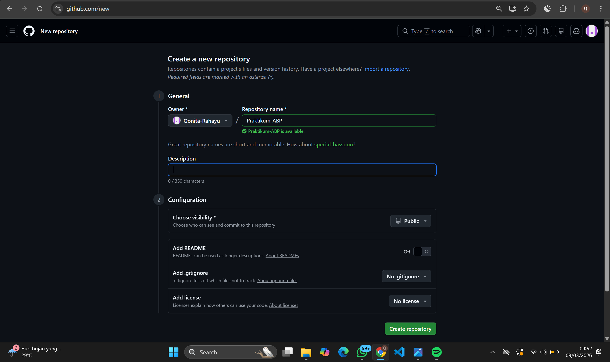
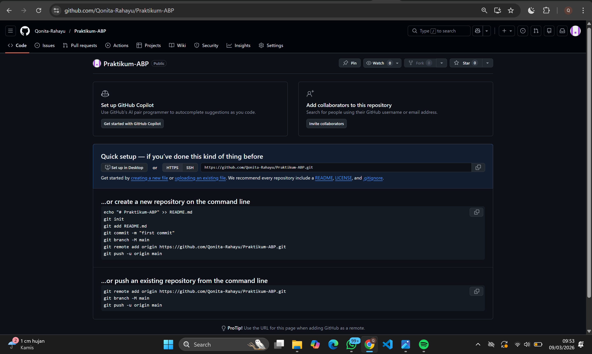
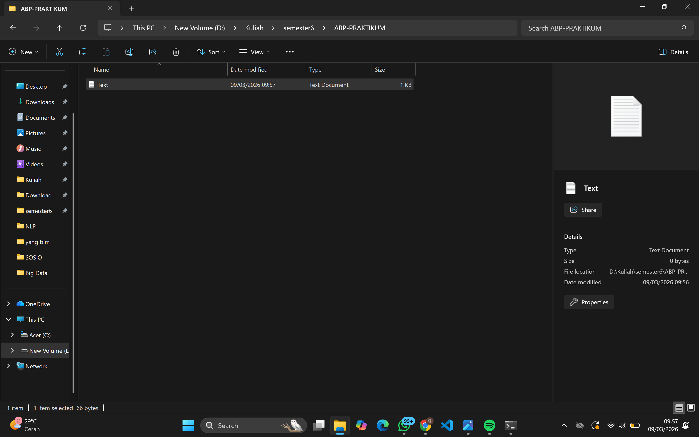
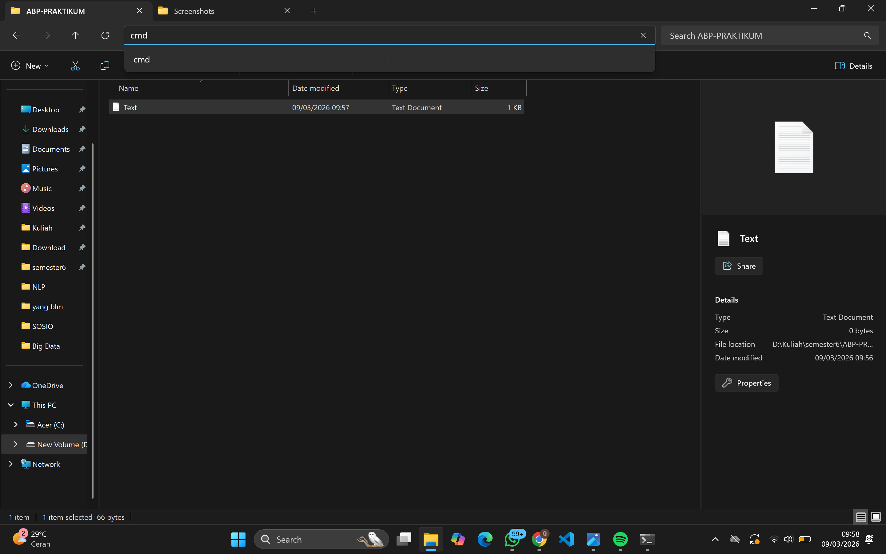
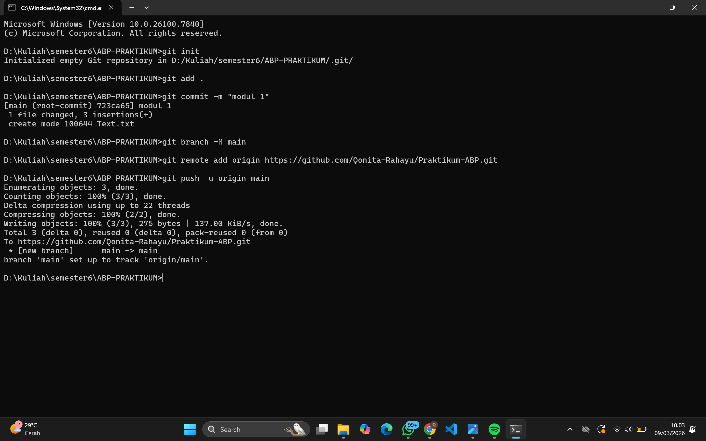
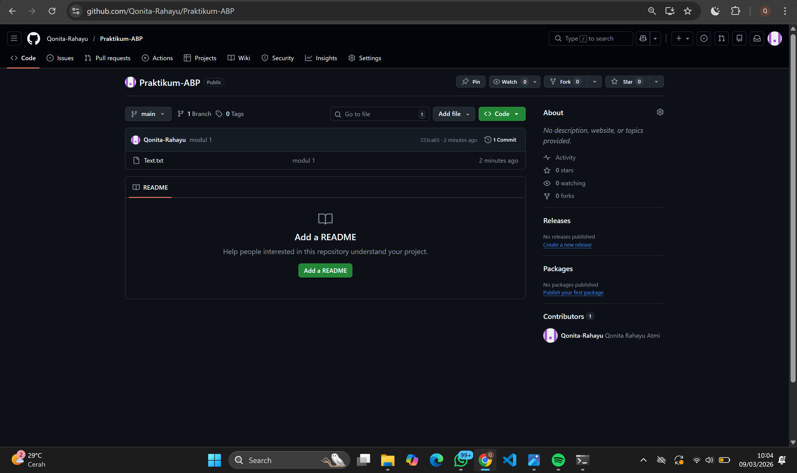

   
  <h1>LAPORAN PRAKTIKUM  APLIKASI BERBASIS PLATFORM</h1>
   
  <h3>MODUL 1   GIT</h3>
   
   
   
   
   
   
  <h3>Disusun Oleh :</h3>
  

    <strong>Qonita Rahayu Atmi</strong> 
    <strong>2311102128</strong> 
    <strong>S1 IF-11-REG01</strong> 
  

   
  <h3>Dosen Pengampu :</h3>
  

    <strong>Dimas Fanny Hebrasianto Permadi, S.ST., M.Kom</strong>
  

   
  <h3>Asisten Praktikum :</h3>
  

    <strong>Apri Pandu Wicaksono</strong> 
    <strong>Rangga Pradarrell Fathi</strong> 
  

   
  <h3>LABORATORIUM HIGH PERFORMANCE FAKULTAS INFORMATIKA  TELKOM UNIVERSITY PURWOKERTO  2026</h3>

---

## A. Dasar Teori

**Git** merupakan sebuah sistem pengontrol versi (Version Control System) yang dirancang oleh Linus Torvalds untuk mengelola riwayat perubahan pada proyek perangkat lunak secara efisien. Secara mendasar, Git berperan sebagai "mesin waktu" yang mencatat setiap detail modifikasi pada file proyek, baik saat dikerjakan secara individu maupun dalam kolaborasi tim besar. Keunggulan utamanya terletak pada sifatnya yang terdistribusi (distributed revision control), yang berarti basis data riwayat proyek tidak hanya tersimpan di satu server pusat, melainkan terduplikasi secara lengkap di setiap perangkat pengembang yang terlibat. Hal ini memungkinkan setiap anggota tim untuk bekerja secara mandiri tanpa ketergantungan penuh pada koneksi server, sekaligus memberikan keamanan data yang lebih tinggi karena setiap salinan lokal berfungsi sebagai cadangan utuh dari seluruh riwayat proyek.

**CLI** Command line interface adalah antarmuka pengguna (UI) berbasis teks yang digunakan untuk berinteraksi  dengan komputer untuk berinteraksi dengan sistem operasi atau perangkat lunak melalui pengetikan perintah secara manual.

---

# Unguided

### Langkah 1: Membuat Repositori Baru di GitHub

Langkah Pertama : Pembuatan Repositori 
- Langkah Pertama adalah melakukan pembuatan repositori baru didalam platform Github, Repositori ini digunakan sebagai wadah atau tempat penyimpanan online untuk kode tugas atau proyek kita.

### Langkah 2: Menghubungkan Proyek ke Repositori

Langkah Kedua : Menghubungkan ke Repositori
- Langkah kedua adalah melakukan inisialisasi Git pada folder proyek dan menghubungkannya ke repositori GitHub yang baru saja dibuat. Melalui instruksi yang muncul di layar, dapat menjalankan perintah seperti (`git init`) untuk memulai repositori baru, serta (`git remote`) add (`origin`) untuk menyambungkan folder lokal ke alamat URL repositori. 

### Langkah 3: Membuat File di Direktori Lokal

Langkah Ketiga : Membuat File di Direktori Lokal
- Langkah ketiga adalah membuat folder proyek dan file yang akan diunggah pada penyimpanan lokal komputer, dan membuat file bernama text.txt. 

### Langkah 4: Membuka CMD dari Direktori Folder Proyek

Langkah Keempat : Membuka CMD
- Langkah Keempat membuka Command Prompt (CMD) atau Terminal, dengan cara mengetikan CMD pada path folder, untuk menjalankan perintah Git nantinya berjalan tepat pada target folder yang sesuai.

### Langkah 5: Menjalankan Perintah Git di Terminal 

Langkah Kelima : Menjalankan Perintah
- Langkah Kelima menjalankan perintah yang sudah ada pada github dan dijalankan di CMD yang telah terbuka pada langkah sebelumnya.
Langkah awal menginisialisasi Git di folder lokal (`git init`), menambahkan file yang sudah ada (`git add`), melakukan commit (`git commit`), menghubungkan tautan remote GitHub, hingga mengunggah kode sumbernya ke online (`git push`).

### Langkah 6: Repositori Berhasil Diperbarui

Langkah Keenam : Repositori Baru Berhasil
- Langkah Keenam setelah semua berhasil dilakukan, seluruh file dan folder sudah berhasil terunggah ke repositori GitHub dan siap digunakan untuk kolaborasi lebih lanjut.

## B. Kesimpulan
- Berdasarkan hasil praktikum yang telah dilakukan, berhasil mendemonstrasikan alur kerja dasar (workflow) Git, mulai dari pembuatan repositori daring di GitHub, penyiapan direktori lokal, hingga proses sinkronisasi menggunakan perintah terminal. Melalui langkah langkah perintah seperti git init, git add, git commit, dan git push, setalah itu repositori baru berhasil dibuat. 

## C. Referensi
- [Materi Modul 1](https://drive.google.com/file/d/1sAJR4AconN_aZjvLF-GTY0DM-e84pL63/view?usp=sharing)
- [R. Rosnelly and S. W. Yudha, "Perancangan Aplikasi Otomatisasi Deteksi XSS Berbasis CLI dengan Bahasa Pemrograman Go," UNES Journal of Information System, vol. 8, no. 2, pp 12., Dec. 2023.](https://fe.ekasakti.org/index.php/UJIS/article/view/37/29)
