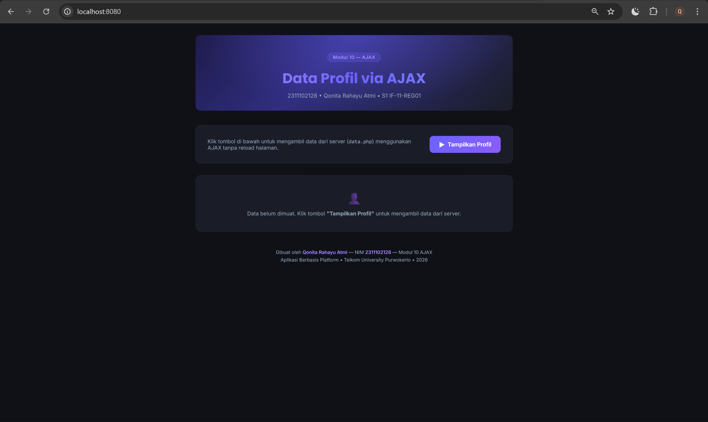
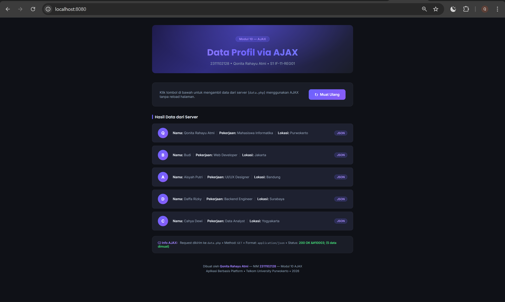

<div align="center">
  <br />
  <h1>LAPORAN PRAKTIKUM <br>APLIKASI BERBASIS PLATFORM</h1>
  <br />
  <h3>MODUL 10 <br> AJAX</h3>
  <br />
  <br />
  
  <br />
  <br />
  <br />
  <h3>Disusun Oleh :</h3>
  <p>
    <strong>Qonita Rahayu Atmi</strong><br>
    <strong>2311102128</strong><br>
    <strong>S1 IF-11-REG01</strong><br>
  </p>
  <br />
  <h3>Dosen Pengampu :</h3>
  <p>
    <strong>Dimas Fanny Hebrasianto Permadi, S.ST., M.Kom</strong>
  </p>
  <br />
  <h3>Asisten Praktikum :</h3>
  <p>
    <strong>Apri Pandu Wicaksono</strong><br>
    <strong>Rangga Pradarrell Fathi</strong><br>
  </p>
  <br />
  <h3>LABORATORIUM HIGH PERFORMANCE<br>FAKULTAS INFORMATIKA <br>TELKOM UNIVERSITY PURWOKERTO <br>2026</h3>
</div>

---

# A. Dasar Teori

- **AJAX (Asynchronous JavaScript and XML)** merupakan teknik dalam pengembangan website yang digunakan untuk membuat antarmuka web menjadi lebih dinamis. Dengan AJAX, halaman web dapat memperbarui atau menampilkan data secara asynchronous tanpa harus memuat ulang seluruh halaman, sehingga proses akses informasi menjadi lebih cepat serta meningkatkan kinerja pada sisi klien maupun server dan memberikan pengalaman penggunaan yang lebih baik bagi pengguna.

- **fetch() API** adalah cara modern dalam JavaScript untuk membuat HTTP request secara asinkron ke server. `fetch()` mengembalikan sebuah **Promise** yang merepresentasikan respons dari server. Promise dapat ditangani menggunakan `.then()` untuk mengelola respons yang berhasil dan `.catch()` untuk menangani error. `fetch()` lebih sederhana dan mudah dibaca dibandingkan XMLHttpRequest (XHR) yang lebih lama.

- **JSON (JavaScript Object Notation)** adalah format pertukaran data yang ringan dan mudah dibaca oleh manusia maupun mesin. JSON menggunakan struktur pasangan nama-nilai (key-value) dalam kurung kurawal `{}` untuk objek, dan tanda kurung siku `[]` untuk array. Dalam konteks AJAX, server mengirimkan data dalam format JSON yang kemudian diproses oleh JavaScript di sisi client.

- **DOM Manipulation** adalah kemampuan JavaScript untuk mengakses dan mengubah elemen-elemen HTML secara dinamis. Pada program ini, `document.getElementById()` digunakan untuk mengakses elemen, `document.createElement()` untuk membuat elemen baru, `appendChild()` untuk menambahkan elemen ke dalam DOM, dan `innerHTML` untuk mengubah isi konten HTML sebuah elemen.

- **PHP (Hypertext Preprocessor)** adalah  bahasa pelengkap  HTML  yang  memungkinkan  dibuatnya aplikasi    dinamis    yang    memungkinkan    adanya pengolahan data dan pemrosesan data. Semua sintaxyang  diberikan  akan  sepenuhnya  dijalankan  pada server sedangkan yang dikirimkan ke browserhanya hasilnya     saja. Kemudian     merupakan     bahasa berbentuk scriptyang ditempatkan dalam serverdan diproses  di server.  Hasilnya  akan  dikirimkan  ke client, tempat  pemakai  menggunakan browser.  PHP dikenal   sebagai   sebuah   bahasa scripting,   yang menyatu dengan tag-tag HTML, dieksekusi di server, dan  digunakan  untuk  membuat  halaman  web  yang dinamis  seperti  halnya Active  Server  Pages(ASP) atau Java   Server   Pages(JSP).   PHP   merupakan sebuah software Open Source.

- **Array** adalah tipe data terstruktur yang digunakan untuk menyimpan sekumpulan data dengan tipe yang sama dalam satu variabel. Data yang tersimpan di dalam array disebut elemen array, dan setiap elemen dapat diakses secara individual menggunakan index.

- **Array Asosiatif** adalah array yang menggunakan string sebagai kunci (key) untuk setiap elemennya. Berbeda dengan array biasa yang menggunakan indeks angka (0, 1, 2, ...), array asosiatif memungkinkan akses data menggunakan nama yang deskriptif seperti `"nama"`, `"nim"`, atau `"nilai_tugas"`. Hal ini membuat kode lebih mudah dibaca dan dipahami.

---

# B. Soal

## Deskripsi Tugas

Buat sebuah halaman web yang bisa mengambil data dari server lalu menampilkannya di halaman tanpa perlu reload.

## Instruksi & Penjelasan Implementasi

### 1. Membuat File Server (`data.php`)

Buat file PHP yang berfungsi sebagai sumber data. Data disimpan dalam array asosiatif, kemudian diubah ke format JSON menggunakan `json_encode()` dan ditampilkan menggunakan `echo`. Header `Content-Type: application/json` ditambahkan agar browser mengenali respons sebagai JSON.

```php
// data.php
header('Content-Type: application/json');

$profil = [
    ['nama' => 'Budi', 'pekerjaan' => 'Web Developer', 'lokasi' => 'Jakarta'],
    // ... data lainnya
];

echo json_encode($profil);
```

Baris `header('Content-Type: application/json')` **wajib dipanggil sebelum ada output apapun** agar header HTTP dikirimkan dengan benar. Header ini memberitahu client bahwa data yang dikirim adalah JSON sehingga `fetch()` di JavaScript dapat memprosesnya dengan pemanggilan `.json()`. Fungsi `json_encode()` mengubah array PHP menjadi string JSON yang valid, misalnya: `[{"nama":"Budi","pekerjaan":"Web Developer","lokasi":"Jakarta"}]`.

Program ini menyimpan **5 data profil** dalam array asosiatif dengan 3 atribut tiap elemen: `nama`, `pekerjaan`, dan `lokasi`, sesuai format yang diminta dalam instruksi tugas.

---

### 2. Membuat File Client (`index.html`)

File HTML menyediakan antarmuka pengguna dengan sebuah tombol dan area untuk menampilkan data.

```html
<!-- Tombol AJAX -->
<button id="btn-tampilkan">
    <span class="icon">▶</span> Tampilkan Profil
</button>

<!-- Tempat menampilkan data dari server -->
<div id="hasil-profil"></div>
```

Elemen `<button id="btn-tampilkan">` adalah tombol yang akan diklik pengguna untuk menampilkan request AJAX. Atribut `id` penting karena digunakan oleh JavaScript untuk mengakses elemen tersebut melalui `document.getElementById()`. Elemen `<div id="hasil-profil">` adalah wadah kosong yang akan diisi secara dinamis oleh JavaScript setelah data diterima dari server, **tanpa perlu reload halaman**.

---

### 3. Membuat Logika AJAX (JavaScript dengan `fetch()`)

JavaScript mendeteksi klik tombol, mengirim request ke `data.php`, dan menampilkan hasilnya ke halaman.

```javascript
const btnTampilkan = document.getElementById('btn-tampilkan');
const hasilProfil  = document.getElementById('hasil-profil');

// Event listener: jalankan AJAX saat tombol diklik
btnTampilkan.addEventListener('click', function () {

    // Kirim request ke data.php menggunakan fetch()
    fetch('data.php')
        .then(function (response) {
            if (!response.ok) {
                throw new Error('Gagal! Status: ' + response.status);
            }
            return response.json(); // Parse JSON
        })
        .then(function (data) {
            // Tampilkan setiap profil ke halaman
            data.forEach(function (profil, index) {
                const item = document.createElement('div');
                item.innerHTML =
                    'Nama: ' + profil.nama +
                    ' | Pekerjaan: ' + profil.pekerjaan +
                    ' | Lokasi: '  + profil.lokasi;
                hasilProfil.appendChild(item);
            });
        })
        .catch(function (error) {
            hasilProfil.innerHTML = 'Error: ' + error.message;
        });
});
```

Alur kerja AJAX pada program ini adalah sebagai berikut:

1. **Event Listener**: `addEventListener('click', ...)` mendaftarkan fungsi yang dipanggil saat tombol diklik.
2. **`fetch('data.php')`**: Mengirim HTTP GET request ke `data.php` secara **asinkron** browser tetap menjalankan halaman saat menunggu respons dari server.
3. **`.then(response => response.json())`**: Setelah respons diterima, respons dikonversi dari string JSON menjadi array JavaScript menggunakan `.json()`. Pengecekan `response.ok` dilakukan terlebih dahulu untuk memastikan request berhasil (status HTTP 200).
4. **`.then(data => ...)`**: Setelah data siap, fungsi `forEach()` mengiterasi setiap elemen array dan membuat elemen `<div>` baru untuk setiap profil, lalu menambahkannya ke `#hasil-profil` menggunakan `appendChild()`.
5. **`.catch(error => ...)`**: Jika terjadi error di mana pun dalam rantai Promise (jaringan terputus, file tidak ditemukan, dst.), blok `.catch()` menangkap error tersebut dan menampilkan pesan error kepada pengguna.

---

# C. Kode Program

## 1. `data.php` — Server: Sumber Data JSON

```php
<?php
// ============================================================
// data.php - Server: menyediakan data dalam format JSON
// 2311102128 - Qonita Rahayu Atmi
// ============================================================

// Header agar browser mengetahui response ini adalah JSON
header('Content-Type: application/json');

// Array asosiatif data profil
$profil = [
    [
        'nama'      => 'Qonita Rahayu Atmi',
        'pekerjaan' => 'Mahasiswa Informatika',
        'lokasi'    => 'Purwokerto',
    ],
    [
        'nama'      => 'Budi',
        'pekerjaan' => 'Web Developer',
        'lokasi'    => 'Jakarta',
    ],
    [
        'nama'      => 'Aisyah Putri',
        'pekerjaan' => 'UI/UX Designer',
        'lokasi'    => 'Bandung',
    ],
    [
        'nama'      => 'Daffa Rizky',
        'pekerjaan' => 'Backend Engineer',
        'lokasi'    => 'Surabaya',
    ],
    [
        'nama'      => 'Cahya Dewi',
        'pekerjaan' => 'Data Analyst',
        'lokasi'    => 'Yogyakarta',
    ],
];

// Ubah array ke format JSON dan tampilkan
echo json_encode($profil);
```

**Penjelasan `data.php`:**
- Pada baris 7, perintah `header('Content-Type: application/json')` digunakan untuk menentukan jenis konten respons yang dikirim server kepada client. Header ini penting agar browser mengenali bahwa data yang dikirimkan adalah JSON, sehingga `fetch()` di JavaScript dapat memprosesnya menggunakan `.json()`.
- Pada baris 10–35, variabel `$profil` dideklarasikan sebagai array asosiatif multidimensi yang berisi 5 elemen data profil. Setiap elemen adalah array asosiatif dengan 3 atribut: `nama`, `pekerjaan`, dan `lokasi`.
- Pada baris 38, perintah `echo json_encode($profil)` mengubah array PHP menjadi string JSON yang valid dan langsung menampilkannya sebagai body respons HTTP. Contoh output: `[{"nama":"Budi","pekerjaan":"Web Developer","lokasi":"Jakarta"},...]`.

---

## 2. `index.html` — Client: HTML + JavaScript AJAX

```html
<!DOCTYPE html>
<html lang="id">
<head>
    <meta charset="UTF-8">
    <meta name="viewport" content="width=device-width, initial-scale=1.0">
    <meta name="description" content="Halaman AJAX Profil - Modul 10 - Qonita Rahayu Atmi">
    <title>AJAX Profil | Modul 10</title>
    <link rel="stylesheet" href="style.css">
</head>
<body>

<div style="max-width:860px; margin:0 auto;">

    <!-- Hero -->
    <div class="hero">
        <div class="badge">Modul 10 &mdash; AJAX</div>
        <h1>Data Profil via AJAX</h1>
        <p>2311102128 &bull; Qonita Rahayu Atmi &bull; S1 IF-11-REG01</p>
    </div>

    <!-- Panel Kontrol -->
    <div class="control-panel">
        <p>Klik tombol di bawah untuk mengambil data dari server (<code>data.php</code>) menggunakan AJAX tanpa reload halaman.</p>
        <button id="btn-tampilkan">
            <span class="icon">&#9654;</span> Tampilkan Profil
        </button>
    </div>

    <!-- Status Loading -->
    <div id="status-ajax">
        <div class="spinner"></div>
        <span>Mengambil data dari server...</span>
    </div>

    <!-- Section Title -->
    <p class="section-title" id="section-label" style="display:none;">Hasil Data dari Server</p>

    <div id="hasil-profil">
        <!-- State kosong awal -->
        <div class="state-empty">
            <span class="icon">&#128100;</span>
            Data belum dimuat. Klik tombol <strong>"Tampilkan Profil"</strong> untuk mengambil data dari server.
        </div>
    </div>

    <!-- Info Request AJAX -->
    <div class="ajax-info" id="ajax-info">
        <span class="label">&#9432; Info AJAX:</span>
        Request dikirim ke <code>data.php</code> &bull;
        Method: <code>GET</code> &bull;
        Format: <code>application/json</code> &bull;
        Status: <span id="ajax-status-text" style="color:#4ade80; font-weight:600;"></span>
    </div>

    <footer>
        <p>Dibuat oleh <span>Qonita Rahayu Atmi</span> &mdash; NIM <span>2311102128</span> &mdash; Modul 10 AJAX</p>
        <p style="margin-top:.3rem;">Aplikasi Berbasis Platform &bull; Telkom University Purwokerto &bull; 2026</p>
    </footer>

</div>

<script>
// ============================================================
// JavaScript AJAX menggunakan fetch()
// 2311102128 - Qonita Rahayu Atmi
// ============================================================

const btnTampilkan  = document.getElementById('btn-tampilkan');
const hasilProfil   = document.getElementById('hasil-profil');
const statusAjax    = document.getElementById('status-ajax');
const ajaxInfo      = document.getElementById('ajax-info');
const ajaxStatusTxt = document.getElementById('ajax-status-text');
const sectionLabel  = document.getElementById('section-label');

// Event listener: saat tombol diklik
btnTampilkan.addEventListener('click', function () {

    // Nonaktifkan tombol & tampilkan loading
    btnTampilkan.disabled  = true;
    btnTampilkan.innerHTML = '<span class="icon">&#9203;</span> Memuat...';
    statusAjax.classList.add('show');
    hasilProfil.innerHTML  = '';
    ajaxInfo.classList.remove('show');
    sectionLabel.style.display = 'none';

    // Kirim AJAX request menggunakan fetch()
    fetch('data.php')
        .then(function (response) {
            if (!response.ok) {
                throw new Error('Gagal mengambil data. Status: ' + response.status);
            }
            return response.json();
        })
        .then(function (data) {
            statusAjax.classList.remove('show');
            sectionLabel.style.display = 'flex';

            data.forEach(function (profil, index) {
                const inisial = profil.nama.charAt(0).toUpperCase();

                const item = document.createElement('div');
                item.className = 'profil-item';
                item.style.animationDelay = (index * 0.08) + 's';

                item.innerHTML =
                    '<div class="profil-avatar">' + inisial + '</div>' +
                    '<div class="profil-info">' +
                        '<span class="profil-field"><strong>Nama:</strong> ' + profil.nama + '</span>' +
                        '<span class="profil-sep">|</span>' +
                        '<span class="profil-field"><strong>Pekerjaan:</strong> ' + profil.pekerjaan + '</span>' +
                        '<span class="profil-sep">|</span>' +
                        '<span class="profil-field"><strong>Lokasi:</strong> ' + profil.lokasi + '</span>' +
                    '</div>' +
                    '<span class="profil-badge">JSON</span>';

                hasilProfil.appendChild(item);
            });

            // Tampilkan info AJAX
            ajaxInfo.classList.add('show');
            ajaxStatusTxt.textContent = '200 OK &#10003; (' + data.length + ' data dimuat)';

            // Reset tombol
            btnTampilkan.disabled  = false;
            btnTampilkan.innerHTML = '<span class="icon">&#8635;</span> Muat Ulang';
        })
        .catch(function (error) {
            // Tampilkan pesan error
            statusAjax.classList.remove('show');
            hasilProfil.innerHTML =
                '<div class="state-error">' +
                '&#9888; <strong>Error:</strong> ' + error.message +
                '</div>';

            btnTampilkan.disabled  = false;
            btnTampilkan.innerHTML = '<span class="icon">&#9654;</span> Coba Lagi';
        });
});
</script>

</body>
</html>      
```

**Penjelasan `index.html`:**
- Pada baris 1–9, dokumen HTML dideklarasikan dengan `<!DOCTYPE html>`, tag `<html lang="id">`, dan bagian `<head>` yang berisi pengaturan karakter, viewport responsif, judul halaman, dan pemanggilan file `style.css`.
- Pada baris 14, elemen `<button id="btn-tampilkan">` adalah tombol yang dapat diklik pengguna untuk memicu proses AJAX. Atribut `id` digunakan JavaScript untuk mengakses elemen ini.
- Pada baris 17, elemen `<div id="hasil-profil">` adalah wadah kosong yang akan diisi secara dinamis oleh JavaScript setelah data diterima dari server, tanpa perlu reload halaman.
- Pada baris 22–23, `document.getElementById()` digunakan untuk menyimpan referensi ke elemen tombol dan div hasil ke dalam variabel JavaScript agar mudah diakses.
- Pada baris 26, `addEventListener('click', function() {...})` mendaftarkan fungsi event handler yang akan dieksekusi setiap kali tombol diklik.
- Pada baris 28–29, tombol dinonaktifkan (`disabled = true`) untuk mencegah klik berulang saat data sedang dimuat, dan isi `#hasil-profil` dikosongkan terlebih dahulu.
- Pada baris 32, `fetch('data.php')` mengirimkan HTTP GET request ke file `data.php` secara **asinkron**. Fungsi ini langsung mengembalikan Promise tanpa memblokir eksekusi JavaScript lainnya.
- Pada baris 33–37, `.then()` pertama menerima objek `response`. Kondisi `response.ok` diperiksa untuk memastikan respons berhasil (status 200–299). Jika tidak, error dilempar menggunakan `throw new Error()`. Jika berhasil, `response.json()` dipanggil untuk mengurai string JSON menjadi array JavaScript.
- Pada baris 38–46, `.then()` kedua menerima array `data` yang sudah diurai. Fungsi `forEach()` mengiterasi setiap elemen dan membuat elemen `<div>` baru menggunakan `document.createElement('div')`. Data profil disisipkan ke dalamnya melalui `innerHTML`, kemudian ditambahkan ke `#hasil-profil` menggunakan `appendChild()`.
- Pada baris 47–50, `.catch()` menangkap error yang terjadi di manapun dalam rantai Promise, termasuk error jaringan atau error yang dilempar secara manual, lalu menampilkan pesan error kepada pengguna.

---

## 3. `style.css` — Styling CSS

```css
/* ============================================================
   2311102128 - Qonita Rahayu Atmi
   ============================================================ */

@import url('https://fonts.googleapis.com/css2?family=Inter:wght@300;400;500;600;700&family=Poppins:wght@400;600;700&display=swap');

*, *::before, *::after { box-sizing: border-box; margin: 0; padding: 0; }

:root {
    --bg-main:    #0f1117;
    --bg-card:    #1a1d27;
    --bg-item:    #1e2130;
    --bg-header:  #252840;
    --accent:     #6c63ff;
    --accent-2:   #a78bfa;
    --green:      #22c55e;
    --yellow:     #facc15;
    --text-main:  #e2e8f0;
    --text-muted: #94a3b8;
    --border:     rgba(255,255,255,0.08);
    --radius:     14px;
}

body {
    font-family: 'Inter', sans-serif;
    background: var(--bg-main);
    color: var(--text-main);
    min-height: 100vh;
    padding: 2rem 1rem 4rem;
}

/* ---- Hero ---- */
.hero {
    text-align: center;
    padding: 3rem 1rem 2rem;
    background: linear-gradient(135deg, #1e1b4b 0%, #312e81 40%, #1a1d27 100%);
    border-radius: var(--radius);
    margin-bottom: 2.5rem;
    position: relative;
    overflow: hidden;
}
.hero::before {
    content: '';
    position: absolute;
    inset: 0;
    background: radial-gradient(ellipse at 50% 0%, rgba(108,99,255,.35) 0%, transparent 70%);
}
.hero .badge {
    display: inline-block;
    background: rgba(108,99,255,.25);
    border: 1px solid rgba(108,99,255,.4);
    color: var(--accent-2);
    padding: .25rem .9rem;
    border-radius: 99px;
    font-size: .78rem;
    font-weight: 600;
    letter-spacing: .5px;
    margin-bottom: 1rem;
    position: relative;
}
.hero h1 {
    font-family: 'Poppins', sans-serif;
    font-size: clamp(1.6rem, 4vw, 2.4rem);
    font-weight: 700;
    background: linear-gradient(90deg, #a78bfa, #6c63ff, #818cf8);
    -webkit-background-clip: text;
    -webkit-text-fill-color: transparent;
    background-clip: text;
    position: relative;
}
.hero p {
    color: var(--text-muted);
    margin-top: .6rem;
    font-size: .95rem;
    position: relative;
}

/* ---- Panel Kontrol ---- */
.control-panel {
    background: var(--bg-card);
    border: 1px solid var(--border);
    border-radius: var(--radius);
    padding: 1.75rem 2rem;
    margin-bottom: 2rem;
    display: flex;
    align-items: center;
    gap: 1.25rem;
    flex-wrap: wrap;
}
.control-panel p {
    color: var(--text-muted);
    font-size: .9rem;
    flex: 1;
}

/* ---- Tombol ---- */
#btn-tampilkan {
    display: inline-flex;
    align-items: center;
    gap: .5rem;
    background: linear-gradient(135deg, var(--accent), #8b5cf6);
    color: #fff;
    border: none;
    border-radius: 10px;
    padding: .7rem 1.6rem;
    font-size: .95rem;
    font-weight: 600;
    font-family: 'Inter', sans-serif;
    cursor: pointer;
    transition: transform .2s, box-shadow .2s, opacity .2s;
    white-space: nowrap;
}
#btn-tampilkan:hover {
    transform: translateY(-2px);
    box-shadow: 0 8px 24px rgba(108,99,255,.45);
}
#btn-tampilkan:active { transform: translateY(0); }
#btn-tampilkan:disabled {
    opacity: .6;
    cursor: not-allowed;
    transform: none;
}
#btn-tampilkan .icon { font-size: 1.1rem; }

/* ---- Status Loading ---- */
#status-ajax {
    display: none;
    align-items: center;
    gap: .5rem;
    font-size: .85rem;
    color: var(--accent-2);
    margin-top: .5rem;
}
#status-ajax.show { display: flex; }

.spinner {
    width: 16px;
    height: 16px;
    border: 2px solid rgba(167,139,250,.3);
    border-top-color: var(--accent-2);
    border-radius: 50%;
    animation: spin .7s linear infinite;
}
@keyframes spin { to { transform: rotate(360deg); } }

/* ---- Section Title ---- */
.section-title {
    font-family: 'Poppins', sans-serif;
    font-size: 1.05rem;
    font-weight: 600;
    color: var(--text-main);
    margin-bottom: 1rem;
    display: flex;
    align-items: center;
    gap: .5rem;
}
.section-title::before {
    content: '';
    display: inline-block;
    width: 4px;
    height: 1.1em;
    background: var(--accent);
    border-radius: 2px;
}

/* ---- Hasil Profil ---- */
#hasil-profil {
    display: flex;
    flex-direction: column;
    gap: .85rem;
}

.profil-item {
    background: var(--bg-item);
    border: 1px solid var(--border);
    border-radius: 10px;
    padding: 1.1rem 1.5rem;
    display: flex;
    align-items: center;
    gap: 1.25rem;
    flex-wrap: wrap;
    opacity: 0;
    transform: translateY(12px);
    animation: fadeInUp .4s ease forwards;
}
@keyframes fadeInUp {
    to { opacity: 1; transform: translateY(0); }
}

.profil-avatar {
    width: 44px;
    height: 44px;
    border-radius: 50%;
    background: linear-gradient(135deg, var(--accent), #8b5cf6);
    display: flex;
    align-items: center;
    justify-content: center;
    font-weight: 700;
    font-size: 1.1rem;
    color: #fff;
    flex-shrink: 0;
}

.profil-info {
    flex: 1;
    display: flex;
    flex-wrap: wrap;
    gap: .25rem .5rem;
    align-items: center;
}

.profil-field {
    font-size: .88rem;
    color: var(--text-muted);
}
.profil-field strong { color: var(--text-main); font-weight: 600; }

.profil-sep {
    color: var(--border);
    font-size: .9rem;
    select: none;
}

.profil-badge {
    background: rgba(108,99,255,.18);
    color: var(--accent-2);
    border: 1px solid rgba(108,99,255,.3);
    border-radius: 99px;
    padding: .15rem .65rem;
    font-size: .75rem;
    font-weight: 600;
}

/* ---- State kosong & error ---- */
.state-empty {
    background: var(--bg-card);
    border: 1px dashed var(--border);
    border-radius: var(--radius);
    padding: 2.5rem;
    text-align: center;
    color: var(--text-muted);
    font-size: .9rem;
}
.state-empty .icon { font-size: 2rem; margin-bottom: .75rem; display: block; }

.state-error {
    background: rgba(239,68,68,.1);
    border: 1px solid rgba(239,68,68,.25);
    border-radius: var(--radius);
    padding: 1.25rem 1.5rem;
    color: #f87171;
    font-size: .9rem;
    display: flex;
    align-items: center;
    gap: .6rem;
}

/* ---- Info AJAX ---- */
.ajax-info {
    background: var(--bg-card);
    border: 1px solid var(--border);
    border-radius: var(--radius);
    padding: 1.25rem 1.5rem;
    margin-top: 1.5rem;
    font-size: .82rem;
    color: var(--text-muted);
    display: none;
}
.ajax-info.show { display: block; }
.ajax-info .label { color: var(--accent-2); font-weight: 600; margin-right: .35rem; }

/* ---- Footer ---- */
footer {
    text-align: center;
    margin-top: 3rem;
    color: var(--text-muted);
    font-size: .8rem;
}
footer span { color: var(--accent-2); font-weight: 600; }

```

**Penjelasan `style.css`:**
- Pada baris 5–7, perintah `@import` digunakan untuk mengambil font Inter dan Poppins dari Google Fonts yang akan digunakan sebagai font utama pada halaman web. Selain itu, selector `*, *::before, *::after` digunakan untuk melakukan reset CSS dengan mengatur `box-sizing: border-box` serta menghapus margin dan padding bawaan browser agar tata letak elemen lebih konsisten.
- Pada baris 9–28, pseudo-class `:root` digunakan untuk mendefinisikan variabel CSS yang berisi pengaturan warna latar belakang, warna teks, warna aksen, border, dan radius sudut. Kemudian selector body digunakan untuk mengatur tampilan dasar halaman, termasuk penggunaan font Inter, warna latar belakang utama, warna teks, tinggi minimum halaman, serta padding agar konten tidak menempel pada tepi layar.
- Pada baris 31–76, selector `.hero`, pseudo-element `.hero::before`, serta elemen `.hero .badge`, `.hero h1`, dan .hero p digunakan untuk membuat bagian hero atau header utama halaman. Bagian ini memiliki teks yang berada di tengah, latar belakang gradasi warna, efek cahaya dekoratif, label kecil berbentuk kapsul, judul utama dengan font Poppins dan efek teks gradasi, serta teks deskripsi dengan warna yang lebih lembut.
- Pada baris 79–120, selector `.control-panel`, `.control-panel p`, serta berbagai selector pada `#btn-tampilkan` digunakan untuk membuat panel kontrol dan tombol interaksi. Panel ini berfungsi sebagai wadah informasi dan tombol untuk menampilkan data, dengan tampilan berbentuk kartu, tata letak fleksibel menggunakan flexbox, serta efek animasi pada tombol saat diarahkan atau ditekan.
- Pada baris 123–158, selector `#status-ajax`, `.spinner`, aturan `@keyframes spin`, serta `.section-title` dan .`section-title::before` digunakan untuk menampilkan status proses AJAX dan judul bagian halaman. Status AJAX ditampilkan dalam bentuk indikator loading dengan animasi putaran, sedangkan judul bagian dilengkapi dengan garis dekoratif di sebelah kiri.
- Pada baris 161–227, selector `#hasil-profil`, `.profil-item`, `.profil-avatar`, `.profil-info`, `.profil-field`, `.profil-sep`, dan `.profil-badge` digunakan untuk mengatur tampilan daftar profil pengguna. Setiap profil ditampilkan dalam bentuk kartu dengan animasi kemunculan, avatar berbentuk lingkaran, informasi data yang tersusun rapi, serta label tambahan berbentuk kapsul.
- Pada baris 230–263, selector `.state-empty`, `.state-error`, serta `.ajax-info` digunakan untuk menampilkan kondisi khusus pada halaman, seperti ketika data belum tersedia, terjadi kesalahan saat memuat data, atau informasi tambahan mengenai proses AJAX.
- Pada baris 266–271, selector footer dan footer span digunakan untuk mengatur tampilan bagian footer, termasuk posisi teks yang berada di tengah, warna teks yang lebih lembut, serta warna aksen pada bagian teks tertentu agar terlihat lebih menonjol.

---

## D. Hasil Tampilan (Screenshot)



Tampilan awal halaman saat pertama dibuka. Tombol **"Tampilkan Profil"** siap diklik, dan area data menampilkan pesan *state kosong* yang menginformasikan pengguna untuk mengklik tombol. Belum ada request AJAX yang dikirim dan halaman belum memuat data apapun dari server.



Tampilan setelah tombol diklik. Data 5 profil berhasil dimuat dari `data.php` dan ditampilkan di halaman **tanpa reload**. Setiap profil ditampilkan dalam kartu terpisah dengan format: **Nama** | **Pekerjaan** | **Lokasi**. Avatar inisial dengan gradasi ungu muncul di sisi kiri setiap kartu, dan badge "JSON" menandakan data berasal dari respons JSON server. Tombol berubah menjadi "Muat Ulang" yang dapat diklik untuk memuat data kembali.

---

## E. Kesimpulan

Berdasarkan hasil praktikum Modul 10, program **Data Profil via AJAX** terdiri dari tiga file utama: `data.php` sebagai sumber data di sisi server, `index.html` sebagai antarmuka pengguna di sisi client, dan `style.css` sebagai styling halaman. Hasilnya, halaman web berhasil mengambil data dari server dan menampilkannya tanpa perlu reload halaman.

File `data.php` berfungsi sebagai "database sederhana" yang menyimpan 5 data profil dalam array asosiatif PHP, masing-masing berisi atribut `nama`, `pekerjaan`, dan `lokasi`. Header `Content-Type: application/json` dideklarasikan di baris pertama sebelum output agar browser mengenali respons sebagai JSON, kemudian data dikonversi menggunakan `json_encode()` dan ditampilkan menggunakan `echo`. Di sisi client, file `index.html` menyediakan elemen `<button id="btn-tampilkan">` berteks "Tampilkan Profil" sebagai pemicu proses AJAX, serta elemen `<div id="hasil-profil">` sebagai wadah kosong yang akan diisi secara dinamis oleh JavaScript setelah data diterima dari server.

Logika AJAX diimplementasikan menggunakan `fetch()` API modern. Event listener `addEventListener('click', ...)` didaftarkan pada tombol untuk mendeteksi aksi pengguna. Saat tombol diklik, fungsi `fetch('data.php')` mengirimkan HTTP GET request ke server secara asinkron tanpa memblokir halaman. Blok `.then(response => response.json())` mengurai respons string JSON menjadi array JavaScript, dan blok `.then(data => data.forEach(...))` mengiterasi setiap elemen untuk membuat elemen DOM baru menggunakan `createElement()` dan `appendChild()`, menampilkan data dengan format **Nama: ... | Pekerjaan: ... | Lokasi: ...** sesuai yang diminta. Penanganan error dilakukan oleh blok `.catch()` yang menampilkan pesan error jika request gagal.


## F. Referensi

- [Materi Modul 9 - PHP](https://drive.google.com/file/d/1Fgj2rbye0s7QZ5VBigpSiTyPBl8TjpKB/view?usp=sharing)
- [R. Hermiati, A. Asnawati, dan I. Kanedi, “Pembuatan E-Commerce pada Raja Komputer Menggunakan Bahasa Pemrograman PHP dan Database MySQL,” Jurnal Media Infotama, vol. 17, no. 1, Feb. 2021.](https://jurnal.unived.ac.id/index.php/jmi/article/view/1317/1077)
- [Y. D. Cahyono, A. Suryanta, dan I. P. Wardani, “Penerapan AJAX untuk Antarmuka Dinamis dalam Website Builder dengan Kemampuan Penyisipan Pesan Tersembunyi,” JATI (Jurnal Mahasiswa Teknik Informatika), vol. 9, no. 1, Feb. 2025.](https://ejournal.itn.ac.id/jati/article/download/12129/6824)