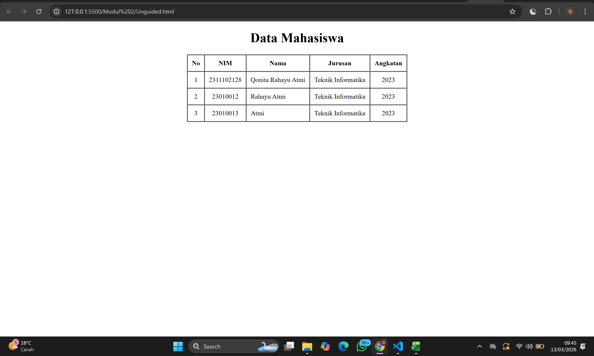

<div align="center">
  <br />
  <h1>LAPORAN PRAKTIKUM <br>APLIKASI BERBASIS PLATFORM</h1>
  <br />
  <h3>MODUL 2 <br> HTML</h3>
  <br />
  <br />
   
  <br />
  <br />
  <br />
  <h3>Disusun Oleh :</h3>
  <p>
    <strong>Qonita Rahayu Atmi</strong><br>
    <strong>2311102128</strong><br>
    <strong>S1 IF-11-REG01</strong><br>
  </p>
  <br />
  <h3>Dosen Pengampu :</h3>
  <p>
    <strong>Dimas Fanny Hebrasianto Permadi, S.ST., M.Kom</strong>
  </p>
  <br />
  <h3>Asisten Praktikum :</h3>
  <p>
    <strong>Apri Pandu Wicaksono</strong><br>
    <strong>Rangga Pradarrell Fathi</strong><br>
  </p>
  <br />
  <h3>LABORATORIUM HIGH PERFORMANCE<br>FAKULTAS INFORMATIKA <br>TELKOM UNIVERSITY PURWOKERTO <br>2026</h3>
</div>

---

# A. Dasar Teori

**1. HTML** (HyperText Markup Language) merupakan fondasi utama dalam pengembangan web yang berfungsi untuk menyusun struktur dan kerangka dasar sebuah situs.HTML bertanggung jawab mengelola elemen-elemen esensial seperti teks, gambar, dan tautan sehingga peramban (browser) dapat menampilkan konten tersebut secara terorganisir kepada pengguna. Struktur HTML paling dasar adalah sebagai berikut:
- **Tag** dalam HTML mempunyai sepasang tag di mana tag pertama merupakan tag pembuka dan yang kedua merupakan tag penutup. 
- **Elemen** merupakan tag HTML yang telah memiliki konten atau isi di antara kedua tag pembuka dan penutupnya. 
- **Atribut** adalah tambahan informasi dari sebuah tag HTML, yang bentuk atribut untuk setiap tag HTML berbeda-beda sehingga kegunaan atribut juga berbeda seperti menambahkan informasi warna elemen, ukuran lebar, ukuran panjang dan lain-lain.

**2. Dasar Sintaks HTML**
Seperti yang sudah dijelaskan sebelumnya struktur dasar HTML antara lain berupa:
- Deklarasi <! DOCTYPE html> Berfungsi sebagai deklarasi untuk memberitahu peramban (browser) bahwa dokumen ini menggunakan standar HTML5.
- Elemen <html> Merupakan elemen induk (root element) yang membungkus seluruh konten dan struktur halaman web.
- Elemen <head> Bagian yang menampung metadata atau informasi teknis tentang dokumen yang tidak muncul langsung di layar pengguna.
- Elemen <title> Bagian di dalam <head> yang menentukan judul halaman yang muncul pada tab peramban.
- Elemen <body> Wadah utama yang menampung seluruh konten visual, seperti teks, gambar, video, dan navigasi yang dapat dilihat oleh pengunjung.

**3. Heading** merupakan elemen yang berfungsi untuk menentukan hierarki judul dan subjudul dalam konten sebuah halaman web. Penggunaan heading dalam sebuah halaman web berperan penting untuk aplikasi mesin pencarian karena sistem mesin pencarian bekerja dengan menggunakan Heading laman web kita sebagai index pencarian. Hal ini dikarenakan mesin pencari menggunakan struktur heading sebagai indeks utama untuk memahami topik dan relevansi konten yang kita sajikan.

**4. Hyperlink** adalah elemen krusial dalam HTML yang berfungsi untuk menghubungkan satu dokumen dengan dokumen lainnya, baik dalam situs yang sama maupun ke situs eksternal. Di balik layar, hyperlink didefinisikan menggunakan tag jangkar atau anchor tag (<a>).

**5. Tabel** adalah salah satu elemen penting digunakan untuk menampilkan data yang membutuhkan bentuk tabel. Tabel pada HTML didefinisikan dengan tag `<table></table>` dengan setiap pendefinisian baris menggunakan tag `<tr></tr>`, pendefinisian heading tabel menggunakan tag `<th></th>` dan pendefinisian kolom menggunakan tag `<td></td>`.

**6. Image** untuk menampilkan sebuah gambar pada halaman web merupakan sebuah improvisasi dalam pembuatan desain sebuah web yang dapat memperindah tampilan website. 

**7. Audio / Video Elemen** untuk menyisipkan audio atau video, diperlukan sebuah plugin seperti Flash Player namun sekarang dengan HTML5 memiliki tag yang dapat menyisipkan audio atau video ke dalam laman web. Untuk audio menggunakan tag `<audio>` untuk tag pembuka dan `<source>` untuk memanggil url atau alamat direktori file. Sedangkan untuk video menggunakan tag `<video>`.

**8. Form** sebagai wadah untuk menampung dan mengumpulkan data-data dari pengguna jika diperlukan untuk disimpan dalam sebuah database. Tag dasar untuk pemanggilan form adalah `<form></form>` dan diantara tag form tersebut merupakan tempat mendefinisikan elemen-elemen yang dibutuhkan form yang akan dibuat nantinya. 

---

# Unguided

## SOAL :  Buat tampilan table dasar namun harus di tengah layar/center dan tidak boleh menggunakan css atau styling atau apapun itu.

### Kode HTML (`Unguided.html`)

```html
<!DOCTYPE html>
<html>
<head>
    <title>Tabel Tanpa CSS</title>
</head>
<body>

    <center>

        <h1>Data Mahasiswa</h1>

        <table border="1" cellpadding="10" cellspacing="0">
            <thead>
                <tr>
                    <th>No</th>
                    <th>NIM</th>
                    <th>Nama</th>
                    <th>Jurusan</th>
                    <th>Angkatan</th>
                </tr>
            </thead>
            <tbody>
                <tr>
                    <td align="center">1</td>
                    <td align="center">2311102128</td>
                    <td>Qonita Rahayu Atmi</td>
                    <td>Teknik Informatika</td>
                    <td align="center">2023</td>
                </tr>
                <tr>
                    <td align="center">2</td>
                    <td align="center">23010012</td>
                    <td>Rahayu Atmi</td>
                    <td>Teknik Informatika</td>
                    <td align="center">2023</td>
                </tr>
                <tr>
                    <td align="center">3</td>
                    <td align="center">23010013</td>
                    <td>Atmi</td>
                    <td>Teknik Informatika</td>
                    <td align="center">2023</td>
                </tr>
            </tbody>
        </table>
        
    </center>

</body>
</html>

```
### Hasil Tampilan (Screenshot)



- **Penjelasan:**
  - Pada baris 1, deklarasi `<!DOCTYPE html>` digunakan untuk memberi tahu web browser bahwa dokumen ini menggunakan standar HTML5.
  - Pada baris 2, tag `<html>` digunakan sebagai elemen root atau akar yang membungkus seluruh konten dokumen HTML dari awal hingga akhir (ditutup pada baris 43).
  - Pada baris 3-5, elemen `<head>` digunakan untuk menyimpan informasi metadata halaman. Di dalamnya terdapat tag `<title>` pada baris 4 yang berfungsi memberikan judul "Tabel Tanpa CSS" pada tab web browser.
  - Pada baris 6, tag `<body>` digunakan untuk membungkus semua konten visual yang akan ditampilkan di dalam halaman web, seperti teks, tabel, dan elemen penataan letak lainnya.
  - Pada baris 8, tag `<center>` digunakan untuk menjajarkan seluruh elemen di dalamnya (judul dan tabel) persis ke tengah halaman web tanpa menggunakan CSS.
  - Pada baris 10, tag `<h1>` digunakan untuk menampilkan teks heading utama atau judul tabel, yaitu "Data Mahasiswa".
  - Pada baris 12, tag `<table>` digunakan untuk membuat kerangka tabel, dengan atribut border="1" untuk menampilkan garis batas, cellpadding="10" untuk memberi jarak spasi dalam sel, dan cellspacing="0" untuk merapatkan jarak antar sel sehingga garis tabel tidak terlihat ganda.
  - Pada baris 13-20, elemen `<thead>` digunakan untuk merangkum elemen baris judul dari setiap kolom tabel.
  - Pada baris 14 (serta baris 22, 29, dan 35), tag `<tr>` (Table Row) digunakan untuk mendefinisikan atau membuat sebuah baris baru secara horizontal di dalam tabel.
  - Pada baris 15-19, tag `<th>` (Table Header) digunakan untuk mendefinisikan sel yang berisi judul kolom (No, NIM, Nama, Jurusan, dan Angkatan). Teks di dalam tag ini secara otomatis akan ditebalkan (bold) dan diletakkan di tengah (center) oleh browser.
  - Pada baris 21-40, elemen `<tbody>` digunakan untuk merangkum daftar seluruh baris data mahasiswa ke dalam baris berurutan standar.
  - Pada baris 23, 24, dan 27 (serta sel serupa pada data mahasiswa lainnya), tag data `<td>` (Table Data) diberikan parameter atribut align="center" untuk memaksa peletakan posisi teks merata persis di bagian tengah kotak sel tabel tersebut (diterapkan pada No, NIM, dan Angkatan).
  - Pada baris 25 dan 26 (serta sel serupa pada data mahasiswa lainnya), tag `<td>` digunakan tanpa atribut tambahan. Secara default, teks di dalamnya akan diratakan ke kiri atau left-aligned (diterapkan pada Nama dan Jurusan).

## B. Kesimpulan
- Berdasarkan hasil praktikum yang telah dilakukan pada modul 2, dapat membuat `<table>` untuk penyajian data, penggunaan tag `<center>` untuk penempatan elemen di tengah layar, serta atribut pendukung seperti border dan align="center", sebuah tabel data mahasiswa yang rapi dan terstruktur berhasil dibuat sesuai dengan ketentuan modul.

## C. Referensi
- [Materi Modul 2](https://drive.google.com/file/d/1Gcsi-U4rzqU0GC6dYTlzO7KUthrGoL8q/view?usp=sharing)

