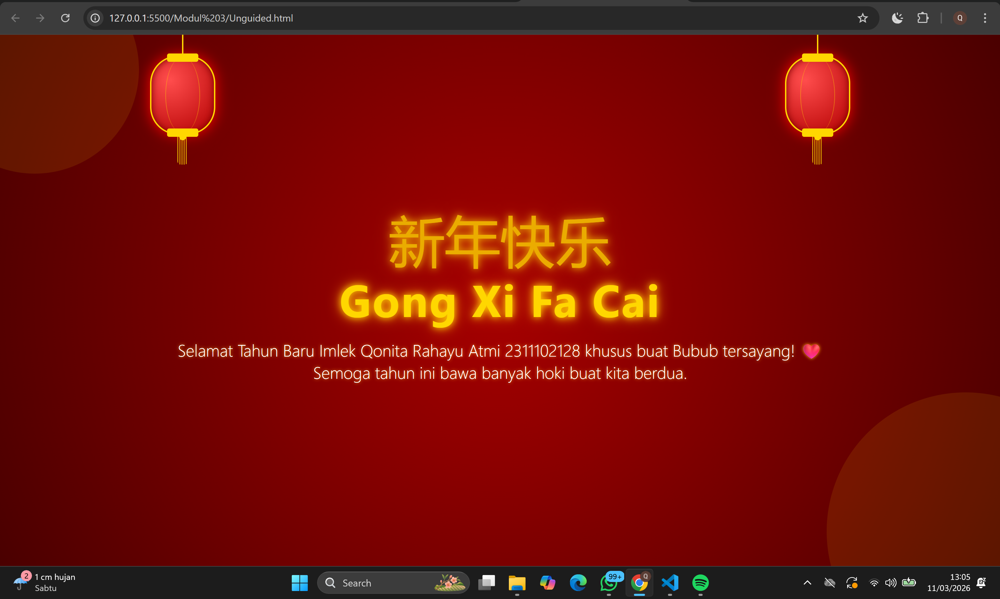

<div align="center">
  <br />
  <h1>LAPORAN PRAKTIKUM <br>APLIKASI BERBASIS PLATFORM</h1>
  <br />
  <h3>MODUL 3 <br> CSS (Cascading Style Sheet) </h3>
  <br />
  <br />
   
  <br />
  <br />
  <br />
  <h3>Disusun Oleh :</h3>
  <p>
    <strong>Qonita Rahayu Atmi</strong><br>
    <strong>2311102128</strong><br>
    <strong>S1 IF-11-REG01</strong><br>
  </p>
  <br />
  <h3>Dosen Pengampu :</h3>
  <p>
    <strong>Dimas Fanny Hebrasianto Permadi, S.ST., M.Kom</strong>
  </p>
  <br />
  <h3>Asisten Praktikum :</h3>
  <p>
    <strong>Apri Pandu Wicaksono</strong><br>
    <strong>Rangga Pradarrell Fathi</strong><br>
  </p>
  <br />
  <h3>LABORATORIUM HIGH PERFORMANCE<br>FAKULTAS INFORMATIKA <br>TELKOM UNIVERSITY PURWOKERTO <br>2026</h3>
</div>

---

# A. Dasar Teori

**1. CSS (Cascading Style Sheets)** adalah bahasa yang dirancang khusus untuk mengatur estetika visual dari halaman web yang telah disusun menggunakan HTML. Jika HTML berfungsi sebagai kerangka bangunan, maka CSS berperan sebagai desain interior yang menentukan bagaimana elemen-elemen tersebut dipresentasikan di layar peramban (browser), mulai dari tata letak, warna, hingga tipografi.

**2. Font Properties**adalah elemen yang sanagt penting dalam setiap halaman web. Oleh karena itu, pemilihan gaya tipografi yang tepat sangat menentukan kualitas visual serta kenyamanan pengguna saat membaca konten. Untuk mencapai tampilan yang estetis dan fungsional, CSS menyediakan berbagai Font Properties yang memungkinkan pengembang mengatur karakter teks secara mendetail.

**3. List Properties** adalah elemen yang berguna membuat sebuah list menggunakan simbol dan karakter. Tag yang digunakan adalah tag `<ul></ul>` atau `<ol></ol>`. Tag `<ul>` digunakan ketika akan menggunakan list dengan penanda berupa simbol atau bisa dikatakan unordered list, sedangkan tag `<ol>` digunakan ketika akan menggunakan list dengan penanda karakter yang memiliki urutan atau bisa dikatakan ordered list.

**4. Alignment of Text** adalah properti CSS yang berfungsi untuk mengatur posisi horizontal teks di dalam sebuah elemen atau wadah (container). Dalam desain web, pengaturan perataan ini sangat penting untuk menciptakan keseimbangan visual, memudahkan pengguna dalam membaca konten, serta mempertegas struktur informasi pada halaman.

**5. Colors** merupakan penting dalam web, namun pengaturan color teks dan latar belakang bisa dilakukan langsung menggunakan atribut di dalam tag HTML, hasil yang lebih maksimal dapat dicapai melalui CSS. Hal ini dikarenakan CSS menyediakan fitur pengaturan yang lebih mendalam dan fleksibel, sehingga memberikan keleluasaan lebih bagi desainer untuk menciptakan komposisi warna yang lebih baik dan terstruktur.

**6. Span & Div** Span merupakan elemen HTML yang dapat menangani perubahan konten elemen pada satu baris. Tag yang digunakan adalah `<span></span>`. Sedangkan Div merupakan elemen HTML yang digunakan untuk membuat section untuk beberapa elemen HTML di dalamnya. Tag yang digunakan yaitu `<div></div>`.

---

# Unguided

## SOAL :  Buat halaman untuk merayakan imlek ("karena bubub gua cina") hanya menggunakan css tanpa library dan tanpa js

### Kode HTML (`Unguided.html`)

```html
<!DOCTYPE html>
<html lang="id">
<head>
    <meta charset="UTF-8">
    <meta name="viewport" content="width=device-width, initial-scale=1.0">
    <title>Selamat Tahun Baru Imlek</title>
    <link rel="stylesheet" href="style.css">
</head>
<body>

    <div class="bg-circle c1"></div>
    <div class="bg-circle c2"></div>

    <div class="lantern-container left">
        <div class="lantern">
            <div class="lantern-cap top"></div>
            <div class="lantern-cap bottom"></div>
            <div class="tassel"></div>
        </div>
    </div>

    <div class="lantern-container right">
        <div class="lantern">
            <div class="lantern-cap top"></div>
            <div class="lantern-cap bottom"></div>
            <div class="tassel"></div>
        </div>
    </div>

    <div class="greeting-container">
        <span class="chinese-char">新年快乐</span>
        <h1 class="gong-xi">Gong Xi Fa Cai</h1>
        <p class="message">Selamat Tahun Baru Imlek Qonita Rahayu Atmi 2311102128 khusus buat Bubub tersayang! ❤️<br>Semoga tahun ini bawa banyak hoki buat kita berdua.</p>
    </div>

</body>
</html>
```

### Kode CSS (`style.css`)

```css
body {
    margin: 0;
    padding: 0;
    height: 100vh;
    background: radial-gradient(circle, #a70000, #4a0000);
    display: flex;
    justify-content: center;
    align-items: center;
    font-family: 'Segoe UI', Tahoma, Geneva, Verdana, sans-serif;
    overflow: hidden;
    color: #FFD700;
    text-align: center;
}

.greeting-container {
    z-index: 10;
    padding: 20px;
}

.gong-xi {
    font-size: 4rem;
    margin: 0;
    letter-spacing: 2px;
    text-shadow: 0 0 10px #FFD700, 0 0 20px #FF8C00;
}

.message {
    font-size: 1.5rem;
    margin-top: 15px;
    color: #fff;
    font-weight: 300;
    text-shadow: 0 0 5px #ffaa00;
}

.chinese-char {
    font-size: 5rem;
    margin-bottom: -10px;
    display: block;
    color: #FFD700;
    opacity: 0.8;
    text-shadow: 0 0 10px #FFD700, 0 0 20px #FF8C00;
}

.lantern-container {
    position: absolute;
    top: -20px;
    transform-origin: top center;
}

.lantern-container.left {
    left: 15%;
}

.lantern-container.right {
    right: 15%;
}

.lantern {
    width: 90px;
    height: 110px;
    background: radial-gradient(circle at 30% 30%, #ff4d4d, #b30000);
    border-radius: 40px;
    border: 2px solid #FFD700;
    position: relative;
    box-shadow: inset 0 0 10px #7a0000, 0 0 20px #ff0000;
    margin-top: 50px;
}

.lantern::after {
    content: '';
    position: absolute;
    top: 0;
    left: 20px;
    right: 20px;
    bottom: 0;
    border-left: 1px solid rgba(255, 215, 0, 0.4);
    border-right: 1px solid rgba(255, 215, 0, 0.4);
    border-radius: 50%;
}

.lantern::before {
    content: '';
    position: absolute;
    top: -50px;
    left: 50%;
    transform: translateX(-50%);
    width: 2px;
    height: 50px;
    background: #FFD700;
}

.lantern-cap {
    position: absolute;
    width: 45px;
    height: 12px;
    background: #FFD700;
    left: 50%;
    transform: translateX(-50%);
    border-radius: 3px;
    z-index: 2;
}

.lantern-cap.top {
    top: -5px;
}

.lantern-cap.bottom {
    bottom: -5px;
}

.tassel {
    position: absolute;
    bottom: -45px;
    left: 50%;
    transform: translateX(-50%);
    width: 15px;
    height: 40px;
    background: repeating-linear-gradient(to right, #FFD700, #FFD700 1px, transparent 1px, transparent 3px);
    border-radius: 0 0 5px 5px;
}

.tassel::before {
    content: '';
    position: absolute;
    top: -5px;
    left: 50%;
    transform: translateX(-50%);
    width: 10px;
    height: 10px;
    background: #FFD700;
    border-radius: 50%;
}

.bg-circle {
    position: absolute;
    border-radius: 50%;
    background: rgba(255, 215, 0, 0.1);
    z-index: 1;
}

.c1 {
    width: 300px;
    height: 300px;
    top: -100px;
    left: -100px;
}

.c2 {
    width: 400px;
    height: 400px;
    bottom: -150px;
    right: -150px;
}

@media (max-width: 600px) {
    .gong-xi {
        font-size: 2.5rem;
    }

    .message {
        font-size: 1.2rem;
    }

    .chinese-char {
        font-size: 3.5rem;
    }

    .lantern-container.left {
        left: 5%;
    }

    .lantern-container.right {
        right: 5%;
    }

    .lantern {
        width: 60px;
        height: 80px;
    }

    .lantern-cap {
        width: 35px;
    }
}
```
### Hasil Tampilan (Screenshot)



- **Penjelasan HTML**:
  - Pada baris 7, tag `<link>` digunakan untuk menyambungkan dokumen HTML utama ini ke dalam file CSS luar (`style.css`) agar kode desain tata letaknya terpisah.
  - Pada baris 11-12, elemen `<div>` kelas `bg-circle` digunakan untuk membuat objek dekoratif berbentuk dua buah lingkaran redup sebagai latar belakang.
  - Pada baris 14 dan 22, elemen `<div>` kelas `lantern-container` digunakan untuk membungkus ragam potongan bentuk lampion menjadi terkelompok di dalam satu kesatuan kerangka objek struktural.
  - Pada baris 30-34, elemen kelas `greeting-container` digunakan untuk mewadahi susunan rincian teks ucapan ("Gong Xi Fa Cai") agar berdiri terpusat rapi di satu wadah.

- **Penjelasan CSS**:
  - Pada baris 1, properti `radial-gradient` pada sistem `body` digunakan untuk menghasilkan skema warna latar berupa gradasi lingkaran memudar dari bercak terang tengah ke sisi gelap.
  - Pada baris 20-42, properti `text-shadow` pada target kelas teks digunakan secara lapis-ganda untuk mengeksplikasi efek pendaran tulisan seakan bercahaya oranye dan emas.
  - Pada baris 58, properti `border-radius: 40px` pada target lampion `.lantern` digunakan untuk memutus sudut siku kotak dan membengkokkannya sampai tervisualisasi bulat rapi seperti halnya silinder.
  - Pada baris 81, selektor pseudo-elemen `.lantern::before` digunakan untuk melukis rekayasa buatan tali garis pengikat secara tegak lurus pada atas badan lampion.
  - Pada baris 111, pewarnaan fungsi latar `repeating-linear-gradient` pada rumbai lampion `.tassel` digunakan untuk mencorak warna arsir bersilang dan berulang merepresentasikan serabut vertikal.
  - Pada baris 155, media query `@media` digunakan untuk mengatur perubahan porsi resolusi responsif yang mengecil pada parameter _font_ dan lampion jika diakses pada lebar dimensi telepon genggam.


## B. Kesimpulan
- Berdasarkan hasil praktikum yang telah dilakukan pada modul 3, dapat memahami alur kerja dasar (workflow) penerapan gaya visual pada halaman web menggunakan CSS, mulai dari penggunaan pemilih (selector), pengaturan tipografi, hingga manipulasi elemen tata letak yang kompleks. Melalui langkah-langkah implementasi properti seperti radial-gradient untuk latar belakang, text-shadow untuk efek cahaya, serta pemanfaatan pseudo-elements (::before/::after) , sebuah halaman perayaan Imlek yang estetis.

## C. Referensi
- [Materi Modul 3](https://drive.google.com/file/d/1kd7ogQkR_rsNCnKDcJDmavY8FiOyTLzs/view?usp=sharing)
