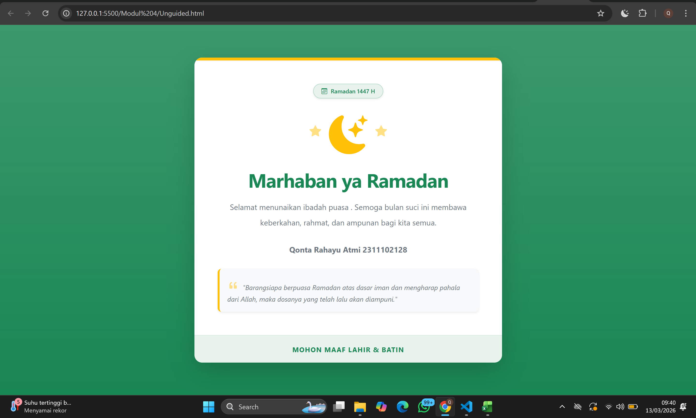

<div align="center">
  <br />
  <h1>LAPORAN PRAKTIKUM <br>APLIKASI BERBASIS PLATFORM</h1>
  <br />
  <h3>MODUL 4 <br> BOOTSTRAP</h3>
  <br />
  <br />
   
  <br />
  <br />
  <br />
  <h3>Disusun Oleh :</h3>
  <p>
    <strong>Qonita Rahayu Atmi</strong><br>
    <strong>2311102128</strong><br>
    <strong>S1 IF-11-REG01</strong><br>
  </p>
  <br />
  <h3>Dosen Pengampu :</h3>
  <p>
    <strong>Dimas Fanny Hebrasianto Permadi, S.ST., M.Kom</strong>
  </p>
  <br />
  <h3>Asisten Praktikum :</h3>
  <p>
    <strong>Apri Pandu Wicaksono</strong><br>
    <strong>Rangga Pradarrell Fathi</strong><br>
  </p>
  <br />
  <h3>LABORATORIUM HIGH PERFORMANCE<br>FAKULTAS INFORMATIKA <br>TELKOM UNIVERSITY PURWOKERTO <br>2026</h3>
</div>

---

# A. Dasar Teori

**1. Bootstrap** merupakan kerangka kerja (framework) front-end gratis yang dirancang untuk mempercepat dan mempermudah pengembangan antarmuka web. Proyek ini diinisiasi oleh Mark Otto dan Jacob Thornton di Twitter, lalu diluncurkan sebagai produk sumber terbuka (open source) di GitHub pada Agustus 2011. Bootstrap menyediakan berbagai desain berbasis HTML dan CSS yang mencakup elemen tipografi, formulir, tombol, navigasi, hingga fitur interaktif seperti carousel gambar dan plugin JavaScript opsional. Keunggulan utamanya terletak pada fitur desain responsif, yang memungkinkan tampilan web beradaptasi secara otomatis untuk memberikan pengalaman pengguna yang optimal di berbagai perangkat, mulai dari ponsel hingga desktop.


**2. Bootstrap Container** merupakan elemen paling dasar yang dibutuhkan dalam layouting menggunakan Bootstrap Grid. Container berbentuk class CSS yang sisipkan pada elemen HTML `<div>`.

**3. Bootstrap Grid** adalah fondasi utama dari framework Bootstrap yang digunakan untuk mengatur tata letak (layout) halaman web secara responsif. Sistem ini menggunakan serangkaian wadah (containers), baris (rows), dan kolom (columns) untuk menyusun dan menyelaraskan konten.

**4. Text Style** Bootstrap menyediakan berbagai class praktis untuk mengatur tampilan teks tanpa perlu menulis CSS manual. Fitur ini mencakup pengaturan perataan teks seperti rata kiri, tengah, atau kanan, serta transformasi huruf menjadi kecil semua, kapital, atau kapital di setiap awal kata. Selain itu, terdapat class untuk mengatur ketebalan huruf (bold, normal, light), memberikan gaya miring (italic), serta mengubah ukuran teks biasa agar memiliki tampilan visual menyerupai elemen heading H1 sampai H6.

**5. Bootstrap Table, Image & Button** Bootstrap menyediakan berbagai class untuk mengatur tampilan tabel, gambar, dan tombol agar lebih menarik dan responsif. Pada elemen tabel, class .table digunakan secara standar, namun dapat dikombinasikan dengan class lain seperti .table-dark untuk latar belakang gelap, .table-striped untuk baris belang, atau .table-hover untuk memberikan efek sorot saat kursor mendekat. Untuk elemen gambar, penggunaan class .img-fluid sangat penting agar ukuran gambar menjadi responsif mengikuti layar perangkat, sementara class .img-thumbnail memberikan bingkai kecil di sekitar gambar. Sedangkan pada tombol, Bootstrap menggunakan class dasar .btn yang dipadukan dengan variasi warna seperti .btn-primary, .btn-success, atau .btn-danger, serta pilihan ukuran seperti .btn-lg untuk ukuran besar dan .btn-sm untuk ukuran kecil guna meningkatkan pengalaman pengguna.

---

# Unguided

## SOAL :  Buat halaman ramadan dan gunakan bootstrap (sebisa mungkin tanpa meggunakan native css full bootstap)

### Kode HTML (`Unguided.html`)

```HTML
<!DOCTYPE html>
<html lang="id">
<head>
    <meta charset="UTF-8">
    <meta name="viewport" content="width=device-width, initial-scale=1.0">
    <title>Halaman Ramadan</title>
    <link href="https://cdn.jsdelivr.net/npm/bootstrap@5.3.2/dist/css/bootstrap.min.css" rel="stylesheet">
    <link rel="stylesheet" href="https://cdn.jsdelivr.net/npm/bootstrap-icons@1.11.1/font/bootstrap-icons.css">
</head>
<body class="bg-success bg-gradient d-flex justify-content-center align-items-center vh-100" style="font-family: system-ui, -apple-system, sans-serif;">

    <div class="container text-center">
        <div class="row justify-content-center">
            <div class="col-11 col-md-8 col-lg-6">
                <div class="card bg-white shadow-lg border-0 rounded-4 overflow-hidden">
                    
                    <div class="bg-warning" style="height: 6px; width: 100%;"></div>

                    <div class="card-body p-4 p-md-5">
                        
                        <div class="mb-4">
                            <span class="badge bg-success bg-opacity-10 text-success px-3 py-2 rounded-pill fw-semibold border border-success border-opacity-25 shadow-sm">
                                <i class="bi bi-calendar3 me-1"></i> Ramadan 1447 H
                            </span>
                        </div>

                        <div class="d-flex justify-content-center gap-3 mb-4">
                            <i class="bi bi-star-fill text-warning fs-4 opacity-50 mt-4"></i>
                            <i class="bi bi-moon-stars-fill text-warning display-1"></i>
                            <i class="bi bi-star-fill text-warning fs-4 opacity-50 mt-4"></i>
                        </div>
                        
                        <h1 class="fw-bolder text-success mb-3" style="letter-spacing: -1px;">Marhaban ya Ramadan</h1>
                        <p class="text-secondary fs-6 mb-4 px-lg-3 lh-lg">
                            Selamat menunaikan ibadah puasa . Semoga bulan suci ini membawa keberkahan, rahmat, dan ampunan bagi kita semua.
                        </p>

                        <p class="text-secondary fs-6 mb-4 px-lg-3 lh-lg">
                            <strong>Qonta Rahayu Atmi 2311102128</strong>
                        </p>
                        
                        <div class="p-3 bg-light rounded-3 text-start border-start border-warning border-4 shadow-sm">
                            <p class="fst-italic text-secondary small mb-0 lh-base">
                                <i class="bi bi-quote fs-4 text-warning opacity-50 me-1"></i>
                                "Barangsiapa berpuasa Ramadan atas dasar iman dan mengharap pahala dari Allah, maka dosanya yang telah lalu akan diampuni."
                            </p>
                        </div>

                    </div>

                    <div class="bg-success bg-opacity-10 py-3 border-top border-success border-opacity-10">
                        <small class="text-success fw-bold text-uppercase" style="letter-spacing: 1px;">Mohon Maaf Lahir & Batin</small>
                    </div>

                </div>
            </div>
        </div>
    </div>

    <script src="https://cdn.jsdelivr.net/npm/bootstrap@5.3.2/dist/js/bootstrap.bundle.min.js"></script>
</body>
</html>
```
### Hasil Tampilan (Screenshot)



- **Penjelasan**:
  - Pada baris 7, tag `<link>` digunakan untuk menghubungkan dokumen halaman dengan CSS eksternal dari framework Bootstrap melalui alamat URL, menyediakan kemudahan desain tanpa kustomisasi terpisah.
  - Pada baris 8, tambahan tag `<link>` digunakan untuk melayani pasokan font desain ikon pendukung milik web pustaka _Bootstrap Icons_.
  - Pada baris 10, kelas bawaan `bg-success` dan `bg-gradient` pada `<body>` diimplementasikan guna memberikan pergerakan gradasi warna hijau rata keseluruh latar belakang layar pengguna tanpa menulis CSS mandiri.
  - Pada baris 12-14, struktur responsif berbasis kelas _Grid_ dari kombinasi class pembungkus kerangka seperti `container`, `row`, serta batasan fraksi kolom `col-md-8` digunakan untuk menyejajarkan penempatan kartu pada pertengahan resolusi.
  - Pada baris 15, tag bersintaks `class="card"` digunakan pada sistem Bootstrap untuk menghasilkan pembatas elemen melayang berwarna cerah berlengkung sudut luwes radius (`rounded-4`) serta berbayangan menjulang tinggi (`shadow-lg`).
  - Pada baris 22, kelas _utility_ `badge` kombinasi properti pembingkai melengkung pepat `rounded-pill` digunakan untuk mengonversi tampilan baris teks keterangan hari puasa tersebut menyerupai sepetak kapsul kecil berlartar hijau.
  - Pada baris 27-31, tata letak sejenis _flexbox_ yakni `<div class="d-flex">` digunakan untuk merapat serta menjajarkan sekumpulan ikon bentuk rembulan bintang secara sejajar menyamping serentak di dalam balok utamanya.
  - Pada baris 33-36, kelas `fw-bolder` digunakan untuk mempertebal secara ganda intensitas tulisan judul (heading) sapaan utama "Marhaban ya Ramadan".
  - Pada baris 38, pemakaian tag batas sisi awal `border-start border-warning` difungsikan guna menandai tepian corak batasan margin berwarna tajam di sebelah irisan teks bagian petikan kutipan pesan hadis pencerahan.
  - Pada baris 56, susunan tag `<script src="...">` digunakan melampirkan modul pendukung integrasi kendali _interactivity_ program _JavaScript_ Bootstrap di porsi paling ujung blok penolakan bodi agar tampilan dimuat utuh.

## B. Kesimpulan
- Berdasarkan hasil praktikum yang telah dilakukan pada modul 4, dapat memahami alur kerja Bootstrap,dengan baik dan benar dalam penerapannya. Melalui langkah-langkah seperti container, card, d-flex, dan sistem pewarnaan responsif, setelah itu halaman bertema Ramadan yang estetis.

## C. Referensi
- [Materi Modul 4](https://drive.google.com/file/d/1TW5Y0AdzkVk24ThPUf1OQNs2Mnw3XNO5/view?usp=sharing)
