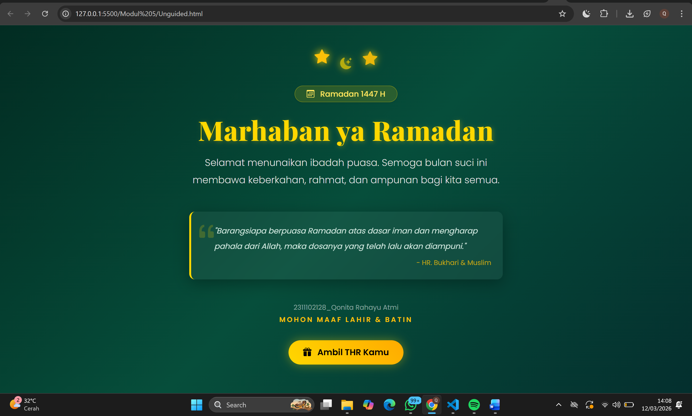
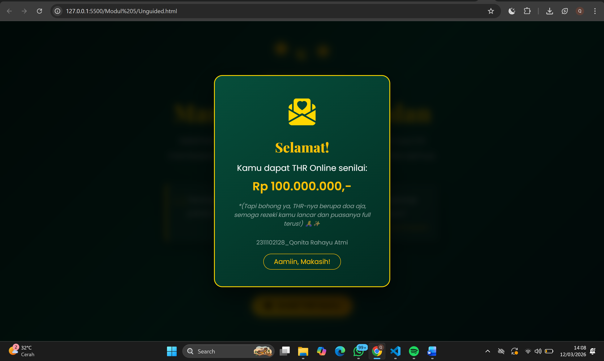

<div align="center">
  <br />
  <h1>LAPORAN PRAKTIKUM <br>APLIKASI BERBASIS PLATFORM</h1>
  <br />
  <h3>MODUL 5 <br> JAVASCRIPT & JQUERY </h3>
  <br />
  <br />
   
  <br />
  <br />
  <br />
  <h3>Disusun Oleh :</h3>
  <p>
    <strong>Qonita Rahayu Atmi</strong><br>
    <strong>2311102128</strong><br>
    <strong>S1 IF-11-REG01</strong><br>
  </p>
  <br />
  <h3>Dosen Pengampu :</h3>
  <p>
    <strong>Dimas Fanny Hebrasianto Permadi, S.ST., M.Kom</strong>
  </p>
  <br />
  <h3>Asisten Praktikum :</h3>
  <p>
    <strong>Apri Pandu Wicaksono</strong><br>
    <strong>Rangga Pradarrell Fathi</strong><br>
  </p>
  <br />
  <h3>LABORATORIUM HIGH PERFORMANCE<br>FAKULTAS INFORMATIKA <br>TELKOM UNIVERSITY PURWOKERTO <br>2026</h3>
</div>

---

# A. Dasar Teori

**1. JavaScrip** adalah  bahasa  pemrograman  yang  biasa  digunakan  bersama  kode  HTML  untuk menentukan suatu tindakan, dan  digunakan  untuk membuat web lebih dinamis dan interaktif. Tujuannya untuk mengendalikan program Java, komunitas Javascript menggunakan bahasa ini untuk tujuan lain, memanipulasi gambar dan isi dari dokumen HTML.
- **Sintaks Umum pada Javascript** terdapat sintaks umum yaitu: Tipe data dasar, Variabel, Array, dan Pengendalian Struktur. 
- **Object Orientation pada Javascript** Javascript memiliki dua jenis tipe data utama, yaitu tipe data dasar dan objek. Tipe data dasar pada Javascript adalah angka (numbers), rentetan karakter (strings), boolean (true dan false), null, dan undefined. Nilai-nilai selain tipe data dasar secara otomatis dianggap sebagai objek.
- **Function pada Javascript** fungsi adalah sebuah wadah yang berisi kumpulan instruksi. Pada saat memanggil fungsi tersebut, semua instruksi di dalamnya otomatis berjalan. Fungsi sangat berguna agar tidak perlu menulis kode yang sama berulang kali (code reuse) dan untuk menyembunyikan detail proses yang rumit. 

**2. jQuery** adalah sebuah library JavaScript ringan yang diciptakan oleh John Resig pada tahun 2006, yang dirancang untuk menyederhanakan proses manipulasi dokumen HTML (DOM), penanganan event, pembuatan animasi, serta memfasilitasi integrasi AJAX hanya dengan menggunakan beberapa baris kode, dan ada beberapa fitur utama, yaitu:
- DOM manipulation – jQuery memungkinkan untuk memodifikasi DOM (Document Object Model) menggunakan source selector yang disebut dengan Sizzle.
- Event Handling – jQuery dapat menangani sebuah aksi pada dokumen HTML seperti saat pengguna melakukan click pada sebuah objek.
- Ajax Support – jQuery dapat memfasilitasi pembuatan website menggunakan teknologi AJAX.
- Animations – pada jQuery terdapat build-in animasi yang dapat digunakan

---

# Unguided

##  SOAL :  Buka kembali halaman ramadan dan tambahkan button atau semacam nya ketika di klik akan menampilkan modal "selamat anda mendapatkan THR" buat se interaktif itu dan sebagus mungkin.

### Kode HTML (`Unguided.html`)

```html
<!DOCTYPE html>
<html lang="id">
<head>
    <meta charset="UTF-8">
    <meta name="viewport" content="width=device-width, initial-scale=1.0">
    <title>Marhaban Ya Ramadan 1447 H - Qonita Rahayu Atmi</title>
    
    <link href="https://cdn.jsdelivr.net/npm/bootstrap@5.3.2/dist/css/bootstrap.min.css" rel="stylesheet">
    <link rel="stylesheet" href="https://cdn.jsdelivr.net/npm/bootstrap-icons@1.11.1/font/bootstrap-icons.css">
    <link href="https://fonts.googleapis.com/css2?family=Playfair+Display:ital,wght@0,600;0,800;1,600&family=Poppins:wght@300;400;500;600&display=swap" rel="stylesheet">
    
    <link rel="stylesheet" href="style.css">
</head>
<body>

    <div class="container text-center px-4" style="max-width: 700px; z-index: 1;">
        
        <div class="d-flex justify-content-center align-items-center gap-4 mb-4">
            <i class="bi bi-star-fill text-warning fs-3 floating-star star-1"></i>
            <i class="bi bi-moon-stars-fill display-2 text-warning floating-star star-2"></i>
            <i class="bi bi-star-fill text-warning fs-3 floating-star star-3"></i>
        </div>

        <div class="mb-4">
            <span class="badge badge-tahun px-4 py-2 rounded-pill fw-medium fs-6 shadow-sm">
                <i class="bi bi-calendar3 me-2"></i> Ramadan 1447 H
            </span>
        </div>
        
        <h1 class="fw-bold mb-3 display-4">Marhaban ya Ramadan</h1>
        
        <p class="fs-5 mb-5 fw-light text-light-custom">
            Selamat menunaikan ibadah puasa. Semoga bulan suci ini membawa keberkahan, rahmat, dan ampunan bagi kita semua.
        </p>
        
        <div class="glass-panel p-4 text-start mb-5 position-relative">
            <i class="bi bi-quote position-absolute top-0 start-0 ms-2 mt-2 quote-icon"></i>
            <p class="fst-italic fs-6 mb-0 lh-lg ms-4 text-quote">
                "Barangsiapa berpuasa Ramadan atas dasar iman dan mengharap pahala dari Allah, maka dosanya yang telah lalu akan diampuni."
            </p>
            <small class="d-block mt-2 text-end text-warning opacity-75">- HR. Bukhari & Muslim</small>
        </div>

        <p class="text-white-50 small mb-1">2311102128_Qonita Rahayu Atmi</p>

        <p class="fw-semibold text-uppercase tracking-widest text-warning mb-4 title-maaf">
            Mohon Maaf Lahir & Batin
        </p>

        <button onclick="bukaTHR()" class="btn btn-thr mt-2">
            <i class="bi bi-gift-fill me-2"></i> Ambil THR Kamu
        </button>

    </div>

    <div class="modal-overlay" id="thrModal" onclick="tutupTHR(event)">
        <div class="thr-card" onclick="event.stopPropagation()">
            <div class="amplop-icon">
                <i class="bi bi-envelope-paper-heart-fill"></i>
            </div>
            <h2 class="text-warning fw-bold mb-3 modal-title-custom">Selamat!</h2>
            <p class="mb-3 fs-5 text-light">
                Kamu dapat THR Online senilai:<br>
                <span class="fs-3 fw-bold text-warning d-block mt-2">Rp 100.000.000,-</span>
            </p>
            <p class="text-white-50 small mb-4 fst-italic">
                *(Tapi bohong ya, THR-nya berupa doa aja, semoga rezeki kamu lancar dan puasanya full terus!) 🙏✨
            </p>

            <p class="text-white-50 small mb-3">2311102128_Qonita Rahayu Atmi</p>

            <button onclick="tutupTHR(event)" class="btn btn-outline-warning rounded-pill px-4">
                Aamiin, Makasih!
            </button>
        </div>
    </div>

    <script src="https://cdn.jsdelivr.net/npm/bootstrap@5.3.2/dist/js/bootstrap.bundle.min.js"></script>
    
    <script src="script.js"></script>
</body>
</html>
```

### Kode CSS (`style.css`)

```css
:root {
    --ramadan-gold: #ffd700;
    --ramadan-gold-light: #ffe55c;
}

body {
    font-family: 'Poppins', sans-serif;
    background: linear-gradient(135deg, #022c22 0%, #064e3b 50%, #042f2e 100%);
    color: white;
    min-height: 100vh;
    display: flex;
    align-items: center;
    justify-content: center;
    overflow-x: hidden;
    position: relative;
}

.floating-star {
    animation: float 4s ease-in-out infinite;
    text-shadow: 0 0 15px var(--ramadan-gold);
}
.star-1 { animation-delay: 0s; }
.star-2 { 
    animation-delay: 1.5s; 
    font-size: 1.5rem !important; 
    color: var(--ramadan-gold) !important;
}
.star-3 { animation-delay: 3s; }

@keyframes float {
    0% { transform: translateY(0px) scale(1); opacity: 0.7; }
    50% { transform: translateY(-15px) scale(1.1); opacity: 1; }
    100% { transform: translateY(0px) scale(1); opacity: 0.7; }
}

h1 {
    font-family: 'Playfair Display', serif;
    color: var(--ramadan-gold);
    text-shadow: 2px 2px 10px rgba(255, 215, 0, 0.3);
    letter-spacing: 1px;
}

.text-light-custom {
    color: #e0e0e0; 
    line-height: 1.8;
}

.title-maaf {
    letter-spacing: 3px; 
    font-size: 0.9rem;
}

.badge-tahun {
    background: rgba(255, 215, 0, 0.15);
    border: 1px solid rgba(255, 215, 0, 0.3);
    color: var(--ramadan-gold-light);
    backdrop-filter: blur(5px);
}

.glass-panel {
    background: rgba(255, 255, 255, 0.05);
    backdrop-filter: blur(10px);
    -webkit-backdrop-filter: blur(10px);
    border-left: 4px solid var(--ramadan-gold);
    border-radius: 12px;
    box-shadow: 0 8px 32px 0 rgba(0, 0, 0, 0.3);
}

.quote-icon {
    font-size: 3rem; 
    color: rgba(255, 215, 0, 0.2);
}

.text-quote {
    color: #d1e8df;
}

.btn-thr {
    background: linear-gradient(45deg, var(--ramadan-gold), #ffaa00);
    color: #000;
    font-weight: 600;
    font-size: 1.1rem;
    border: none;
    border-radius: 50px;
    padding: 12px 30px;
    box-shadow: 0 0 20px rgba(255, 215, 0, 0.4);
    transition: all 0.3s ease;
    position: relative;
    overflow: hidden;
}

.btn-thr:hover {
    transform: translateY(-3px) scale(1.05);
    box-shadow: 0 0 30px rgba(255, 215, 0, 0.6);
    color: #000;
}

.modal-overlay {
    position: fixed;
    top: 0; left: 0; width: 100%; height: 100%;
    background: rgba(0, 0, 0, 0.8);
    backdrop-filter: blur(8px);
    display: flex;
    align-items: center;
    justify-content: center;
    z-index: 9999;
    opacity: 0;
    visibility: hidden;
    transition: all 0.4s ease;
}

.modal-overlay.active {
    opacity: 1;
    visibility: visible;
}

.thr-card {
    background: linear-gradient(145deg, #064e3b, #022c22);
    border: 2px solid var(--ramadan-gold);
    border-radius: 20px;
    padding: 40px 30px;
    text-align: center;
    transform: scale(0.7) translateY(50px);
    transition: all 0.5s cubic-bezier(0.175, 0.885, 0.32, 1.275);
    box-shadow: 0 20px 50px rgba(0,0,0,0.5);
    max-width: 90%;
    width: 420px;
}

.modal-overlay.active .thr-card {
    transform: scale(1) translateY(0);
}

.modal-title-custom {
    font-family: 'Playfair Display', serif;
}

.amplop-icon {
    font-size: 4rem;
    color: var(--ramadan-gold);
    margin-bottom: 15px;
    display: inline-block;
}
```
### Kode JS (`script.js`)

```javascript
const modal = document.getElementById('thrModal');

function bukaTHR() {
    modal.classList.add('active');
}

function tutupTHR(e) {
    if (e) {
        e.preventDefault();
    }
    modal.classList.remove('active');
}
```
### Hasil Tampilan (Screenshot)




- **Penjelasan HTML**:
  - Pada baris 8-9, tag `<link>` digunakan untuk menghubungkan file CSS eksternal dari CDN (Content Delivery Network), yaitu Bootstrap 5 untuk sistem tata letak dan Bootstrap Icons untuk menampilkan ikon seperti bintang dan bulan.

  - Pada baris 10, tag `<link>` digunakan untuk memanggil Google Fonts (Playfair Display dan Poppins) guna memberikan tampilan tipografi yang estetis dan modern.

  - Pada baris 12, tag `<link>` menghubungkan file style.css lokal yang berisi pengaturan gaya khusus, termasuk animasi dan efek glassmorphism.

  - Pada baris 17-21, elemen `<div>` dengan kelas d-flex digunakan sebagai pembungkus ikon dekoratif. Di dalamnya terdapat tag `<i>` yang menampilkan ikon bintang dan bulan dengan kelas animasi floating-star.

  - Pada baris 33-39, elemen `<div>` dengan kelas glass-panel berfungsi sebagai wadah untuk menampilkan kutipan hadits dengan gaya visual panel transparan yang elegan.

  - Pada baris 48-50, elemen `<button>` dengan atribut onclick="bukaTHR()" digunakan untuk membuat tombol interaktif yang, saat diklik, akan menjalankan fungsi JavaScript untuk menampilkan pesan hadiah.

  - Pada baris 54-73, elemen `<div>` dengan id="thrModal" digunakan untuk membuat struktur Modal (Pop-up). Elemen ini memiliki kelas modal-overlay yang secara default diatur agar tersembunyi dan hanya muncul saat tombol THR ditekan.

  - Pada baris 76-78, tag `<script>` digunakan untuk menyisipkan logika program. Baris 76 memanggil library JavaScript dari Bootstrap, sementara baris 78 memanggil file lokal script.js untuk menangani interaksi klik pada halaman.

- **Penjelasan CSS**:
  - Pada baris 1-4, terdapat penggunaan CSS Variables (:root) untuk menyimpan kode warna emas (--ramadan-gold). Ini memudahkan pengelolaan warna agar konsisten di seluruh elemen.

  - Pada baris 6-17, bagian body menggunakan Linear Gradient untuk menciptakan latar belakang gelap bernuansa hijau islami yang dalam, serta menggunakan display: flex agar konten selalu berada tepat di tengah layar.

  - Pada baris 19-35, terdapat definisi Animasi Keyframes (@keyframes float). Animasi ini memberikan efek "mengapung" dan perubahan opasitas pada ikon bintang dan bulan secara terus-menerus.

  - Pada baris 37-42, tag h1 diberikan sentuhan font Playfair Display dengan efek text-shadow agar teks judul terlihat bercahaya (efek glow).

  - Pada baris 53-57, kelas .badge-tahun menerapkan teknik Backdrop Filter (Blur). Ini memberikan efek kaca transparan pada teks "Ramadan 1447 H" sehingga terlihat menyatu dengan latar belakang.

  - Pada baris 59-66, kelas .glass-panel menggunakan konsep Glassmorphism. Dengan kombinasi background: rgba(...) dan backdrop-filter: blur(10px), kotak hadits terlihat seperti kaca buram yang elegan.

  - Pada baris 78-93, desain tombol .btn-thr dibuat dengan gradasi warna emas dan efek hover (transisi). Saat kursor diarahkan, tombol akan sedikit membesar (scale) dan bayangannya menguat.

  - Pada baris 96-121, terdapat pengaturan untuk Modal Overlay. Menggunakan position: fixed dan z-index: 9999 agar jendela pop-up THR muncul di lapisan paling depan, lengkap dengan efek transisi halus saat muncul (opacity dan transform).

- **Penjelasan JS**:
  - Pada baris 1, perintah document.getElementById('thrModal') digunakan untuk mengambil elemen HTML dengan ID thrModal (jendela pop-up) dan menyimpannya ke dalam variabel const modal agar bisa dimanipulasi lebih lanjut.

  - Pada baris 3-5, fungsi bukaTHR() didefinisikan untuk menambahkan class CSS bernama 'active' ke dalam elemen modal. Class inilah yang memicu perubahan properti opacity dan visibility pada CSS sehingga pop-up THR muncul di layar.

  - Pada baris 7-12, fungsi tutupTHR(e) digunakan untuk menyembunyikan kembali jendela pop-up dengan cara menghapus class 'active' dari elemen modal.

  - Pada baris 8-10, terdapat pengecekan parameter e. Jika fungsi dipanggil dengan sebuah event, maka e.preventDefault() akan dijalankan untuk mencegah perilaku default browser yang tidak diinginkan (seperti scrolling atau refreshing yang tidak sengaja).

## B. Kesimpulan
- Berdasarkan hasil praktikum yang telah dilakukan pada modul 5, dapat memahami alur kerja dasar (workflow) pembuatan halaman web yang dinamis dan interaktif menggunakan JavaScript. Melalui langkah-langkah implementasi fungsi seperti bukaTHR() dan tutupTHR(), serta integrasi variabel untuk manipulasi DOM, setelah itu fitur interaktif berupa modal pop-up "THR Online" yang responsif dan menarik berhasil dibuat.

## C. Referensi
- [Materi Modul 5](https://drive.google.com/file/d/1J27NhEO2MbOF9DetZmOtEGAcPkczzm1r/view?usp=sharing)