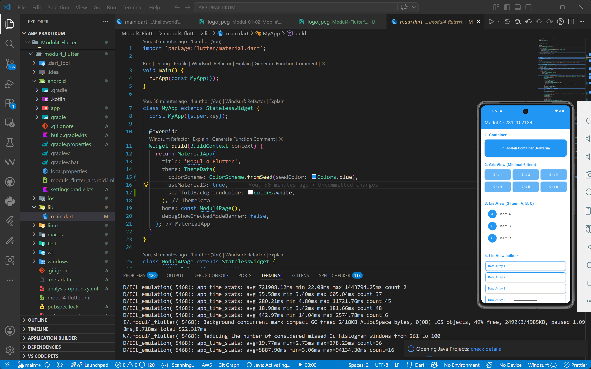
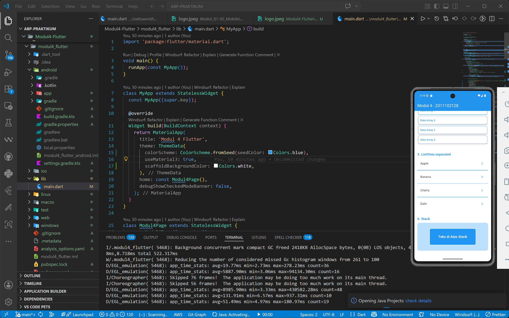

<div align="center">
  <br />
  <h1>LAPORAN PRAKTIKUM <br>APLIKASI BERBASIS PLATFORM</h1>
  <br />
  <h3>MODUL 3 & 4 <br> MOBILE</h3>
  <br />
  <br />
  
  <br />
  <br />
  <br />
  <h3>Disusun Oleh :</h3>
  <p>
    <strong>Qonita Rahayu Atmi</strong><br>
    <strong>2311102128</strong><br>
    <strong>S1 IF-11-REG01</strong><br>
  </p>
  <br />
  <h3>Dosen Pengampu :</h3>
  <p>
    <strong>Dimas Fanny Hebrasianto Permadi, S.ST., M.Kom</strong>
  </p>
  <br />
  <h3>Asisten Praktikum :</h3>
  <p>
    <strong>Apri Pandu Wicaksono</strong><br>
    <strong>Rangga Pradarrell Fathi</strong><br>
  </p>
  <br />
  <h3>LABORATORIUM HIGH PERFORMANCE<br>FAKULTAS INFORMATIKA <br>TELKOM UNIVERSITY PURWOKERTO <br>2026</h3>
</div>

---

# A. Dasar Teori

- **Flutter** adalah framework atau Software Development Kit (SDK) open source yang dikembangkan oleh Google untuk membangun aplikasi mobile, web, dan desktop dalam satu basis kode (single codebase). Flutter digunakan untuk mengembangkan aplikasi pada sistem operasi Android dan iOS secara lebih efisien karena pengembang hanya perlu menulis satu kali kode program untuk berbagai platform. Flutter menggunakan bahasa pemrograman Dart serta didukung oleh Skia Graphics Engine sehingga mampu menghasilkan tampilan antarmuka pengguna (user interface/UI) yang menarik, responsif, dan memiliki performa tinggi. Selain itu, Flutter menyediakan berbagai widget yang dapat disesuaikan, seperti Material Design dan Cupertino, sehingga memudahkan pengembang dalam membuat antarmuka aplikasi yang modern dan interaktif.
- **Widget** adalah konsep dasar dan inti dari pembuatan UI dalam Flutter. Segala sesuatu yang terlihat di layar aplikasi Flutter adalah Widget. Terdapat dua jenis widget utama: *StatelessWidget* (tidak memiliki state/perubahan data) dan *StatefulWidget* (memiliki state yang dapat berubah-ubah).
- **Container** merupakan widget praktis yang menggabungkan fitur widget dasar seperti *padding*, *margin*, *alignment*, dan *decoration* (seperti warna latar belakang, border, atau bayangan).
- **GridView** adalah widget scrollable yang menampilkan elemen dalam bentuk grid 2 dimensi (baris dan kolom).
- **ListView** adalah widget scrollable yang menampilkan daftar linear anak widget secara berurutan. Ini adalah widget list yang paling sering digunakan pada Flutter.
- **ListView.builder** adalah varian ListView yang membuat item widget secara dinamis (*on-demand*) saat akan ditampilkan di layar, sangat cocok untuk menampilkan array/data yang sangat banyak atau tidak terhingga panjangnya.
- **ListView.separated** hampir mirip dengan `ListView.builder`, namun memiliki konstruktor tambahan untuk membuat batas pemisah (separator) di antara masing-masing item list.
- **Stack** adalah widget yang memungkinkan beberapa anak widget saling tumpang tindih (*overlap*). Anak pertama yang diletakkan pada Stack akan berada di posisi paling bawah, dan anak berikutnya ditumpuk di atasnya.

---

# B. Soal

## Deskripsi Tugas

Buat 1 project Flutter yang menampilkan beberapa widget UI berikut:
- **Container** → kotak berwarna
- **GridView** → minimal 6 item (grid)
- **ListView** → 3 item (A, B, C)
- **ListView.builder** → list dari data array
- **ListView.separated** → list + garis pembatas
- **Stack** → tampilan bertumpuk (kotak / text)
---

# C. Kode Program

### 1. Container (Kotak Berwarna)

```dart
Container(
  height: 80,
  width: double.infinity,
  decoration: BoxDecoration(
    color: Colors.blue,
    borderRadius: BorderRadius.circular(12),
    boxShadow: const [
      BoxShadow(color: Colors.black12, blurRadius: 4, offset: Offset(2, 2)),
    ],
  ),
  alignment: Alignment.center,
  child: const Text(
    'Ini adalah Container Berwarna',
    style: TextStyle(color: Colors.white, fontSize: 16, fontWeight: FontWeight.bold),
  ),
)
```

**Penjelasan:**  
Widget `Container` ini dirancang sebagai kotak teks yang memiliki lebar penuh (`double.infinity`) dan tinggi 80 piksel. Properti `BoxDecoration` digunakan untuk mengatur tampilan visual kotak, yaitu memberikannya warna dasar biru (`Colors.blue`), membuat ujung sudutnya melengkung sebesar 12 piksel, dan memberikan bayangan tipis (`boxShadow`) agar kotak terlihat memiliki efek menonjol. Teks di dalamnya secara otomatis diposisikan ke bagian tengah karena pengaturan `alignment: Alignment.center`.

### 2. GridView (Minimal 6 Item)

```dart
GridView.count(
  crossAxisCount: 3, 
  crossAxisSpacing: 8,
  mainAxisSpacing: 8,
  childAspectRatio: 2.5,
  shrinkWrap: true,
  physics: const NeverScrollableScrollPhysics(), 
  children: List.generate(6, (index) {
    return Container(
      decoration: BoxDecoration(
        color: Colors.blue.shade300,
        borderRadius: BorderRadius.circular(8),
      ),
      alignment: Alignment.center,
      child: Text('Grid ${index + 1}', style: const TextStyle(color: Colors.white, fontWeight: FontWeight.bold)),
    );
  }),
)
```

**Penjelasan:**  
`GridView.count` digunakan untuk membuat struktur tata letak berwujud jaring (grid). Properti `crossAxisCount: 3` menetapkan batas kolom maksimal sejumlah tiga lajur. Pengaturan `shrinkWrap: true` bersama `NeverScrollableScrollPhysics()` diterapkan untuk memastikan grid menyesuaikan tingginya secara presisi dengan seluruh kontennya dan mencegah bentrokan fitur geser (scroll) saat diletakkan di dalam `SingleChildScrollView`. Fungsi perulangan `List.generate(6, ...)` membuat 6 buah kotak bertuliskan "Grid 1" hingga "Grid 6" secara efisien tanpa harus diketik berulang.

### 3. ListView (3 Item A, B, C)

```dart
ListView(
  shrinkWrap: true,
  physics: const NeverScrollableScrollPhysics(),
  children: const [
    ListTile(leading: CircleAvatar(backgroundColor: Colors.blue, child: Text('A', style: TextStyle(color: Colors.white))), title: Text('Item A')),
    ListTile(leading: CircleAvatar(backgroundColor: Colors.blue, child: Text('B', style: TextStyle(color: Colors.white))), title: Text('Item B')),
    ListTile(leading: CircleAvatar(backgroundColor: Colors.blue, child: Text('C', style: TextStyle(color: Colors.white))), title: Text('Item C')),
  ],
)
```

**Penjelasan:**  
`ListView` untuk menyusun komponen anaknya menjadi deretan vertikal dari atas ke bawah. Pada widget ini didaftarkan tiga elemen list statis berupa deretan `ListTile`. Masing-masing baris memiliki simbol `CircleAvatar` (ikon lingkaran) berwarna biru di sisi kiri (`leading`) yang memuat inisial abjad warna putih. 

### 4. ListView.builder (List dari data array)

```dart
final List<String> builderData = ['Data Array 1', 'Data Array 2', 'Data Array 3', 'Data Array 4'];

ListView.builder(
  shrinkWrap: true,
  physics: const NeverScrollableScrollPhysics(),
  itemCount: builderData.length,
  itemBuilder: (context, index) {
    return Card(
      color: Colors.white,
      elevation: 2,
      shape: RoundedRectangleBorder(
        side: const BorderSide(color: Colors.blue, width: 1),
        borderRadius: BorderRadius.circular(8),
      ),
      child: Padding(
        padding: const EdgeInsets.all(12.0),
        child: Text(builderData[index], style: const TextStyle(fontWeight: FontWeight.w500, color: Colors.blue)),
      ),
    );
  },
)
```

**Penjelasan:**  
`ListView.builder` digunakan untuk membangun sekumpulan item daftar bersumber dari data mentah/array (`builderData`) secara terotomatisasi. Sistem hanya merender widget `Card` sebatas mana layar mampu menampilkannya. Parameter `itemCount` mengunci jumlah batas rendering agar persis setara dengan panjang ukuran data array-nya untuk menghindari pesan galat pembacaan indeks (*out of bounds*).

### 5. ListView.separated (List + garis pembatas)

```dart
final List<String> separatedData = ['Apple', 'Banana', 'Cherry', 'Date'];

ListView.separated(
  shrinkWrap: true,
  physics: const NeverScrollableScrollPhysics(),
  itemCount: separatedData.length,
  separatorBuilder: (context, index) => const Divider(color: Colors.blue, thickness: 1.5),
  itemBuilder: (context, index) {
    return ListTile(
      title: Text(separatedData[index], style: const TextStyle(color: Colors.black87)),
      trailing: const Icon(Icons.arrow_forward_ios, size: 16, color: Colors.blue),
    );
  },
)
```

**Penjelasan:**  
`ListView.separated` membagikan cara kerja fungsional yang serupa dengan *ListView.builder*, perbedaannya mengerucut pada tambahan paramater spesifik `separatorBuilder`. Fungsi `separatorBuilder` untuk merender objek `Divider` yaitu sebentang garis horisontal berwarna biru setebal 1.5 piksel, yang nantinya secara intermiten memisahkan baris nama buah. Jadi, data tampil lebih berjarak, rapi, dan mudah dibaca secara individual.

### 6. Stack (Tampilan Bertumpuk)

```dart
Stack(
  alignment: Alignment.center,
  children: [
    Container(
      height: 150,
      width: double.infinity,
      decoration: BoxDecoration(
        color: Colors.blue.shade100,
        borderRadius: BorderRadius.circular(12),
      ),
    ),
    Container(
      height: 90,
      width: 250,
      decoration: BoxDecoration(
        color: Colors.blue,
        borderRadius: BorderRadius.circular(8),
        border: Border.all(color: Colors.white, width: 2),
      ),
    ),
    const Text(
      'Teks di Atas Stack',
      style: TextStyle(color: Colors.white, fontSize: 18, fontWeight: FontWeight.bold),
    ),
  ],
)
```

**Penjelasan:**  
Penggunaan widget `Stack` membuat antarmuka aplikasi dengan penempatan visual berlapis layaknya tumpukan kertas (menggunakan metode koordinat kartesian kedalaman *Z-Axis*). Semua elemen diposisikan sejajar di tengah area dengan parameter `alignment: Alignment.center`. Hierarki kedalaman penumpukan ditentukan dari susunan urutan `children`. Secara berurutan: wadah dasar *Container* biru muda diletakkan di bawah, lalu tertimpa *Container* biru pekat yang lebih kecil, dan pada akhirnya ditutupi susunan paling atas berupa *Text* tulisan berwarna putih murni.

---

# D. Hasil Tampilan (Screenshot)




---

# E. Kesimpulan

Praktikum Modul 4 ini membuat antarmuka (UI) di Flutter. Penggunaan **Container** dan **Stack** dapat memodifikasi desain kotak serta menyusun elemen visual secara bertumpuk. Sementara itu, varian widget **GridView** dan **ListView** (termasuk *builder* dan *separated*) sangat penting dan efisien untuk menyusun daftar data berulang baik secara vertikal maupun berbentuk grid sehingga menghasilkan tampilan aplikasi yang dinamis, responsif.

---

# F. Referensi

- [R. Fadilla and T. Wiharko, "Penerapan Metode Forward Chaining Dalam Sistem Pakar Deteksi Kerusakan Hardware Komputer Berbasis Android," Digital Transformation Technology (Digitech), vol. 3, no. 2, Sep. 2023.](https://itscience-indexing.com/jurnal/index.php/digitech/article/view/2784/2205)

