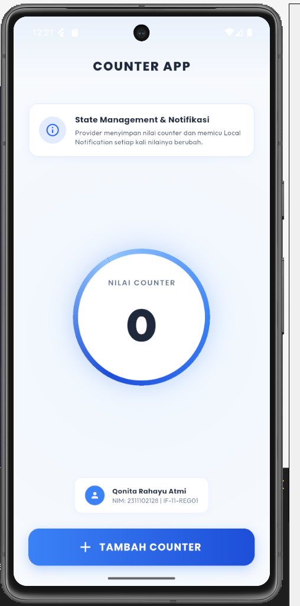
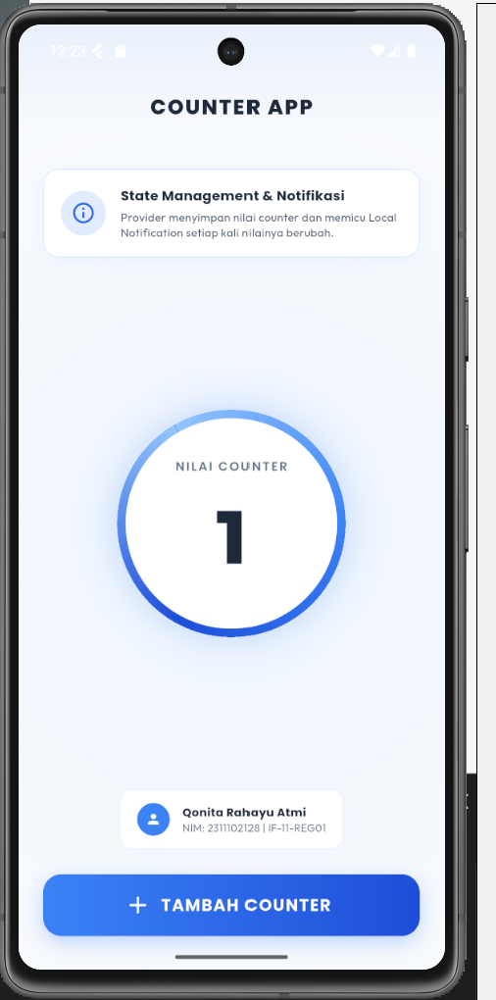
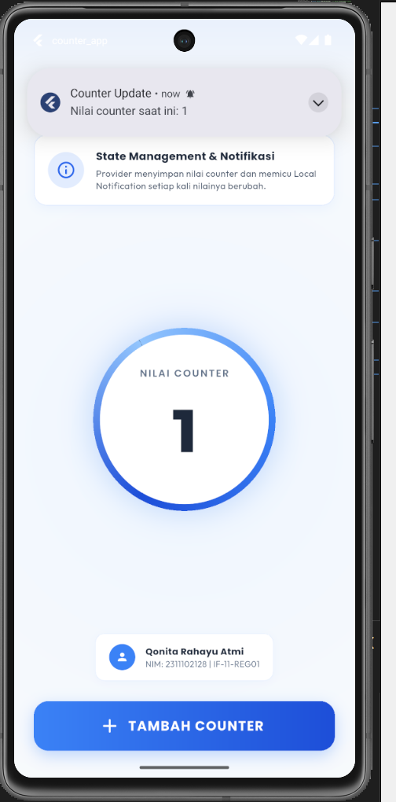

<div align="center">
  <br />
  <h1>LAPORAN PRAKTIKUM <br>APLIKASI BERBASIS PLATFORM</h1>
  <br />
  <h3>MODUL 12 & 13 <br> IMPLEMENTASI PROVIDER & NOTIFIKASI PADA FLUTTER </h3>
  <br />
  <br />
  
  <br />
  <br />
  <br />
  <h3>Disusun Oleh :</h3>
  <p>
    <strong>Qonita Rahayu Atmi</strong><br>
    <strong>2311102128</strong><br>
    <strong>S1 IF-11-REG01</strong><br>
  </p>
  <br />
  <h3>Dosen Pengampu :</h3>
  <p>
    <strong>Dimas Fanny Hebrasianto Permadi, S.ST., M.Kom</strong>
  </p>
  <br />
  <h3>Asisten Praktikum :</h3>
  <p>
    <strong>Apri Pandu Wicaksono</strong><br>
    <strong>Rangga Pradarrell Fathi</strong><br>
  </p>
  <br />
  <h3>LABORATORIUM HIGH PERFORMANCE<br>FAKULTAS INFORMATIKA <br>TELKOM UNIVERSITY PURWOKERTO <br>2026</h3>
</div>

---

# A. Dasar Teori

- **State Management (Provider)** adalah pustaka manajemen status (*state management*) yang direkomendasikan oleh tim Flutter untuk mengelola data aplikasi secara terpusat dan efisien. Konsep dasarnya adalah memisahkan logika bisnis dari tampilan UI (User Interface) menggunakan pola arsitektur Pub-Sub (Publisher-Subscriber). Dengan Provider, data dapat diakses oleh widget mana pun yang membutuhkannya tanpa perlu melewatkan parameter secara berantai melalui konstruktor widget (*prop drilling*).

- **ChangeNotifier** adalah kelas bawaan dari Flutter SDK yang menyediakan fungsionalitas untuk mengirimkan notifikasi perubahan kondisi kepada objek pendengar (*listeners*). Kelas yang mengimplementasikan `ChangeNotifier` bertindak sebagai model data. Ketika data di dalamnya berubah, pemanggilan fungsi `notifyListeners()` akan memicu pembangunan kembali (*rebuild*) pada semua widget yang mengamati model tersebut.

- **ChangeNotifierProvider** adalah widget khusus dari paket `provider` yang membungkus sub-pohon widget dan menyediakan instansi dari `ChangeNotifier` ke dalamnya. Widget ini mendengarkan perubahan pada `ChangeNotifier` dan secara otomatis memperbarui widget konsumen di bawahnya saat notifikasi dipancarkan.

- **Consumer** adalah widget dari paket `provider` yang digunakan untuk mengakses data dari `ChangeNotifier`. Keuntungan menggunakan `Consumer` adalah efisiensi rendering, karena hanya widget di dalam pembangun (*builder*) `Consumer` saja yang akan direkonstruksi saat terjadi perubahan status data, sedangkan bagian widget lain di luar Consumer tetap dipertahankan.

- **Local Notification** adalah mekanisme penyampaian pesan atau peringatan kepada pengguna secara lokal langsung dari sistem operasi perangkat tanpa memerlukan koneksi server internet (seperti Firebase Cloud Messaging). Paket `flutter_local_notifications` digunakan untuk memfasilitasi fungsionalitas ini pada platform Android dan iOS dengan membuat saluran notifikasi (*notification channel*) yang menentukan tingkat kepentingan (*importance*), suara, serta getaran peringatan. Pada Android 13 ke atas, aplikasi wajib meminta izin `POST_NOTIFICATIONS` secara dinamis agar notifikasi dapat ditampilkan di bilah status perangkat.

---

# B. Soal

Buatlah aplikasi Flutter sederhana yang menerapkan State Management Provider dan Notifikasi. Aplikasi cukup satu halaman yang menampilkan nilai counter dan sebuah tombol untuk menambah nilai counter.

### Ketentuan:
1. Gunakan Provider untuk menyimpan dan mengelola nilai counter.
2. Tampilkan nilai counter pada layar utama aplikasi.
3. Sediakan tombol Tambah (+) untuk menambah nilai counter sebanyak 1 setiap kali ditekan.
4. Setiap kali nilai counter bertambah, tampilkan notifikasi yang berisi:
   - Judul: Counter Update
   - Pesan: "Nilai counter saat ini: X" (X adalah nilai counter terbaru)
5. Notifikasi menggunakan Local Notification.

---

# C. Kode Program

### 1. State Management (`lib/counter_provider.dart`)

- **Kode Program:**

```dart
import 'package:flutter/material.dart';
import 'notification_service.dart';

class CounterProvider extends ChangeNotifier {
  int _counter = 0;

  int get counter => _counter;

  void increment() {
    _counter++;
    notifyListeners();

    NotificationService().showNotification(
      title: 'Counter Update',
      body: 'Nilai counter saat ini: $_counter',
    );
  }
}
```

- **Penjelasan:**
Kelas CounterProvider menggunakan ChangeNotifier untuk memberitahu perubahan data kepada widget yang terdaftar ketika terjadi perubahan nilai. Variabel _counter dideklarasikan sebagai variabel privat untuk mencegah perubahan nilai secara langsung dari luar kelas. Nilai variabel tersebut diakses melalui getter counter, sehingga dapat dibaca dengan aman tanpa memberikan akses untuk mengubah nilainya secara langsung. Metode increment() digunakan untuk menambah nilai _counter sebesar satu. Setelah nilai diperbarui, metode notifyListeners() dipanggil untuk memberitahukan seluruh widget yang memantau perubahan data agar memperbarui tampilan sesuai nilai terbaru. Selanjutnya, metode showNotification() pada NotificationService dipanggil untuk mengirimkan notifikasi kepada pengguna sebagai informasi bahwa nilai counter telah bertambah.

---

### 2. Notification Service (`lib/notification_service.dart`)

- **Kode Program:**

```dart
import 'dart:io';
import 'package:flutter/material.dart';
import 'package:flutter_local_notifications/flutter_local_notifications.dart';
import 'package:permission_handler/permission_handler.dart';

class NotificationService {
  static final NotificationService _instance = NotificationService._internal();
  factory NotificationService() => _instance;
  NotificationService._internal();

  final FlutterLocalNotificationsPlugin flutterLocalNotificationsPlugin =
      FlutterLocalNotificationsPlugin();

  Future<void> init() async {
    const AndroidInitializationSettings initializationSettingsAndroid =
        AndroidInitializationSettings('@mipmap/ic_launcher');

    const InitializationSettings initializationSettings = InitializationSettings(
      android: initializationSettingsAndroid,
    );

    await flutterLocalNotificationsPlugin.initialize(
      settings: initializationSettings,
      onDidReceiveNotificationResponse: (NotificationResponse response) {
        debugPrint("Notification clicked!");
      },
    );
  }

  Future<void> showNotification({required String title, required String body}) async {
    if (Platform.isAndroid) {
      final status = await Permission.notification.status;
      if (status.isDenied || status.isPermanentlyDenied) {
        await Permission.notification.request();
      }
    }

    const AndroidNotificationDetails androidPlatformChannelSpecifics =
        AndroidNotificationDetails(
      'counter_app_channel_id',
      'Counter App Notifications',
      channelDescription: 'Notifications triggered on counter updates',
      importance: Importance.max,
      priority: Priority.high,
      playSound: true,
      enableVibration: true,
    );

    const NotificationDetails platformChannelSpecifics = NotificationDetails(
      android: androidPlatformChannelSpecifics,
    );

    await flutterLocalNotificationsPlugin.show(
      id: DateTime.now().millisecond,
      title: title,
      body: body,
      notificationDetails: platformChannelSpecifics,
    );
  }
}
```

- **Penjelasan Fungsionalitas:**
Kode ini digunakan untuk mengatur konfigurasi pustaka flutter_local_notifications dan menangani pemberian izin notifikasi pada perangkat Android. NotificationService dirancang menggunakan pola desain Singleton untuk menjamin bahwa terdapat satu instansi pengelola notifikasi yang aktif. Fungsi init() bertanggung jawab untuk melakukan inisialisasi awal pustaka dengan mengatur ikon bawaan aplikasi Android melalui konfigurasi mipmap ic_launcher. Sementara itu, fungsi showNotification() bertugas memeriksa sistem operasi yang sedang berjalan untuk meminta izin notifikasi secara dinamis jika berjalan pada Android 13 ke atas menggunakan bantuan pustaka permission_handler, lalu menampilkan notifikasi secara instan dengan konfigurasi saluran penting bertingkat tinggi lengkap dengan getaran dan suara peringatan yang aktif.

---

### 3. Main Application (`lib/main.dart`)

- **Kode Program:**

```dart

import 'package:flutter/material.dart';
import 'package:google_fonts/google_fonts.dart';
import 'package:provider/provider.dart';
import 'counter_provider.dart';
import 'notification_service.dart';

void main() async {
  WidgetsFlutterBinding.ensureInitialized();
  
  final notificationService = NotificationService();
  await notificationService.init();

  runApp(const MyApp());
}

class MyApp extends StatelessWidget {
  const MyApp({super.key});

  @override
  Widget build(BuildContext context) {
    return ChangeNotifierProvider(
      create: (_) => CounterProvider(),
      child: MaterialApp(
        title: 'Provider & Notifikasi',
        debugShowCheckedModeBanner: false,
        theme: ThemeData.light().copyWith(
          scaffoldBackgroundColor: const Color(0xFFF8FAFC), 
          colorScheme: ColorScheme.fromSeed(
            seedColor: const Color(0xFF3B82F6), 
            primary: const Color(0xFF2563EB),
            secondary: const Color(0xFF60A5FA), 
            brightness: Brightness.light,
          ),
          textTheme: GoogleFonts.outfitTextTheme(
            ThemeData.light().textTheme,
          ),
        ),
        home: const CounterScreen(),
      ),
    );
  }
}

class CounterScreen extends StatefulWidget {
  const CounterScreen({super.key});

  @override
  State<CounterScreen> createState() => _CounterScreenState();
}

class _CounterScreenState extends State<CounterScreen> {
  @override
  Widget build(BuildContext context) {
    return Scaffold(
      appBar: AppBar(
        title: Text(
          'COUNTER APP',
          style: GoogleFonts.poppins(
            fontWeight: FontWeight.w800,
            letterSpacing: 1.5,
            fontSize: 20,
          ),
        ),
        centerTitle: true,
        backgroundColor: Colors.transparent,
        elevation: 0,
        foregroundColor: const Color(0xFF1E293B), 
        flexibleSpace: Container(
          decoration: BoxDecoration(
            gradient: LinearGradient(
              colors: [
                const Color(0xFF3B82F6).withOpacity(0.08),
                const Color(0xFF3B82F6).withOpacity(0.0),
              ],
              begin: Alignment.topCenter,
              end: Alignment.bottomCenter,
            ),
          ),
        ),
      ),
      body: Container(
        decoration: const BoxDecoration(
          gradient: RadialGradient(
            colors: [
              Color(0xFFEFF6FF), 
              Color(0xFFF8FAFC), 
            ],
            center: Alignment.center,
            radius: 1.2,
          ),
        ),
        child: Padding(
          padding: const EdgeInsets.symmetric(horizontal: 24.0, vertical: 32.0),
          child: Column(
            mainAxisAlignment: MainAxisAlignment.center,
            children: [
              // Header Card Info
              Container(
                padding: const EdgeInsets.all(16.0),
                decoration: BoxDecoration(
                  color: Colors.white,
                  borderRadius: BorderRadius.circular(16.0),
                  boxShadow: [
                    BoxShadow(
                      color: const Color(0xFF3B82F6).withOpacity(0.06),
                      blurRadius: 10,
                      offset: const Offset(0, 4),
                    ),
                  ],
                  border: Border.all(
                    color: const Color(0xFF3B82F6).withOpacity(0.15),
                    width: 1.0,
                  ),
                ),
                child: Row(
                  children: [
                    Container(
                      padding: const EdgeInsets.all(10.0),
                      decoration: BoxDecoration(
                        color: const Color(0xFF3B82F6).withOpacity(0.15),
                        shape: BoxShape.circle,
                      ),
                      child: const Icon(
                        Icons.info_outline_rounded,
                        color: Color(0xFF2563EB),
                        size: 24,
                      ),
                    ),
                    const SizedBox(width: 14),
                    Expanded(
                      child: Column(
                        crossAxisAlignment: CrossAxisAlignment.start,
                        children: [
                          Text(
                            'State Management & Notifikasi',
                            style: GoogleFonts.poppins(
                              fontWeight: FontWeight.bold,
                              fontSize: 13,
                              color: const Color(0xFF1E293B),
                            ),
                          ),
                          const SizedBox(height: 3),
                          Text(
                            'Provider menyimpan nilai counter dan memicu Local Notification setiap kali nilainya berubah.',
                            style: GoogleFonts.outfit(
                              fontSize: 11,
                              color: const Color(0xFF475569),
                              height: 1.4,
                            ),
                          ),
                        ],
                      ),
                    ),
                  ],
                ),
              ),
              const Spacer(),

              Consumer<CounterProvider>(
                builder: (context, provider, child) {
                  return Container(
                    width: 220,
                    height: 220,
                    decoration: BoxDecoration(
                      shape: BoxShape.circle,
                      gradient: const SweepGradient(
                        colors: [
                          Color(0xFF3B82F6), // Sky Blue
                          Color(0xFF1D4ED8), // Cobalt Blue
                          Color(0xFF93C5FD), // Light Blue
                          Color(0xFF3B82F6), // Sky Blue
                        ],
                      ),
                      boxShadow: [
                        BoxShadow(
                          color: const Color(0xFF3B82F6).withOpacity(0.25),
                          blurRadius: 30,
                          spreadRadius: 2,
                        ),
                      ],
                    ),
                    padding: const EdgeInsets.all(8),
                    child: Container(
                      decoration: const BoxDecoration(
                        shape: BoxShape.circle,
                        color: Colors.white,
                      ),
                      child: Column(
                        mainAxisAlignment: MainAxisAlignment.center,
                        children: [
                          Text(
                            'NILAI COUNTER',
                            style: GoogleFonts.poppins(
                              fontSize: 12,
                              fontWeight: FontWeight.w600,
                              color: const Color(0xFF64748B),
                              letterSpacing: 1.5,
                            ),
                          ),
                          const SizedBox(height: 8),
                          Text(
                            '${provider.counter}',
                            style: GoogleFonts.outfit(
                              fontSize: 72,
                              fontWeight: FontWeight.w900,
                              color: const Color(0xFF1E293B),
                            ),
                          ),
                        ],
                      ),
                    ),
                  );
                },
              ),

              const Spacer(),

              Container(
                margin: const EdgeInsets.only(bottom: 24.0),
                padding: const EdgeInsets.symmetric(horizontal: 16.0, vertical: 12.0),
                decoration: BoxDecoration(
                  color: Colors.white,
                  borderRadius: BorderRadius.circular(12.0),
                  boxShadow: [
                    BoxShadow(
                      color: const Color(0xFF3B82F6).withOpacity(0.04),
                      blurRadius: 8,
                      offset: const Offset(0, 2),
                    ),
                  ],
                  border: Border.all(
                    color: const Color(0xFF3B82F6).withOpacity(0.1),
                    width: 1.0,
                  ),
                ),
                child: Row(
                  mainAxisSize: MainAxisSize.min,
                  children: [
                    const CircleAvatar(
                      radius: 16,
                      backgroundColor: Color(0xFF3B82F6),
                      child: Icon(Icons.person, size: 16, color: Colors.white),
                    ),
                    const SizedBox(width: 12),
                    Column(
                      crossAxisAlignment: CrossAxisAlignment.start,
                      children: [
                        Text(
                          'Qonita Rahayu Atmi',
                          style: GoogleFonts.poppins(
                            fontSize: 11,
                            fontWeight: FontWeight.bold,
                            color: const Color(0xFF1E293B),
                          ),
                        ),
                        Text(
                          'NIM: 2311102128 | IF-11-REG01',
                          style: GoogleFonts.outfit(
                            fontSize: 10,
                            color: const Color(0xFF64748B),
                          ),
                        ),
                      ],
                    ),
                  ],
                ),
              ),

              Container(
                height: 60,
                width: double.infinity,
                decoration: BoxDecoration(
                  borderRadius: BorderRadius.circular(18.0),
                  gradient: const LinearGradient(
                    colors: [
                      Color(0xFF3B82F6), // Sky Blue
                      Color(0xFF1D4ED8), // Cobalt Blue
                    ],
                    begin: Alignment.centerLeft,
                    end: Alignment.centerRight,
                  ),
                  boxShadow: [
                    BoxShadow(
                      color: const Color(0xFF3B82F6).withOpacity(0.3),
                      blurRadius: 15,
                      offset: const Offset(0, 6),
                    ),
                  ],
                ),
                child: ElevatedButton.icon(
                  onPressed: () {
                    context.read<CounterProvider>().increment();
                  },
                  icon: const Icon(
                    Icons.add_rounded,
                    color: Colors.white,
                    size: 28,
                  ),
                  label: Text(
                    'TAMBAH COUNTER',
                    style: GoogleFonts.poppins(
                      fontWeight: FontWeight.bold,
                      fontSize: 16,
                      color: Colors.white,
                      letterSpacing: 1.0,
                    ),
                  ),
                  style: ElevatedButton.styleFrom(
                    backgroundColor: Colors.transparent,
                    shadowColor: Colors.transparent,
                    shape: RoundedRectangleBorder(
                      borderRadius: BorderRadius.circular(18.0),
                    ),
                  ),
                ),
              ),
            ],
          ),
        ),
      ),
    );
  }
}
```

- **Penjelasan Penggunaan Elemen UI:**
Integrasi state management pada antarmuka pengguna dilakukan dengan menempatkan ChangeNotifierProvider pada widget utama MaterialApp, sehingga seluruh widget di dalam hierarki aplikasi dapat mengakses data yang dikelola oleh CounterProvider. Untuk menampilkan nilai counter, digunakan widget Consumer<CounterProvider> yang memperbarui bagian tampilan yang bergantung pada perubahan nilai counter. Pendekatan ini membantu mengurangi proses pembaruan widget yang tidak diperlukan dan meningkatkan efisiensi rendering antarmuka. Tampilan aplikasi menggunakan tema terang minimalis yang dikonfigurasi melalui ThemeData.light().copyWith(). Tema tersebut dipadukan dengan aksen warna biru untuk memberikan kesan visual bersih. Selain itu, aplikasi memanfaatkan pustaka Google Fonts dengan font Outfit pada tampilan angka counter dan font Poppins pada teks tombol untuk meningkatkan keterbacaan dan konsistensi desain antarmuka.

---

# D. Hasil Tampilan (Screenshot)

### 1. Halaman Utama (Counter Awal 0)
Halaman awal saat aplikasi pertama kali dijalankan menampilkan nilai counter bernilai `0`.



---

### 2. Halaman Utama Setelah Ditambah
Setelah pengguna menekan tombol **"TAMBAH COUNTER"**, nilai counter akan bertambah secara dinamis di layar utama tanpa memuat ulang seluruh halaman.



---

### 3. Notifikasi Berhasil Muncul
Setiap kali tombol ditekan, notifikasi sistem dari *Local Notification* akan muncul atas perangkat secara real-time yang memperlihatkan judul "Counter Update" dan isi pesan nilai terbarunya.



---

# E. Kesimpulan

Praktikum Modul 12 dan 13 berhasil mendemonstrasikan implementasi manajemen status (*state management*) menggunakan pola **Provider** serta **Local Notification** secara sinkron pada Flutter. 

Berdasarkan pengerjaan praktikum Modul 12 dan 13 ini, dapat disimpulkan bahwa implementasi state management menggunakan pola Provider yang dipadukan dengan pustaka flutter_local_notifications berhasil dijalankan dengan sangat efisien dan sinkron pada platform Flutter. Penerapan kelas ChangeNotifierProvider dan widget Consumer terbukti mampu menyederhanakan pembaruan tampilan antarmuka secara dinamis tanpa perlu memanggil fungsi setState() di seluruh komponen halaman utama. Di samping itu, pemisahan logika notifikasi ke dalam kelas layanan NotificationService mempercepat integrasi dengan sistem operasi untuk peringatan lokal secara instan di status perangkat begitu ada perubahan data pada tingkat model, sekaligus mempermudah pengembangan fitur di masa mendatang.
