<div align="center">
  <br />
  <h1>LAPORAN PRAKTIKUM <br>APLIKASI BERBASIS PLATFORM</h1>
  <br />
  <h3>TUGAS COTS <br> WEB SISTEM MANAJEMEN PRODUK </h3>
  <br />
  <br />
   
  <br />
  <br />
  <br />
  <h3>Disusun Oleh :</h3>
  <p>
    <strong>Qonita Rahayu Atmi</strong><br>
    <strong>2311102128</strong><br>
    <strong>S1 IF-11-REG01</strong><br>
  </p>
  <br />
  <h3>Dosen Pengampu :</h3>
  <p>
    <strong>Dimas Fanny Hebrasianto Permadi, S.ST., M.Kom</strong>
  </p>
  <br />
  <h3>Asisten Praktikum :</h3>
  <p>
    <strong>Apri Pandu Wicaksono</strong><br>
    <strong>Rangga Pradarrell Fathi</strong><br>
  </p>
  <br />
  <h3>LABORATORIUM HIGH PERFORMANCE<br>FAKULTAS INFORMATIKA <br>TELKOM UNIVERSITY PURWOKERTO <br>2026</h3>
</div>

---

# A. DASAR TEORI
**HTML** (HyperText Markup Language) merupakan fondasi utama dalam pengembangan web yang berfungsi untuk menyusun struktur dan kerangka dasar sebuah situs.HTML bertanggung jawab mengelola elemen-elemen esensial seperti teks, gambar, dan tautan sehingga peramban (browser) dapat menampilkan konten tersebut secara terorganisir kepada pengguna.

**CSS (Cascading Style Sheets)** adalah bahasa yang dirancang khusus untuk mengatur estetika visual dari halaman web yang telah disusun menggunakan HTML. Jika HTML berfungsi sebagai kerangka bangunan, maka CSS berperan sebagai desain interior yang menentukan bagaimana elemen-elemen tersebut dipresentasikan di layar peramban (browser), mulai dari tata letak, warna, hingga tipografi.

**Bootstrap** merupakan kerangka kerja (framework) front-end gratis yang dirancang untuk mempercepat dan mempermudah pengembangan antarmuka web. Proyek ini diinisiasi oleh Mark Otto dan Jacob Thornton di Twitter, lalu diluncurkan sebagai produk sumber terbuka (open source) di GitHub pada Agustus 2011. Bootstrap menyediakan berbagai desain berbasis HTML dan CSS yang mencakup elemen tipografi, formulir, tombol, navigasi, hingga fitur interaktif seperti carousel gambar dan plugin JavaScript opsional. Keunggulan utamanya terletak pada fitur desain responsif, yang memungkinkan tampilan web beradaptasi secara otomatis untuk memberikan pengalaman pengguna yang optimal di berbagai perangkat, mulai dari ponsel hingga desktop.

**DataTables** adalah pustaka JavaScript yang fleksibel dan tangguh untuk menambahkan kontrol interaksi tingkat lanjut ke tabel HTML mana pun. Fokus utamanya adalah memberikan kemudahan bagi pengguna akhir (user) untuk mengolah data tanpa harus terus-menerus memuat ulang halaman (refresh).

# B. SOAL

Buatlah sebuah halaman web sederhana untuk menampilkan data produk. Pada halaman tersebut terdapat form input dan tabel data produk.
Ketentuan:
1. Gunakan Bootstrap untuk tampilan halaman.
2. Buat form input dengan data:
   * Nama Produk
   * Kategori
   * Harga
3. Data yang diinput dari form harus ditampilkan pada tabel.
4. Gunakan JQuery Datatable pada tabel.
5. Tambahkan tombol hapus pada setiap data di tabel.
6. Pastikan tabel memiliki fitur search dan pagination.
7. Bikin crud sederhana dengan sistem penyimpanan dengan mapping object
  
Output:
* Halaman memiliki form input produk
* Data yang dimasukkan muncul di tabel
* Tabel menggunakan Datatable
* Tampilan menggunakan Bootstrap

---

# C. PENGERJAAN

## - Penggunaan Bootstrap untuk Halaman

Website ini dibangun menggunakan **Bootstrap 5.3.0** sebagai framework CSS murni tanpa file CSS eksternal. Bootstrap digunakan secara menyeluruh untuk:
- Sistem *Grid System* (`row`, `col-md-4` untuk kartu statistik, `col-lg-3` untuk form input, dan `col-lg-9` untuk tabel data).
- Komponen form utama (`form-control`, `form-select`, `input-group`, `input-group-text`).
- Estetika Kartu (`card`, `shadow-sm`, `border-0`) serta layout margin & padding (`mb-4`, `p-3`).
- Komponen *Modal* Bootstrap untuk pop-up *Edit Data*.
- Pengaturan navigasi (`navbar`, `sticky-top`, `navbar-expand-lg`).

Bukti kodenya (`index.html`):
```html
<link href="https://cdn.jsdelivr.net/npm/bootstrap@5.3.0/dist/css/bootstrap.min.css" rel="stylesheet">

<div class="row g-4 align-items-start">
    <div class="col-lg-3 col-md-4">
        <div class="card text-white bg-primary bg-gradient shadow-sm border-0">
        </div>
    </div>
</div>
```

## - Form Input dengan Data

Form input dirancang melekat di panel sebelah kiri menggunakan warna dasar `bg-primary bg-gradient`. Form memuat 3 isian wajib:
| Field        | Tipe Input          | Keterangan                                                                 |
|--------------|---------------------|----------------------------------------------------------------------------|
| Nama Produk  | `text`                | Input bebas untuk memasukkan nama produk (`#productName`).                                 |
| Kategori     | `select` (dropdown)   | Pilihan Statis: Elektronik, Pakaian, Makanan, Minuman, Peralatan Rumah, Lainnya (`#productCategory`). |
| Harga        | `number`              | Input untuk harga, ditambah prefix **"Rp"** dengan tata letak `input-group` Bootstrap (`#productPrice`). |

Bukti implementasinya pada tabel HTML:
```html
<form id="productForm" class="flex-grow-1 d-flex flex-column">
    <div class="mb-2">
        <label for="productName" class="form-label fw-semibold">Nama Produk</label>
        <input type="text" class="form-control form-control-sm border-0 shadow-sm" id="productName" required>
    </div>
    <div class="mb-2">
        <label for="productCategory" class="form-label fw-semibold">Kategori</label>
        <select class="form-select form-select-sm border-0 shadow-sm" id="productCategory" required>
            <option value="" disabled selected>Pilih Kategori</option>
            <option value="Elektronik">Elektronik</option>
            ...
        </select>
    </div>
    <div class="mb-3">
        <label for="productPrice" class="form-label fw-semibold">Harga (Rp)</label>
        <div class="input-group input-group-sm shadow-sm rounded">
            <span class="input-group-text fw-bold border-0 bg-white">Rp</span>
            <input type="number" class="form-control border-0" id="productPrice" required min="0">
        </div>
    </div>
</form>
```
### Hasil Tampilan (Screenshot)

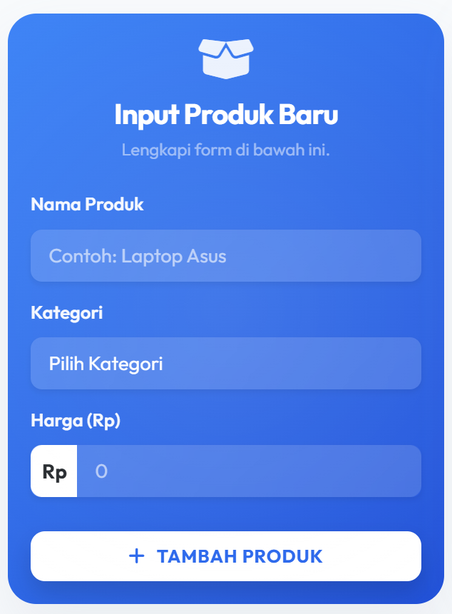

## - Inputan Data pada Tabel
Sebuah tabel dengan 5 kolom (*No, Nama Produk, Kategori, Harga, Aksi*) merender data-data yang dikirim form. Saat tombol submit *form* ditekan, objek `productData` baru ditambahkan secara lokal.

Bukti kode (`script.js`):
```javascript
$('#productForm').on('submit', function(e) {
    e.preventDefault();

    const productData = {
        id: Date.now().toString(),
        name: $('#productName').val(),
        category: $('#productCategory').val(),
        price: parseInt($('#productPrice').val(), 10)
    };

    productDB.push(productData);
    syncTabel();
    
    Swal.fire({ ... });
    
    $('#productForm')[0].reset();
});
```
### Hasil Tampilan (Screenshot) Input Data

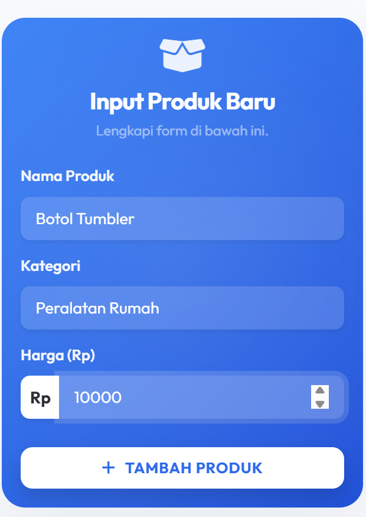

### Hasil Tampilan (Screenshot) Data Masuk Pada Tabel

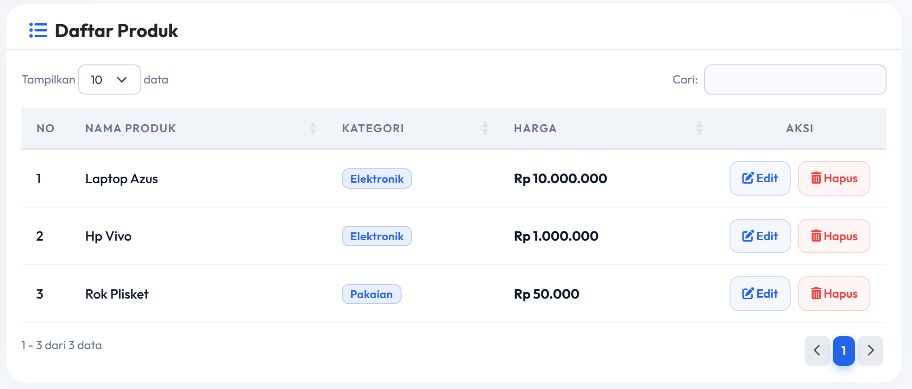

## - Penggunaan Jquery Datatable pada tabel
Data pada tabel HTML diproses dan diformat lebih lanjut (enhancement) dengan library `jQuery DataTables` v1.13.6. Konfigurasinya telah disempurnakan dengan *Bootstrap 5 Integration* (`dataTables.bootstrap5.min.js`).

Beberapa kustomisasi yang terpasang pada skrip:
| Custom Config | Fungsi |
|-------------|-------------------------------------------|
| `order: []` | Menonaktifkan otomatis *sorting* bawaan yang merusak nomor urut ascending.|
| `language` | Menerjemahkan seluruh UI (tombol, *info bar*) menggunakan JSON Bahasa Indonesia.|
| `responsive` | *Auto-collapse* baris ke bawah ketika layar (mobile) menyempit.|
| `columns.render` | Memodifikasi keluaran kolom, contoh: Harga ditambah teks *Strong* 'Rp' dan titik ribuan `toLocaleString('id-ID')`, dan label *Badge Bootstrap* ke dalam sel *Kategori*.|

Bukti inisialisasi DataTables:
```javascript
const table = $('#productTable').DataTable({
    data: productDB,
    columns: [
        { 
            data: null, 
            render: function (data, type, row, meta) {
                return meta.row + meta.settings._iDisplayStart + 1;
            }
        },
        { data: 'name' },
        { 
            data: 'category', 
            render: function(data) { return `<span class="badge bg-primary-subtle text-primary border border-primary-subtle px-2 py-1">${data}</span>`; }
        },
    ],
    language: {
        url: 'https://cdn.datatables.net/plug-ins/1.13.6/i18n/id.json',
    }
});
```

### Hasil Tampilan (Screenshot) 


## - Tambah Button Hapus pada Setiap Data
Kolom _Aksi_ disisipkan secara _hardcoded_ menggunakan konfigurasi `render` DataTable yang menghasilkan dua button utilitas: Edit dan Hapus. Proses penghapusan ditahan sesaat oleh utilitas `<SweetAlert2>` modern untuk *confirmation prompt* agar data tidak hilang tanpa persetujuan.

Kumpulan Bukti kodenya:
```javascript
render: function(data, type, row) {
    return `
        <div class="d-flex justify-content-center gap-2">
            <button class="btn btn-sm btn-outline-primary edit-btn" data-id="${row.id}">
                <i class="fas fa-edit"></i> Edit
            </button>
            <button class="btn btn-sm btn-outline-danger delete-btn" data-id="${row.id}">
                <i class="fas fa-trash-alt"></i> Hapus
            </button>
        </div>
    `;
}

$('#productTable tbody').on('click', '.delete-btn', function() {
    const id = $(this).data('id').toString();
    
    Swal.fire({
        title: 'Hapus Produk?',
    }).then((result) => {
        if (result.isConfirmed) {
            productDB = productDB.filter(p => p.id !== id);
            syncTabel();
        }
    });
});
```
### Hasil Tampilan Hapus (Screenshot Klik Tombol Hapus) 

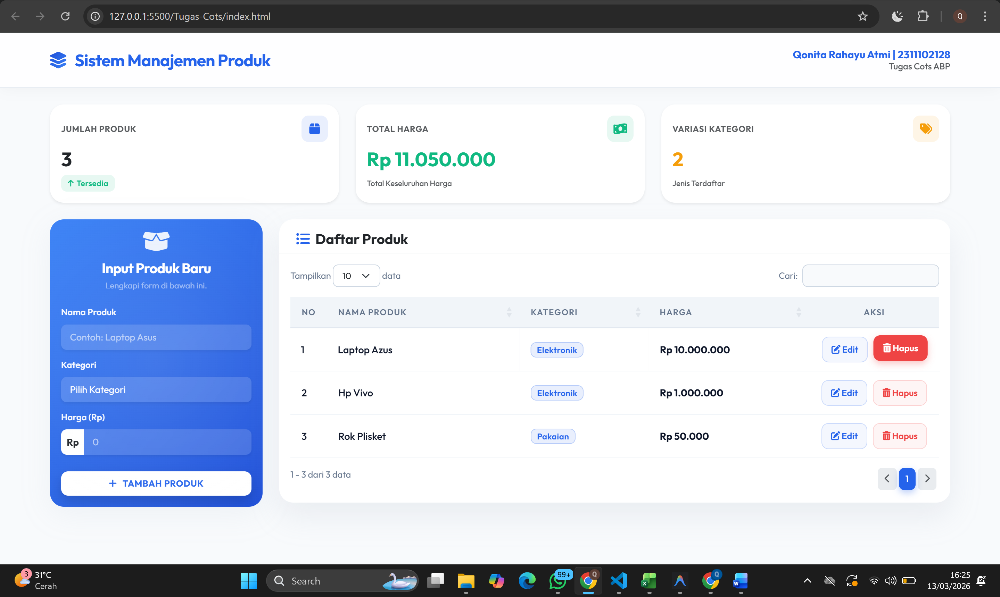

### Hasil Tampilan Konfirmasi Hapus (Screenshot) 

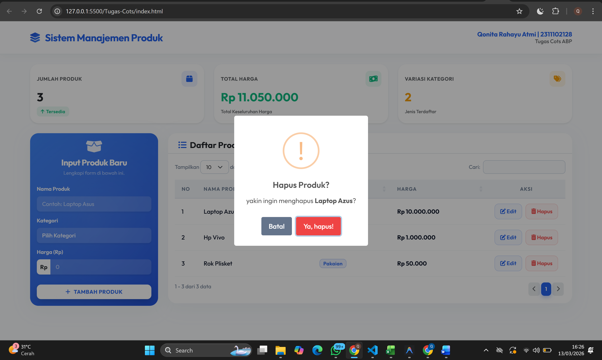

## - Fitur Search dan Pagination
Karena mengimplementasikan jQuery Datatables aktif di front-end, kapabilitas *search* & *pagination* melekat langsung. 
Kotak filter input pencarian DataTables berada di atas kanan tabel, mencari kata kunci dari segala sisi kolom secara _real-time_ waktu di-*type*. Bagian *Pagination* dibuat efisien dengan mengonversi teks _String_ bawaan ("Previous"/"Next") ke *Font Awesome Icons (`fas fa-chevron-left/right`)* demi kekompakan grid UI.

Bukti snippet kustom pagination di dalam _Language setting_ DataTables:
```javascript
paginate: {
    previous: '<i class="fas fa-chevron-left"></i>',
    next: '<i class="fas fa-chevron-right"></i>'
}
```

### Hasil Tampilan (Screenshot) 

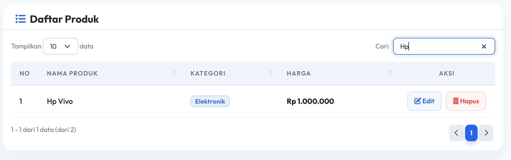

## - CRUD Sederhana dengan Mapping Object
Penyimpanan *record* bekerja di sisi klien (*Client-side Storage*). Sistem mengambil dan memproyeksikan data Array dari *Browser Local Storage* (`productsDB`). Setiap representasi produk adalah turunan dari properti Mapping Object yang dikendalikan oleh id spesifik.

Semua fungsi CRUD yang bekerja memanipulasi _Mapping Object_ ini direkam kembali sinkronisasinya memanggil blok fungsi custom `syncTabel();`.

```javascript
let productDB = JSON.parse(localStorage.getItem('productsDB')) || [];
```

| Operasi | Fungsi | Cara Kerja Logika Implementasi |
|--------|--------|-----------|
| **C - Create** | `productForm.submit` | Membangun Instance `object` menggunakan Timestamp unik (_sebagai key/ID_), menyisipkan objek data inputan, lantas di-_push_ ke array utama `productDB.push(productData)`.|
| **R - Read** | `DataTables Initializer` | Mengikat struktur array `productDB` agar selalu diekstraksi tabel melalui konfigurasi _columns_ milik DataTables tiap kali `syncTabel()` dijalankan.|
| **U - Update** | `editForm.submit` | Mencari data yang tersorot via modal form menggunakan `.findIndex(p => p.id === id)`, memodifikasi properti sesuai dengan nilai input elemen modal, dan mengaturnya ulang. |
| **D - Delete** | `.delete-btn` listener | Mengomparasi ID dari instance _button row_ dengan state array untuk memilah array baru tanpa object terkait `filter(p => p.id !== id)`. |

Kutipan proses *Update Data* dari object index terkait:
```javascript
const index = productDB.findIndex(p => p.id === productData.id);
if (index !== -1) {
    productDB[index] = productData;
    syncTabel();
    $('#editModal').modal('hide'); 
}
```
### Hasil Tampilan Create (Screenshot) 

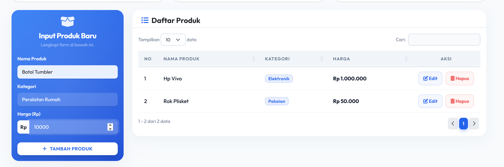

### Hasil Tampilan Read (Screenshot) 

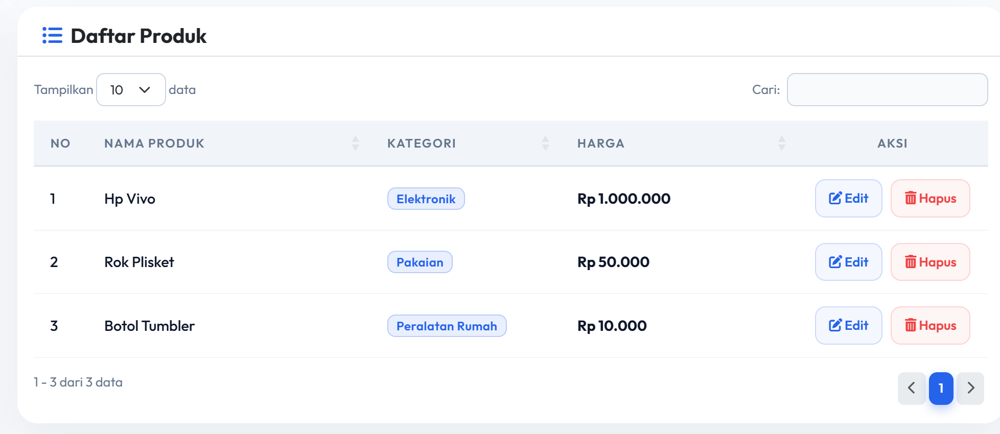

### Hasil Tampilan Update (Screenshot) 

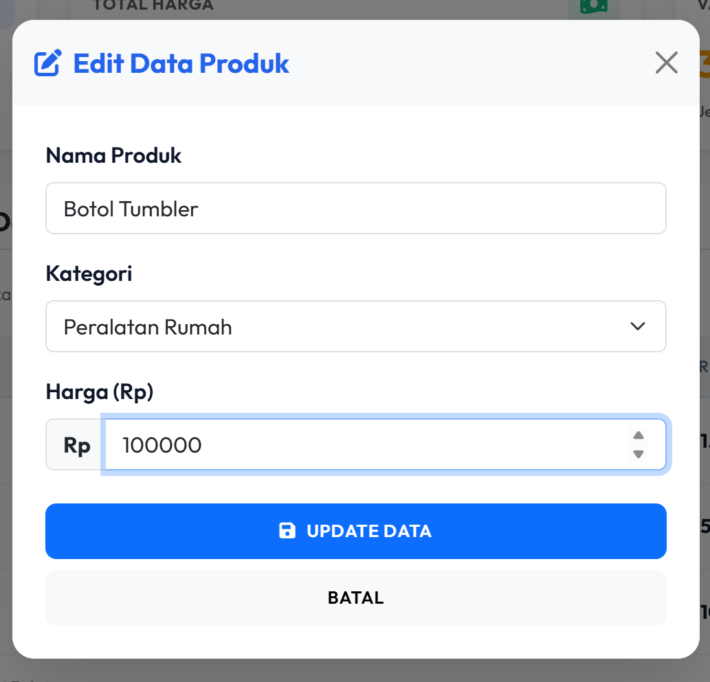

### Hasil Tampilan Berhasil Ke Update(Screenshot) 

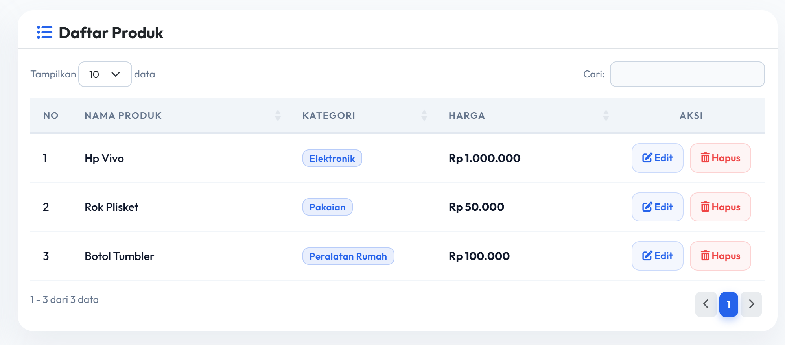

### Hasil Tampilan Hapus (Screenshot) 

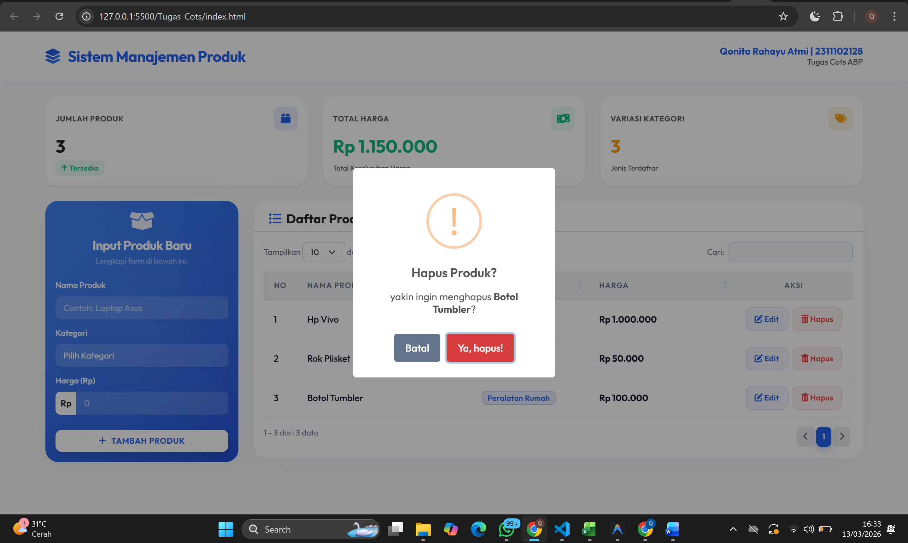

### Hasil Tampilan Berhasil Di Hapus (Screenshot) 

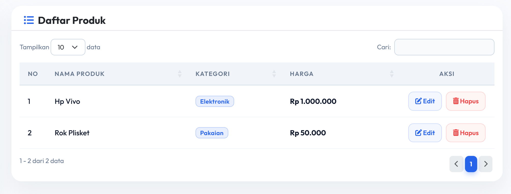

# D. KODE

### Kode HTML (`index.html`)

```html
<!DOCTYPE html>
<html lang="id">
<head>
    <meta charset="UTF-8">
    <meta name="viewport" content="width=device-width, initial-scale=1.0">
    <title>Manajemen Data Produk</title>
    <link href="https://cdn.jsdelivr.net/npm/bootstrap@5.3.0/dist/css/bootstrap.min.css" rel="stylesheet">
    <link href="https://cdn.datatables.net/1.13.6/css/dataTables.bootstrap5.min.css" rel="stylesheet">
    <link href="https://cdnjs.cloudflare.com/ajax/libs/font-awesome/6.0.0/css/all.min.css" rel="stylesheet">
    <link href="https://cdn.jsdelivr.net/npm/sweetalert2@11.7.32/dist/sweetalert2.min.css" rel="stylesheet">
    <link href="style.css" rel="stylesheet">
</head>
<body>
    <nav class="navbar navbar-expand-lg navbar-light navbar-custom sticky-top mb-4">
        <div class="container">
            <a class="navbar-brand" href="#">
                <i class="fas fa-layer-group me-2"></i> Sistem Manajemen Produk
            </a>
            <div class="ms-auto d-none d-md-flex align-items-center gap-3">
                <div class="text-end" style="line-height: 1.2;">
                    <div class="fw-bold text-primary" style="font-size: 0.95rem;">Qonita Rahayu Atmi | 2311102128</div>
                    <div class="text-muted" style="font-size: 0.8rem; font-weight: 500;">Tugas Cots ABP</div>
                </div>
            </div>
        </div>
    </nav>

    <div class="container my-4 pb-5">
        <div class="row g-4 mb-4">
            <div class="col-md-4">
                <div class="card stat-card border-0 shadow-sm h-100 position-relative overflow-hidden">
                    <div class="card-body p-3">
                        <div class="d-flex justify-content-between align-items-center mb-2">
                            <h6 class="text-muted fw-bold mb-0 text-uppercase" style="letter-spacing: 0.5px; font-size: 0.75rem;">Jumlah Produk</h6>
                            <div class="stat-icon-wrapper bg-primary bg-opacity-10 text-primary">
                                <i class="fas fa-box"></i>
                            </div>
                        </div>
                        <h3 class="fw-bold mb-1" id="statTotalProducts">0</h3>
                        <span class="badge bg-success bg-opacity-10 text-success fw-semibold" style="font-size: 0.7rem;"><i class="fas fa-arrow-up me-1"></i>Tersedia</span>
                    </div>
                </div>
            </div>
            <div class="col-md-4">
                <div class="card stat-card border-0 shadow-sm h-100 position-relative overflow-hidden">
                    <div class="card-body p-3">
                        <div class="d-flex justify-content-between align-items-center mb-2">
                            <h6 class="text-muted fw-bold mb-0 text-uppercase" style="letter-spacing: 0.5px; font-size: 0.75rem;">Total Harga</h6>
                            <div class="stat-icon-wrapper bg-success bg-opacity-10 text-success">
                                <i class="fas fa-money-bill-wave"></i>
                            </div>
                        </div>
                        <h3 class="fw-bold mb-1 text-success" id="statTotalValue">Rp 0</h3>
                        <span class="text-muted fw-medium" style="font-size: 0.7rem;">Total Keseluruhan Harga</span>
                    </div>
                </div>
            </div>
            <div class="col-md-4">
                <div class="card stat-card border-0 shadow-sm h-100 position-relative overflow-hidden">
                    <div class="card-body p-3">
                        <div class="d-flex justify-content-between align-items-center mb-2">
                            <h6 class="text-muted fw-bold mb-0 text-uppercase" style="letter-spacing: 0.5px; font-size: 0.75rem;">Variasi Kategori</h6>
                            <div class="stat-icon-wrapper bg-warning bg-opacity-10 text-warning">
                                <i class="fas fa-tags"></i>
                            </div>
                        </div>
                        <h3 class="fw-bold mb-1 text-warning" id="statTotalCategories">0</h3>
                        <span class="text-muted fw-medium" style="font-size: 0.7rem;">Jenis Terdaftar</span>
                    </div>
                </div>
            </div>
        </div>


        <div class="row g-4 align-items-start">
            <div class="col-lg-3 col-md-4">
                <div class="card main-card form-card text-white">
                    <div class="card-header bg-transparent border-0 pt-3 pb-0 text-center">
                        <div class="mb-2">
                            <i class="fas fa-box-open fa-2x" style="opacity: 0.9;"></i>
                        </div>
                        <h5 class="card-title text-white mb-1 fw-bold">Input Produk Baru</h5>
                        <p class="text-white-50 mb-0" style="font-size: 0.75rem;">Lengkapi form di bawah ini.</p>
                    </div>
                    <div class="card-body p-3 d-flex flex-column">
                        <form id="productForm" class="flex-grow-1 d-flex flex-column">
                            <input type="hidden" id="productId">
                            <div class="mb-2">
                                <label for="productName" class="form-label fw-semibold" style="font-size: 0.8rem;">Nama Produk</label>
                                <input type="text" class="form-control form-control-sm border-0 shadow-sm" id="productName" required placeholder="Contoh: Laptop Asus">
                            </div>
                            <div class="mb-2">
                                <label for="productCategory" class="form-label fw-semibold" style="font-size: 0.8rem;">Kategori</label>
                                <select class="form-select form-select-sm border-0 shadow-sm" id="productCategory" required>
                                    <option value="" disabled selected>Pilih Kategori</option>
                                    <option value="Elektronik">Elektronik</option>
                                    <option value="Pakaian">Pakaian</option>
                                    <option value="Makanan">Makanan</option>
                                    <option value="Minuman">Minuman</option>
                                    <option value="Peralatan Rumah">Peralatan Rumah</option>
                                    <option value="Lainnya">Lainnya</option>
                                </select>
                            </div>
                            <div class="mb-3">
                                <label for="productPrice" class="form-label fw-semibold" style="font-size: 0.8rem;">Harga (Rp)</label>
                                <div class="input-group input-group-sm shadow-sm rounded">
                                    <span class="input-group-text fw-bold border-0 bg-white text-dark">Rp</span>
                                    <input type="number" class="form-control border-0" id="productPrice" required placeholder="0" min="0">
                                </div>
                            </div>
                            <div class="d-grid mt-auto pt-2">
                                <button type="submit" class="btn btn-light btn-sm btn-action fw-bold w-100 shadow" id="saveBtn">
                                    <i class="fas fa-plus me-2"></i>Tambah Produk
                                </button>
                            </div>
                        </form>
                    </div>
                </div>
            </div>

            <div class="col-lg-9 col-md-8" style="animation-delay: 0.2s;">
                <div class="card main-card bg-white h-100">
                    <div class="card-header table-card-header border-bottom pt-3 pb-2 px-4">
                        <div class="d-flex justify-content-between align-items-center">
                            <h5 class="mb-0 fw-bold text-dark">
                                <i class="fas fa-list-ul me-2 text-primary"></i>Daftar Produk
                            </h5>
                        </div>
                    </div>
                    <div class="card-body p-3">
                        <table id="productTable" class="table w-100 align-middle">
                            <thead>
                                <tr>
                                    <th width="5%" class="text-center">No</th>
                                    <th width="30%">Nama Produk</th>
                                    <th width="20%">Kategori</th>
                                    <th width="25%">Harga</th>
                                    <th class="text-center" width="20%">Aksi</th>
                                </tr>
                            </thead>
                            <tbody>
                            </tbody>
                        </table>
                    </div>
                </div>
            </div>
        </div>
    </div>

    <div class="modal fade" id="editModal" tabindex="-1" aria-labelledby="editModalLabel" aria-hidden="true">
        <div class="modal-dialog modal-dialog-centered">
            <div class="modal-content border-0 shadow-lg" style="border-radius: 16px;">
                <div class="modal-header border-bottom-0 bg-light" style="border-radius: 16px 16px 0 0;">
                    <h5 class="modal-title fw-bold text-primary" id="editModalLabel">
                        <i class="fas fa-edit me-2"></i>Edit Data Produk
                    </h5>
                    <button type="button" class="btn-close" data-bs-dismiss="modal" aria-label="Close"></button>
                </div>
                <div class="modal-body p-4">
                    <form id="editForm">
                        <input type="hidden" id="editProductId">
                        <div class="mb-3">
                            <label for="editProductName" class="form-label fw-semibold">Nama Produk</label>
                            <input type="text" class="form-control" id="editProductName" required>
                        </div>
                        <div class="mb-3">
                            <label for="editProductCategory" class="form-label fw-semibold">Kategori</label>
                            <select class="form-select" id="editProductCategory" required>
                                <option value="" disabled>Pilih Kategori</option>
                                <option value="Elektronik">Elektronik</option>
                                <option value="Pakaian">Pakaian</option>
                                <option value="Makanan">Makanan</option>
                                <option value="Minuman">Minuman</option>
                                <option value="Peralatan Rumah">Peralatan Rumah</option>
                                <option value="Lainnya">Lainnya</option>
                            </select>
                        </div>
                        <div class="mb-4">
                            <label for="editProductPrice" class="form-label fw-semibold">Harga (Rp)</label>
                            <div class="input-group">
                                <span class="input-group-text bg-light fw-bold border-end-0">Rp</span>
                                <input type="number" class="form-control border-start-0" id="editProductPrice" required min="0">
                            </div>
                        </div>
                        <div class="d-grid gap-2">
                            <button type="submit" class="btn btn-primary btn-action w-100">
                                <i class="fas fa-save me-2"></i>Update Data
                            </button>
                            <button type="button" class="btn btn-light btn-action w-100" data-bs-dismiss="modal">Batal</button>
                        </div>
                    </form>
                </div>
            </div>
        </div>
    </div>

    <script src="https://code.jquery.com/jquery-3.7.0.min.js"></script>
    <script src="https://cdn.jsdelivr.net/npm/bootstrap@5.3.0/dist/js/bootstrap.bundle.min.js"></script>
    <script src="https://cdn.datatables.net/1.13.6/js/jquery.dataTables.min.js"></script>
    <script src="https://cdn.datatables.net/1.13.6/js/dataTables.bootstrap5.min.js"></script>
    <script src="https://cdn.jsdelivr.net/npm/sweetalert2@11.7.32/dist/sweetalert2.all.min.js"></script>
    <script src="script.js"></script>
</body>
</html>
```
### Kode CSS (`style.css`)

```css
@import url('https://fonts.googleapis.com/css2?family=Outfit:wght@300;400;500;600;700&display=swap');

:root {
    --primary-blue: #2563eb;
    --primary-blue-hover: #1d4ed8;
    --light-bg: #f8fafc;
    --card-bg: #ffffff;
    --text-main: #0f172a;
    --text-muted: #64748b;
    --gradient-start: #3b82f6;
    --gradient-end: #1d4ed8;
}

body {
    background-color: var(--light-bg);
    font-family: 'Outfit', -apple-system, BlinkMacSystemFont, "Segoe UI", Roboto, sans-serif;
    color: var(--text-main);
    overflow-x: hidden;
    animation: fadeIn 0.8s ease-out;
}

@keyframes fadeIn {
    from { opacity: 0; }
    to { opacity: 1; }
}

@keyframes slideUp {
    from { opacity: 0; transform: translateY(20px); }
    to { opacity: 1; transform: translateY(0); }
}

.navbar-custom {
    background: rgba(255, 255, 255, 0.85);
    backdrop-filter: blur(16px);
    -webkit-backdrop-filter: blur(16px);
    border-bottom: 1px solid rgba(226, 232, 240, 0.8);
    box-shadow: 0 4px 20px rgba(0, 0, 0, 0.03);
    padding: 1rem 0;
    transition: all 0.3s ease;
}

.navbar-brand {
    color: var(--primary-blue) !important;
    font-weight: 700;
    font-size: 1.5rem;
    letter-spacing: -0.5px;
}

.navbar-brand i {
    color: var(--gradient-start);
    background: -webkit-linear-gradient(135deg, var(--gradient-start), var(--gradient-end));
    -webkit-background-clip: text;
    background-clip: text;
    -webkit-text-fill-color: transparent;
}

.main-card {
    border-radius: 20px;
    border: none;
    box-shadow: 0px 10px 40px rgba(148, 163, 184, 0.1);
    animation: slideUp 0.6s ease-out forwards;
    transition: transform 0.3s cubic-bezier(0.4, 0, 0.2, 1), box-shadow 0.3s cubic-bezier(0.4, 0, 0.2, 1);
}

.main-card:hover {
    transform: translateY(-4px);
    box-shadow: 0px 20px 40px rgba(148, 163, 184, 0.15);
}

.stat-card {
    border-radius: 20px;
    transition: all 0.3s cubic-bezier(0.4, 0, 0.2, 1);
    animation: fadeIn 0.8s ease-out forwards;
}

.stat-card:hover {
    transform: translateY(-5px);
    box-shadow: 0 15px 35px rgba(0, 0, 0, 0.08) !important;
}

.stat-icon-wrapper {
    width: 38px;
    height: 38px;
    border-radius: 10px;
    display: flex;
    align-items: center;
    justify-content: center;
    font-size: 1.1rem;
}

.bg-success.bg-opacity-10 {
    background-color: rgba(16, 185, 129, 0.1) !important;
}

.text-success {
    color: #10b981 !important;
}

.bg-warning.bg-opacity-10 {
    background-color: rgba(245, 158, 11, 0.1) !important;
}

.text-warning {
    color: #f59e0b !important;
}

/* Glassmorphism Gradient Form Card */
.form-card {
    background: linear-gradient(135deg, var(--gradient-start) 0%, var(--gradient-end) 100%);
    position: relative;
    overflow: hidden;
}

.form-card::after {
    content: '';
    position: absolute;
    top: -50%;
    left: -50%;
    width: 200%;
    height: 200%;
    background: radial-gradient(circle, rgba(255,255,255,0.1) 0%, rgba(255,255,255,0) 60%);
    pointer-events: none;
}

.form-card .card-header .card-title {
    font-weight: 700;
    letter-spacing: -0.5px;
}

.form-card .form-label {
    font-weight: 500;
    font-size: 0.95rem;
    color: rgba(255, 255, 255, 0.95);
    margin-bottom: 0.5rem;
}

.form-card .form-control, .form-card .form-select {
    background: rgba(255, 255, 255, 0.15);
    border: 1px solid rgba(255, 255, 255, 0.25);
    color: white;
    border-radius: 8px;
    padding: 0.5rem 0.8rem;
    font-size: 0.85rem;
    backdrop-filter: blur(10px);
    transition: all 0.3s ease;
}

.form-card .form-control::placeholder {
    color: rgba(255, 255, 255, 0.6);
}

.form-card .form-control:focus, .form-card .form-select:focus {
    background: rgba(255, 255, 255, 0.25);
    border-color: rgba(255, 255, 255, 0.6);
    box-shadow: 0 0 0 4px rgba(255, 255, 255, 0.15);
}

.form-card option {
    color: var(--text-main);
}

.form-card .input-group-text {
    background: rgba(255, 255, 255, 0.2);
    border: 1px solid rgba(255, 255, 255, 0.25);
    border-right: none;
    color: white;
    border-radius: 8px 0 0 8px;
}

.form-card .input-group .form-control {
    border-left: none;
    border-radius: 0 8px 8px 0;
}

.btn-action {
    border-radius: 8px;
    font-weight: 600;
    padding: 0.6rem 1rem;
    transition: all 0.3s cubic-bezier(0.4, 0, 0.2, 1);
    text-transform: uppercase;
    font-size: 0.8rem;
    letter-spacing: 0.5px;
}

.form-card .btn-light {
    background: white;
    color: var(--primary-blue);
    border: none;
    box-shadow: 0 8px 16px rgba(0, 0, 0, 0.1);
}

.form-card .btn-light:hover {
    background: #f8fafc;
    transform: translateY(-3px);
    box-shadow: 0 12px 20px rgba(0, 0, 0, 0.15);
}

.form-card .btn-warning {
    background: #FFB547 !important;
    border: none !important;
    color: #fff !important;
    box-shadow: 0 8px 16px rgba(255, 181, 71, 0.3);
}

.form-card .btn-warning:hover {
    background: #ffaa2b !important;
    transform: translateY(-3px);
    box-shadow: 0 12px 20px rgba(255, 181, 71, 0.4);
}

.form-card .btn-outline-light {
    border: 2px solid rgba(255, 255, 255, 0.4);
    color: white;
    background: transparent;
}

.form-card .btn-outline-light:hover {
    background: rgba(255, 255, 255, 0.15);
    border-color: white;
    transform: translateY(-3px);
}

/* Table Card */
.table-card-header {
    background: transparent !important;
}

.table-card-header h4 {
    color: var(--text-main);
    font-weight: 700;
    letter-spacing: -0.5px;
}

.table-card-header i {
    color: var(--primary-blue);
}

.table {
    margin-top: 1rem !important;
}

div.dataTables_length,
div.dataTables_filter {
    margin-bottom: 0.5rem;
}

.table th {
    font-weight: 600;
    text-transform: uppercase;
    font-size: 0.75rem;
    letter-spacing: 1px;
    color: var(--text-muted);
    border-bottom: 2px solid #e2e8f0;
    padding: 0.8rem 1rem;
    background: #f1f5f9 !important;
}

.table td {
    color: var(--text-main);
    font-weight: 500;
    font-size: 0.9rem;
    vertical-align: middle;
    border-bottom: 1px solid #f1f5f9;
    padding: 0.75rem 1rem;
}

.table tbody tr {
    transition: background-color 0.2s ease, transform 0.2s ease;
}

.table tbody tr:hover {
    background-color: #f8fafc;
    transform: scale(1.002);
}

.badge {
    padding: 0.4rem 0.6rem;
    border-radius: 8px;
    font-weight: 600;
    font-size: 0.75rem;
    letter-spacing: 0.3px;
}

.bg-primary.bg-opacity-10 {
    background-color: rgba(37, 99, 235, 0.1) !important;
}

.text-primary {
    color: var(--primary-blue) !important;
}

.border-opacity-25 {
    border-color: rgba(37, 99, 235, 0.25) !important;
}

div.dataTables_wrapper div.dataTables_filter input {
    border-radius: 8px;
    padding: 0.35rem 0.8rem;
    border: 1px solid #cbd5e1;
    background: var(--light-bg);
    color: var(--text-main);
    font-size: 0.8rem;
    transition: all 0.3s ease;
}

div.dataTables_wrapper div.dataTables_filter input:focus {
    border-color: var(--primary-blue);
    background: white;
    box-shadow: 0 0 0 4px rgba(37, 99, 235, 0.1);
    outline: none;
}

div.dataTables_wrapper div.dataTables_length select {
    border-radius: 8px;
    border: 1px solid #cbd5e1;
    padding: 0.35rem 2rem 0.35rem 0.8rem;
    font-size: 0.8rem;
}

div.dataTables_wrapper div.dataTables_length label,
div.dataTables_wrapper div.dataTables_filter label,
div.dataTables_info {
    font-size: 0.8rem;
    color: var(--text-muted);
}

div.dataTables_info {
    padding-top: 0.5rem !important;
}

div.dataTables_paginate {
    margin-top: 0.5rem !important;
}

.page-item.active .page-link {
    background-color: var(--primary-blue);
    border-color: var(--primary-blue);
    box-shadow: 0 4px 10px rgba(37, 99, 235, 0.3);
    border-radius: 8px;
}

.page-link {
    border-radius: 6px;
    margin: 0 4px;
    font-weight: 600;
    color: var(--text-muted);
    border: none;
    padding: 0.4rem 0.6rem;
    font-size: 0.8rem;
}

.page-link:hover {
    background-color: var(--light-bg);
    color: var(--primary-blue);
}

.btn-sm {
    border-radius: 10px;
    padding: 0.5rem 0.8rem;
    font-size: 0.8rem;
    font-weight: 600;
    transition: all 0.3s ease;
}

.btn-outline-primary {
    color: var(--primary-blue);
    border-color: rgba(37, 99, 235, 0.2);
    background: rgba(37, 99, 235, 0.05);
}

.btn-outline-primary:hover {
    background: var(--primary-blue);
    border-color: var(--primary-blue);
    color: white;
    box-shadow: 0 4px 10px rgba(37, 99, 235, 0.3);
    transform: translateY(-2px);
}

.btn-outline-danger {
    color: #ef4444;
    border-color: rgba(239, 68, 68, 0.2);
    background: rgba(239, 68, 68, 0.05);
}

.btn-outline-danger:hover {
    background: #ef4444;
    border-color: #ef4444;
    color: white;
    box-shadow: 0 4px 10px rgba(239, 68, 68, 0.3);
    transform: translateY(-2px);
}

::-webkit-scrollbar {
    width: 8px;
    height: 8px;
}

::-webkit-scrollbar-track {
    background: transparent;
}

::-webkit-scrollbar-thumb {
    background: #cbd5e1;
    border-radius: 10px;
}

::-webkit-scrollbar-thumb:hover {
    background: #94a3b8;
}

```

### Kode JS (`script.js`)

```javascript
$(document).ready(function() {
    let productDB = JSON.parse(localStorage.getItem('productsDB')) || [];
    
    const table = $('#productTable').DataTable({
        data: productDB,
        columns: [
            { 
                data: null, 
                orderable: false, 
                searchable: false,
                render: function (data, type, row, meta) {
                    return meta.row + meta.settings._iDisplayStart + 1;
                }
            },
            { data: 'name' },
            { 
                data: 'category',
                render: function(data) {
                    return `<span class="badge bg-primary bg-opacity-10 text-primary border border-primary border-opacity-25 px-2 py-1">${data}</span>`;
                }
            },
            { 
                data: 'price',
                render: function(data) {
                    return '<strong>Rp ' + Number(data).toLocaleString('id-ID') + '</strong>';
                }
            },
            {
                data: null,
                className: "text-center",
                orderable: false,
                render: function(data, type, row) {
                    return `
                        <div class="d-flex justify-content-center gap-2">
                            <button class="btn btn-sm btn-outline-primary edit-btn" data-id="${row.id}" title="Edit Data">
                                <i class="fas fa-edit"></i> Edit
                            </button>
                            <button class="btn btn-sm btn-outline-danger delete-btn" data-id="${row.id}" title="Hapus Data">
                                <i class="fas fa-trash-alt"></i> Hapus
                            </button>
                        </div>
                    `;
                }
            }
        ],
        language: {
            url: 'https://cdn.datatables.net/plug-ins/1.13.6/i18n/id.json',
            search: "Cari:",
            lengthMenu: "Tampilkan _MENU_ data",
            info: "_START_ - _END_ dari _TOTAL_ data",
            infoEmpty: "0 data",
            infoFiltered: "(dari _MAX_)",
            zeroRecords: "Data tidak ditemukan",
            paginate: {
                previous: '<i class="fas fa-chevron-left"></i>',
                next: '<i class="fas fa-chevron-right"></i>'
            }
        },
        responsive: true,
        order: [] 
    });

    table.on('order.dt search.dt', function () {
        let i = 1;
        table.cells(null, 0, { search: 'applied', order: 'applied' }).every(function (cell) {
            this.data(i++);
        });
    }).draw();

    function renderStats() {
        const totalProducts = productDB.length;
        
        let totalValue = 0;
        const categories = new Set();

        productDB.forEach(p => {
            totalValue += p.price || 0;
            if (p.category) {
                categories.add(p.category);
            }
        });

        $('#statTotalProducts').text(totalProducts);
        $('#statTotalValue').text('Rp ' + Number(totalValue).toLocaleString('id-ID'));
        $('#statTotalCategories').text(categories.size);
    }

    function syncTabel() {
        localStorage.setItem('productsDB', JSON.stringify(productDB));
        table.clear().rows.add(productDB).draw();
        renderStats(); 
    }

    renderStats();

    $('#productForm').on('submit', function(e) {
        e.preventDefault();

        const productData = {
            id: Date.now().toString(), 
            name: $('#productName').val(),
            category: $('#productCategory').val(),
            price: parseInt($('#productPrice').val(), 10)
        };

        productDB.push(productData);

        syncTabel();
        
        Swal.fire({
            icon: 'success',
            title: 'Data ditambahkan!',
            showConfirmButton: false,
            timer: 1500,
            toast: true,
            position: 'top-end',
            customClass: { popup: 'p-2' }
        });

        $('#productForm')[0].reset();
    });

    $('#editForm').on('submit', function(e) {
        e.preventDefault();

        const idField = $('#editProductId').val();
        
        const productData = {
            id: idField,
            name: $('#editProductName').val(),
            category: $('#editProductCategory').val(),
            price: parseInt($('#editProductPrice').val(), 10)
        };

        const index = productDB.findIndex(p => p.id === productData.id);
        if (index !== -1) {
            productDB[index] = productData;
            syncTabel();
            
            $('#editModal').modal('hide');
            
            Swal.fire({
                icon: 'success',
                title: 'Data disimpan!',
                showConfirmButton: false,
                timer: 1500,
                toast: true,
                position: 'top-end',
                customClass: { popup: 'p-2' }
            });
        }
    });

    $('#productTable tbody').on('click', '.delete-btn', function() {
        const id = $(this).data('id').toString();
        const product = productDB.find(p => p.id === id);
        
        Swal.fire({
            title: 'Hapus Produk?',
            html: `yakin ingin menghapus <strong>${product ? product.name : 'produk ini'}</strong>?`,
            icon: 'warning',
            showCancelButton: true,
            confirmButtonColor: '#ef4444',
            cancelButtonColor: '#64748b',
            confirmButtonText: 'Ya, hapus!',
            cancelButtonText: 'Batal',
            reverseButtons: true,
            width: '320px',
            customClass: {
                title: 'fs-5',
                htmlContainer: 'fs-6'
            }
        }).then((result) => {
            if (result.isConfirmed) {
                productDB = productDB.filter(p => p.id !== id);
                syncTabel();
                
                Swal.fire({
                    icon: 'success',
                    title: 'Data dihapus!',
                    showConfirmButton: false,
                    timer: 1500,
                    toast: true,
                    position: 'top-end',
                    customClass: { popup: 'p-2' }
                });
            }
        });
    });

    $('#productTable tbody').on('click', '.edit-btn', function() {
        const id = $(this).data('id').toString();
        const product = productDB.find(p => p.id === id);
        
        if (product) {
            $('#editProductId').val(product.id);
            $('#editProductName').val(product.name);
            $('#editProductCategory').val(product.category);
            $('#editProductPrice').val(product.price);
            
            const editModal = new bootstrap.Modal(document.getElementById('editModal'));
            editModal.show();
        }
    });

});

```


- **Penjelasan HTML**:
  - Pada baris 7-11, tag `<link>` digunakan untuk menghubungkan berbagai library CSS eksternal dari CDN untuk memperkaya tampilan, yaitu Bootstrap 5 untuk sistem grid dan tata letak UI, DataTables untuk styling tabel interaktif, FontAwesome untuk ikon visual, dan SweetAlert2 untuk gaya pop-up notifikasi, serta pemanggilan file style.css lokal.
  - Pada baris 13-26, tag `<nav>` membuat menu navigasi (navbar) yang menempel di bagian atas layar (sticky-top). Di dalamnya terdapat judul sistem di sebelah kiri, dan di sebelah kanan terdapat informasi identitas pembuat proyek (menampilkan namamu dan NIM) beserta keterangan tugas.
  - Pada baris 29-65, elemen `<div>` dengan kelas card stat-card digunakan untuk merancang tiga kartu statistik dashboard (Jumlah Produk, Total Harga, dan Variasi Kategori). Setiap kartu memiliki penanda khusus berupa atribut id (seperti statTotalProducts dan statTotalValue) yang disiapkan agar angkanya bisa diubah secara dinamis melalui JavaScript.
  - Pada baris 68-106, elemen `<form>` dengan id="productForm" digunakan untuk membuat antarmuka input produk baru. Form ini diletakkan dalam tata letak kolom di sebelah kiri dan memiliki berbagai elemen input (seperti `<input type="text">` dan `<select>`) untuk mengumpulkan data nama produk, kategori, dan harga, diakhiri dengan tombol submit untuk menambah data.
  - Pada baris 108-135, elemen `<table>` dengan id="productTable" berfungsi sebagai kerangka untuk menampilkan daftar data produk. Tabel ini memiliki `<thead>` yang memuat judul kolom (No, Nama Produk, Kategori, Harga, Aksi), sedangkan bagian `<tbody>` dibiarkan kosong karena datanya akan di-render secara dinamis oleh library DataTables lewat fungsi JavaScript.
  - Pada baris 138-181, elemen `<div>` dengan kelas modal fade dan id="editModal" digunakan untuk membuat struktur Modal (Pop-up). Komponen ini secara default disembunyikan dan hanya akan muncul sebagai overlay ketika pengguna mengklik tombol aksi edit pada tabel, yang di dalamnya berisi form untuk memperbarui data spesifik
  - Pada baris 183-189, tag `<script>` digunakan untuk menyisipkan library JavaScript yang membuat halaman web ini menjadi fungsional dan interaktif. Ini mencakup pemanggilan jQuery, Bootstrap, DataTables, dan SweetAlert2, sementara baris terakhir (baris 188) memanggil file lokal script.js untuk menjalankan logika utama program (seperti operasi CRUD, perhitungan statistik, dan interaksi tabel).

- **Penjelasan CSS**:
  - Pada baris 1, digunakan untuk memanggil dan memuat font `Outfit` dari Google Fonts agar bisa diterapkan pada teks di seluruh halaman web.
  - Pada baris 3-12, selektor `:root` berfungsi untuk mendefinisikan Variabel CSS. Variabel ini menyimpan palet warna utama (seperti biru utama, latar belakang, teks, dan gradien) agar penggunaan warna lebih konsisten dan mudah diubah cukup dari satu tempat.
  - Pada baris 14-20, selektor `body` mengatur gaya dasar bawaan (default) halaman web. Ini mencakup penerapan warna latar, jenis font, menyembunyikan guliran horizontal `(overflow-x: hidden)`, dan menjalankan animasi `fadeIn` saat halaman pertama kali dimuat.
  - Pada baris 22-30, mendefinisikan dua animasi kustom `fadeIn` (membuat elemen muncul perlahan dari transparan menjadi jelas) dan slideUp (membuat elemen muncul sambil bergeser mulus dari bawah ke atas).
  - Pada baris 32-52, kelas `.navbar-custom` memberikan gaya untuk pilar navigasi. Di sini diterapkan efek visual glassmorphism menggunakan `backdrop-filter: blur(16px)` dan warna latar putih semi-transparan.
  - Pada baris 54-82, kelas `.main-card` dan `.stat-card` digunakan untuk mempercantik elemen kartu . Keduanya diberikan sudut membulat, bayangan halus, dan efek interaktif pada status `:hover` (kartu akan terlihat sedikit terangkat dan bayangannya membesar saat kursor mouse diarahkan).
  - Pada baris 84-97, terdapat pengaturan kelas utilitas pewarnaan (seperti `.bg-success.bg-opacity-10` dan `.text-warning`) untuk membuat latar belakang ikon statistik atau badge terlihat menarik dengan warna yang transparan.
  - Pada baris 99-165, kelompok kelas `.form-card` mendesain area form input dengan gaya Glassmorphism Gradient. Latar belakangnya menggunakan gradien, dan elemen input di dalamnya `(.form-control`, `.form-select)` dibuat sedikit transparan dengan efek blur. Tombol-tombolnya `(.btn-action`, `.btn-light)` juga dimodifikasi agar memiliki bayangan dan efek terangkat saat di-hover.
  - Pada baris 167-275, kumpulan kode ini sangat penting karena berfungsi menimpa (override) gaya visual bawaan dari library DataTables dan tabel Bootstrap. Ini mencakup modifikasi garis bawah pada header tabel, efek hover pada baris data, memperhalus kolom pencarian (search bar), serta mengubah warna dan bentuk tombol paginasi angka di bawah tabel agar serasi dengan tema .
  - Pada baris 277-291, pseudo-elemen `::-webkit-scrollbar` digunakan untuk mengkustomisasi tampilan scrollbar bawaan browser, dibuat menjadi lebih tipis (8px) dengan sudut membulat agar lebih bagus dan menyatu dengan desain halaman.

- **Penjelasan JS**:
  - Pada baris 1-2, `$(document).ready()` memastikan semua elemen HTML telah dimuat sebelum script dijalankan. Baris ke-2 mengambil data produk dari penyimpanan lokal browser (localStorage). Jika belum ada data sebelumnya, variabel productDB akan diisi dengan array kosong [].
  - Pada baris 4-50, library DataTables diinisialisasi pada elemen tabel. Properti columns mengatur bagaimana data ditampilkan, termasuk membuat nomor urut otomatis (baris 8-13), mempercantik kategori dengan badge HTML (baris 16-21), memformat angka menjadi mata uang Rupiah (baris 23-28), dan merender tombol aksi "Edit" serta "Hapus" menggunakan Template Literals (baris 30-46). Properti language digunakan untuk menerjemahkan teks antarmuka tabel ke bahasa Indonesia.
  - Pada baris 52-57, terdapat fungsi tambahan yang memastikan penomoran pada kolom pertama (Nomor Urut) tetap berurutan dan rapi mulai dari angka 1, meskipun pengguna sedang melakukan pengurutan kolom (sorting) atau pencarian data (searching).
  - Pada baris 59-75, fungsi `renderStats()` dibuat untuk menghitung data statistik dashboard. Fungsi ini menghitung jumlah produk dari panjang array, menjumlahkan harga keseluruhan, dan menggunakan objek `Set()` untuk menghitung berapa banyak jenis kategori yang berbeda tanpa menghitung ganda. 
  - Pada baris 77-81, fungsi `syncTabel()` sebagai pusat sinkronisasi. Setiap kali ada perubahan (tambah, edit, hapus), fungsi ini akan dipanggil untuk menyimpan data terbaru kembali ke localStorage, menghapus tampilan tabel lama dan merendernya ulang dengan data baru, serta memanggil `renderStats()` untuk memperbarui angka di kartu statistik.
  - Pada baris 85-110, penambahan data produk baru saat `#productForm` di-submit. Nilai dari input pengguna diambil, diberikan ID unik menggunakan `Date.now()`, lalu dimasukkan (push) ke dalam array productDB. Setelah tersimpan, tabel disinkronkan, form dikosongkan `(reset())`, dan muncul notifikasi pop-up kecil dari SweetAlert2.
  - Pada baris 112-140, pembaruan data saat form di dalam Modal Edit `(#editForm)` di-submit, mencari urutan indeks data lama di dalam array berdasarkan ID, lalu menimpa data lama tersebut dengan data baru yang baru saja diubah oleh pengguna. Setelah itu, Modal ditutup secara otomatis dan notifikasi sukses ditampilkan.
  - Pada baris 142-175, untuk aksi ketika tombol "Hapus" ditekan. Karena tombol hapus dibuat secara dinamis,menggunakan Event Delegation pada tbody. Ketika diklik, akan memicu pop-up konfirmasi SweetAlert2. Jika pengguna mengonfirmasi ("Ya, hapus!"), data tersebut disaring (filter) agar keluar dari array, lalu tabel disinkronkan kembali.
  - Pada baris 177-189, untuk aksi ketika tombol "Edit" ditekan pada tabel, mencari data produk yang spesifik berdasarkan ID-nya, lalu secara otomatis mengisi nilai (value) di setiap kolom input di dalam Modal Edit sebelum akhirnya memunculkan tampilan Modal tersebut ke layar menggunakan API Bootstrap.

# E. SS FULL

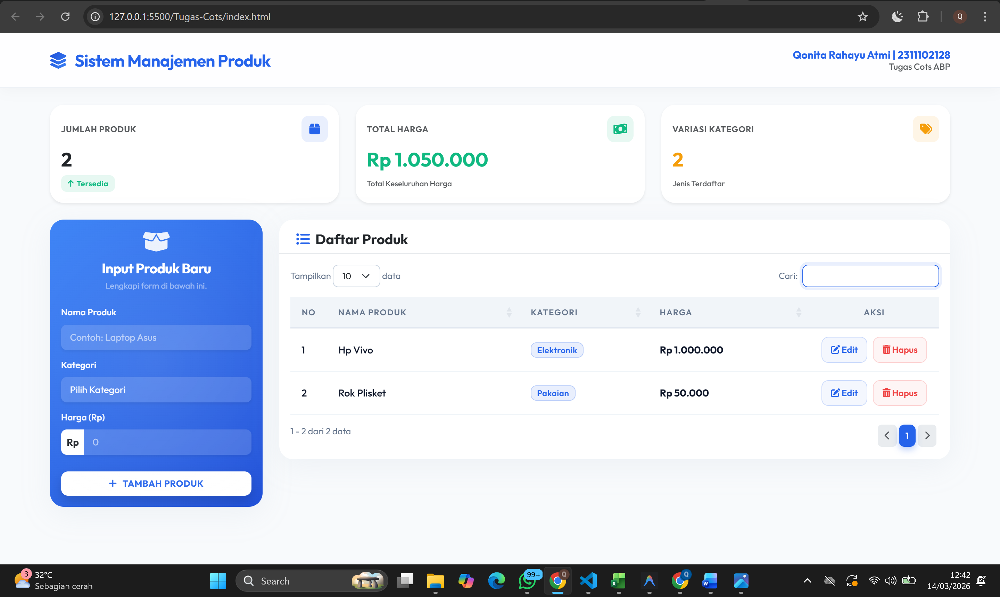

# F. KESIMPULAN
- Praktikum pada tugas cots ini membuat framework Bootstrap 5, library jQuery, dan plugin DataTables untuk menciptakan sistem manajemen produk yang fungsional . Bootstrap berperan sentral dalam membangun struktur layout yang responsif melalui sistem grid seperti kartu (cards) serta modal. Sementara itu, jQuery digunakan untuk menangani logika interaksi DOM dan manipulasi data pada sisi klien, termasuk pengelolaan penyimpanan lokal menggunakan LocalStorage agar data bersifat persisten. Implementasi fitur CRUD (Create, Read, Update, Delete) yang dipadukan dengan DataTables memberikan pengalaman pengguna yang baik, di mana fitur pencarian, filter, dan paginasi tersedia secara otomatis. Penggunaan library tambahan seperti SweetAlert2 untuk notifikasi dan konfirmasi penghapusan menambah aspek keamanan dan profesionalitas pada antarmuka. Melalui penugasan ini, pemahaman mengenai manajemen data berbasis objek (mapping object) dan sinkronisasi antara state data JavaScript dengan tampilan tabel telah diterapkan secara komprehensif.

# G. REFERENSI
- [Materi Modul 2](https://drive.google.com/file/d/1Gcsi-U4rzqU0GC6dYTlzO7KUthrGoL8q/view?usp=sharing)
- [Materi Modul 3](https://drive.google.com/file/d/1kd7ogQkR_rsNCnKDcJDmavY8FiOyTLzs/view?usp=sharing)
- [Materi Modul 4](https://drive.google.com/file/d/1TW5Y0AdzkVk24ThPUf1OQNs2Mnw3XNO5/view?usp=sharing)
- [E. B. P. Manurung dan H. Simangunsong, "Penerapan Aplikasi Kasir Berbasis Android pada Toko Aneka Snack dan Cemilan UD. Ibu Ida Medan," CTIS, vol. 6, no. 2, hlm. 36-42, November 2022](https://www.jurnal.stikommedan.ac.id/index.php/ctis/article/view/70/50)
