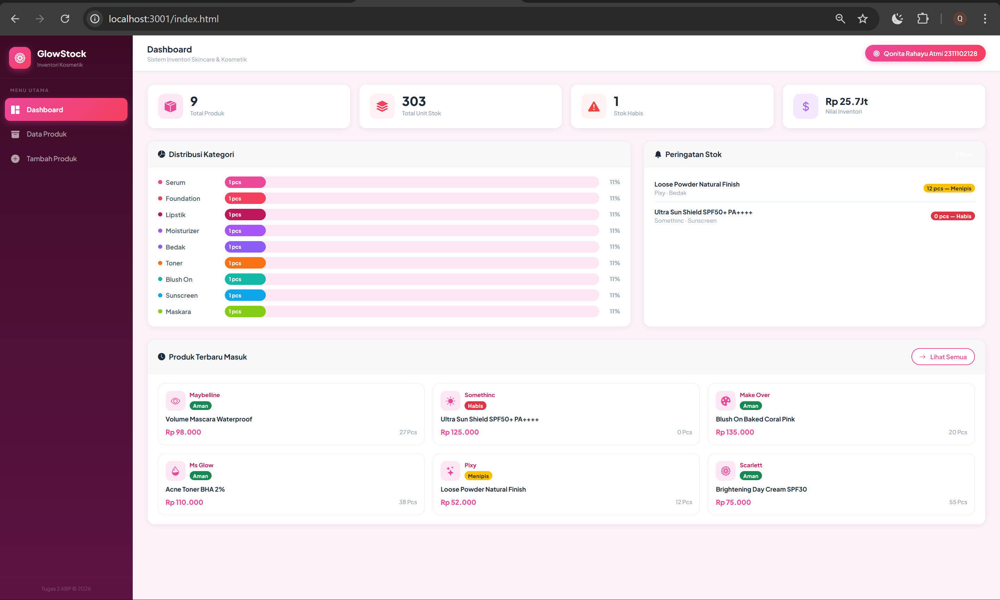
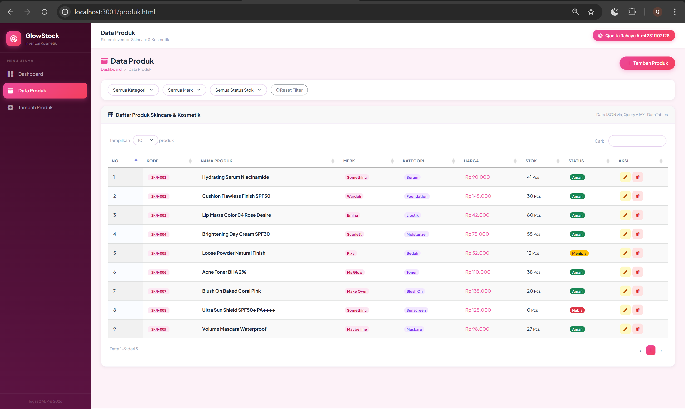
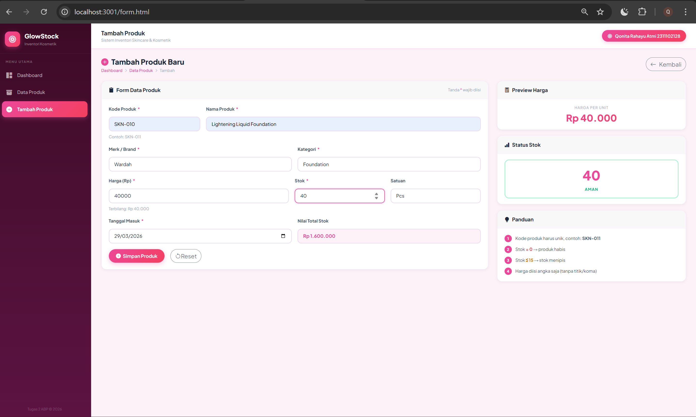
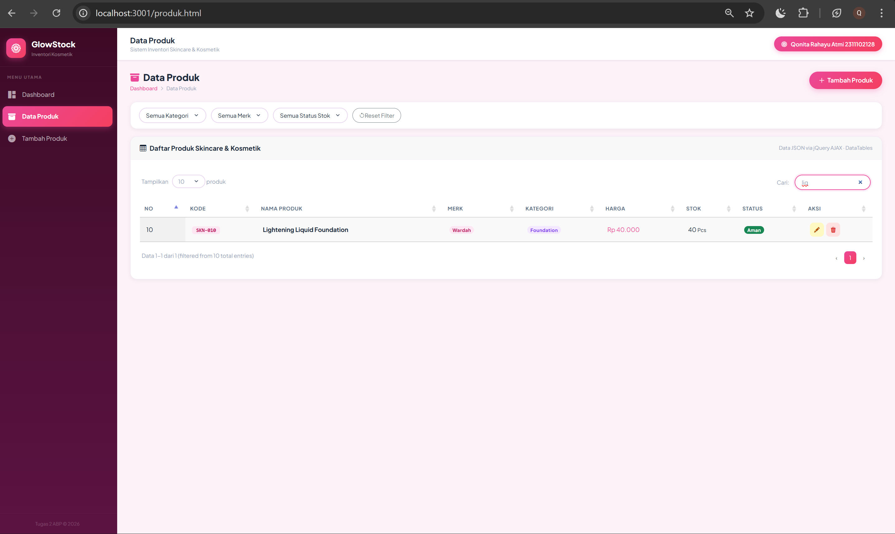
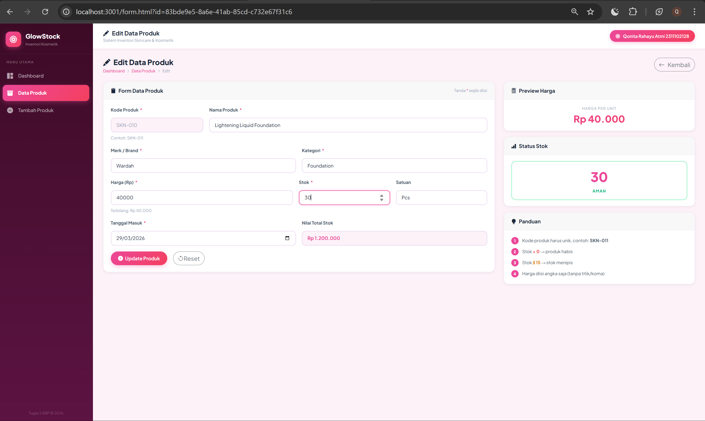
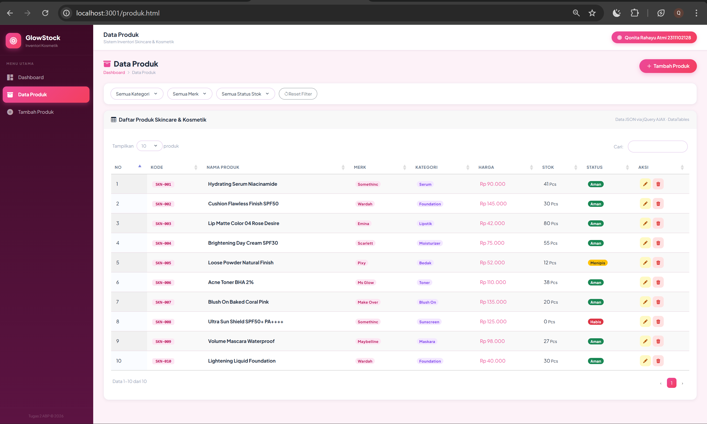
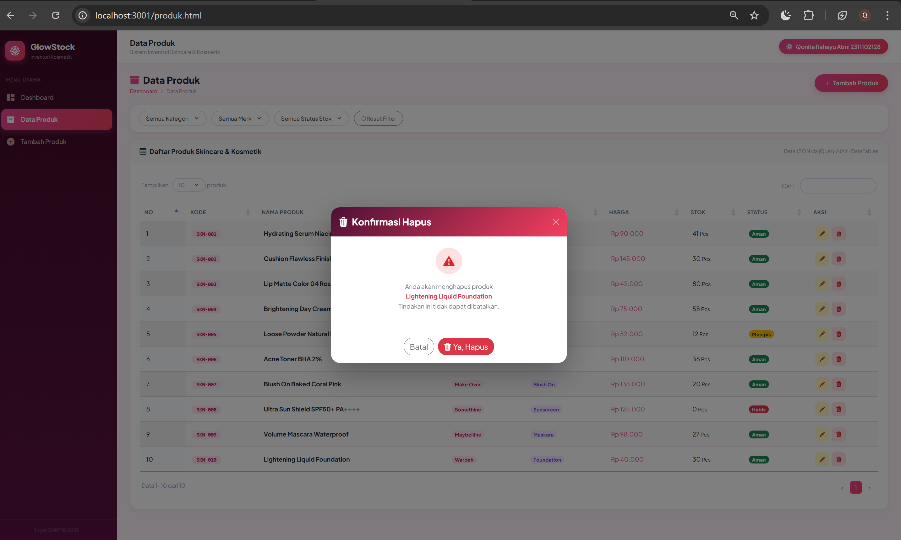
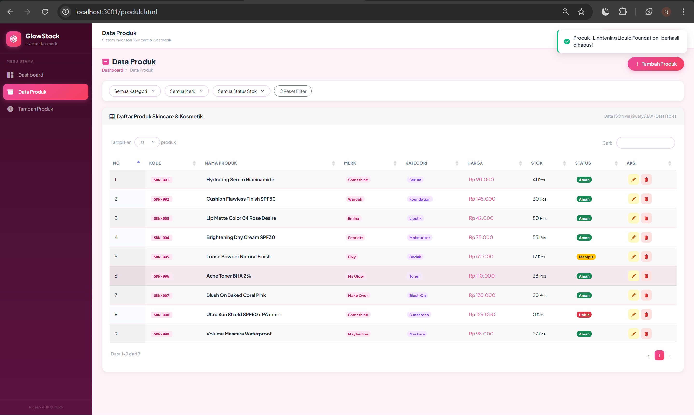

<div align="center">
  <br />
  <h1>LAPORAN PRAKTIKUM <br>APLIKASI BERBASIS PLATFORM</h1>
  <br />
  <h3>TUGAS COTS 2</h3>
  <br />
  <br />
   
  <br />
  <br />
  <br />
  <h3>Disusun Oleh :</h3>
  <p>
    <strong>Qonita Rahayu Atmi</strong><br>
    <strong>2311102128</strong><br>
    <strong>S1 IF-11-REG01</strong><br>
  </p>
  <br />
  <h3>Dosen Pengampu :</h3>
  <p>
    <strong>Dimas Fanny Hebrasianto Permadi, S.ST., M.Kom</strong>
  </p>
  <br />
  <h3>Asisten Praktikum :</h3>
  <p>
    <strong>Apri Pandu Wicaksono</strong><br>
    <strong>Rangga Pradarrell Fathi</strong><br>
  </p>
  <br />
  <h3>LABORATORIUM HIGH PERFORMANCE<br>FAKULTAS INFORMATIKA <br>TELKOM UNIVERSITY PURWOKERTO <br>2026</h3>
</div>

---

# A. Dasar Teori
**HTML** (HyperText Markup Language) merupakan fondasi utama dalam pengembangan web yang berfungsi untuk menyusun struktur dan kerangka dasar sebuah situs.HTML bertanggung jawab mengelola elemen-elemen esensial seperti teks, gambar, dan tautan sehingga peramban (browser) dapat menampilkan konten tersebut secara terorganisir kepada pengguna.

**CSS (Cascading Style Sheets)** adalah bahasa yang dirancang khusus untuk mengatur estetika visual dari halaman web yang telah disusun menggunakan HTML. Jika HTML berfungsi sebagai kerangka bangunan, maka CSS berperan sebagai desain interior yang menentukan bagaimana elemen-elemen tersebut dipresentasikan di layar peramban (browser), mulai dari tata letak, warna, hingga tipografi.

**Bootstrap** merupakan kerangka kerja (framework) front-end gratis yang dirancang untuk mempercepat dan mempermudah pengembangan antarmuka web. Proyek ini diinisiasi oleh Mark Otto dan Jacob Thornton di Twitter, lalu diluncurkan sebagai produk sumber terbuka (open source) di GitHub pada Agustus 2011. Bootstrap menyediakan berbagai desain berbasis HTML dan CSS yang mencakup elemen tipografi, formulir, tombol, navigasi, hingga fitur interaktif seperti carousel gambar dan plugin JavaScript opsional. Keunggulan utamanya terletak pada fitur desain responsif, yang memungkinkan tampilan web beradaptasi secara otomatis untuk memberikan pengalaman pengguna yang optimal di berbagai perangkat, mulai dari ponsel hingga desktop.

**DataTables** adalah pustaka JavaScript yang fleksibel dan tangguh untuk menambahkan kontrol interaksi tingkat lanjut ke tabel HTML mana pun. Fokus utamanya adalah memberikan kemudahan bagi pengguna akhir (user) untuk mengolah data tanpa harus terus-menerus memuat ulang halaman (refresh).

**Express JS** adalah framework minimalis untuk Node.js yang sering digunakan dalam pengembangan aplikasi backend. Framework ini menyediakan berbagai fitur untuk menangani permintaan HTTP dan memudahkan integrasi dengan middleware, sehingga mempercepat proses pengembangan API.

**Node.js** adalah sebuah platform yang digunakan untuk menjalankan kode JavaScript di luar browser, dibangun di atas mesin V8 milik Google Chrome. Platform ini sangat populer di kalangan pengembang karena mudah digunakan dan efisien dalam menangani proses input/output (I/O), seperti membaca file atau berkomunikasi dengan server, berkat model kerjanya yang berbasis event-driven dan non-blocking. 

---

# B. Tugas 2 Praktikum

## SOAL : 
Buatlah sebuah aplikasi web sederhana yang memiliki minimal 3 (tiga) halaman fungsional yang mencakup Form, Halaman Data (Tabel), dan fungsionalitas CRUD (Create, Read, Update, Delete).

## Spesifikasi Teknis Pengembangan (Wajib):

**1. Aplikasi harus menggunakan Framework Bootstrap sebagai styling.**
   - **Penjelasan**: Aplikasi inventori menggunakan **Bootstrap 5** sebagai framework *styling* utama. Bootstrap digunakan secara dominan untuk: (1) **Sistem grid responsif**, (2) **Utility classes**, (3) **Komponen `badge`**, (4) **Komponen `modal`**, (5) **Tombol**, (6) **Bootstrap Icons**.
   - **Kode Penerapan Bootstrap (Contoh pada `produk.html`)**:
     ```html
     <!-- Grid responsif Bootstrap -->
     <div class="row g-3 mb-4" id="statsRow">
       <div class="col-sm-6 col-lg-3">
         <div class="stat-card">...</div>
       </div>
     </div>

     <!-- Badge status stok menggunakan Bootstrap -->
     <span class="badge bg-success">Aman</span>
     <span class="badge bg-warning text-dark">Menipis</span>
     <span class="badge bg-danger">Habis</span>

     <!-- Tombol aksi menggunakan Bootstrap -->
     <button class="btn btn-outline-secondary rounded-pill">Batal</button>
     <button class="btn btn-danger rounded-pill">Ya, Hapus</button>

     <!-- Modal konfirmasi Bootstrap -->
     <div class="modal fade" id="modalHapus" tabindex="-1">
       <div class="modal-dialog modal-dialog-centered">
         <div class="modal-content">
           <div class="modal-header">...</div>
           <div class="modal-body text-center py-4">...</div>
           <div class="modal-footer justify-content-center">...</div>
         </div>
       </div>
     </div>
     ```

**2. Aplikasi harus dibangun menggunakan Framework CodeIgniter (CI) atau NodeJS (express, fastify, atau berbasis library lain nya).**
   - **Penjelasan**: Aplikasi backend dibangun menggunakan NodeJS dan *framework* Express JS, yang difungsikan untuk menyediakan RESTful API dan menyajikan *static files* (HTML, CSS, JS) di sisi klien.
   - **Kode Inisialisasi ExpressJS Server (Contoh pada `app.js`)**:
     ```javascript
     const express = require('express');
     const bodyParser = require('body-parser');
     const app = express();
     const PORT = 3001;
     
     app.use(express.static('public'));
     app.use(bodyParser.json());
     
     app.listen(PORT, () => console.log(`GlowStock berjalan di: http://localhost:${PORT}`));
     ```

**3. Struktur Halaman: Minimal terdiri dari 3 halaman utama (Halaman Form, Halaman Tabel/Tampil Data, CRUD Fungsional Berjalan Dengan Baik).**

   Aplikasi GlowStock terdiri dari 3 halaman utama: `index.html` (Dashboard), `produk.html` (Tabel Data), dan `form.html` (Form Tambah/Edit). Berikut penjelasan dan kode masing-masing halaman:

   ---

   **3.1 Halaman Dashboard (`index.html`)**
   - **Penjelasan**: Halaman utama yang menjadi pusat informasi inventori. Menampilkan **4 kartu statistik** (Total Produk, Total Unit Stok, Stok Habis, dan Nilai Inventori), **grafik distribusi kategori** berupa *progress bar* visual, **panel peringatan stok** (produk dengan stok ≤ 15), serta **grid kartu produk terbaru**. Semua data diambil secara dinamis dari endpoint `/api/produk` menggunakan jQuery AJAX satu kali saat halaman dimuat, lalu diolah di sisi klien.
   - **Kode Implementasi (`index.html`)** Bagian Statistik & Grafik Kategori:
     ```html
     <!-- Kartu Statistik (Read: Menampilkan ringkasan data) -->
     <div class="row g-3 mb-4" id="statsRow">
       <div class="col-sm-6 col-lg-3">
         <div class="stat-card"><div class="stat-icon pink"><i class="bi bi-box-seam-fill"></i></div>
           <div><div class="stat-value" id="sTotal">—</div><div class="stat-label">Total Produk</div></div></div>
       </div>
       <div class="col-sm-6 col-lg-3">
         <div class="stat-card"><div class="stat-icon rose"><i class="bi bi-stack"></i></div>
           <div><div class="stat-value" id="sStok">—</div><div class="stat-label">Total Unit Stok</div></div></div>
       </div>
       <div class="col-sm-6 col-lg-3">
         <div class="stat-card"><div class="stat-icon red"><i class="bi bi-exclamation-triangle-fill"></i></div>
           <div><div class="stat-value" id="sHabis">—</div><div class="stat-label">Stok Habis</div></div></div>
       </div>
       <div class="col-sm-6 col-lg-3">
         <div class="stat-card"><div class="stat-icon purple"><i class="bi bi-currency-dollar"></i></div>
           <div><div class="stat-value" id="sNilai">—</div><div class="stat-label">Nilai Inventori</div></div></div>
       </div>
     </div>

     <!-- Grafik Kategori & Panel Peringatan Stok -->
     <div class="row g-4">
       <div class="col-lg-7">
         <div class="card h-100">
           <div class="card-header"><h5><i class="bi bi-pie-chart-fill"></i>Distribusi Kategori</h5></div>
           <div class="card-body">
             <div class="chart-wrap" id="chartKategori">
               <div class="loading-center"><div class="spinner"></div> Memuat...</div>
             </div>
           </div>
         </div>
       </div>
       <div class="col-lg-5">
         <div class="card h-100">
           <div class="card-header">
             <h5><i class="bi bi-bell-fill"></i>Peringatan Stok</h5>
             <span class="badge badge-habis" id="badgeAlertCount">0 item</span>
           </div>
           <div class="card-body" id="alertStok">
             <div class="loading-center"><div class="spinner"></div></div>
           </div>
         </div>
       </div>
     </div>
     ```
   - **Kode JavaScript (`index.html`)** Pengolahan data statistik dan grafik:
     ```javascript
     $(document).ready(function() {
       $.ajax({
         url: '/api/produk',
         success: function(res) {
           var data = res.data;
           var total = data.length;
           var totalStok = data.reduce(function(s,p){ return s + parseInt(p.stok); }, 0);
           var habis   = data.filter(function(p){ return parseInt(p.stok) === 0; }).length;
           var nilaiTotal = data.reduce(function(s,p){ return s + (parseInt(p.harga)*parseInt(p.stok)); }, 0);

           // Isi kartu statistik
           $('#sTotal').text(total);
           $('#sStok').text(totalStok.toLocaleString('id-ID'));
           $('#sHabis').text(habis);
           $('#sNilai').text('Rp ' + (nilaiTotal/1000000).toFixed(1) + 'Jt');

           // Buat grafik distribusi kategori
           var katMap = {};
           data.forEach(function(p) { katMap[p.kategori] = (katMap[p.kategori] || 0) + 1; });
           var katArr = Object.entries(katMap).sort(function(a,b){ return b[1]-a[1]; });
           var chartHTML = katArr.map(function(item, i) {
             var pct = Math.round(item[1]/total*100);
             return '<div class="chart-row">' +
               '<div class="chart-lbl"><span class="chart-dot" style="background:'+COLORS[i%COLORS.length]+'"></span>'+item[0]+'</div>' +
               '<div class="chart-track"><div class="chart-fill" style="width:'+pct+'%;background:'+COLORS[i%COLORS.length]+'">'+item[1]+' pcs</div></div>' +
               '<div class="chart-pct">'+pct+'%</div>' +
             '</div>';
           }).join('');
           $('#chartKategori').html(chartHTML);
         }
       });
     });
     ```

   ---

   **3.2 Halaman Tabel / Tampil Data (`produk.html`)**
   - **Penjelasan**: Halaman ini merupakan pusat manajemen data produk. Menampilkan **seluruh data produk dalam tabel** yang dilengkapi dengan fitur filter (berdasarkan kategori, merk, dan status stok), pencarian, serta paginasi oleh plugin jQuery DataTables. Setiap baris tabel memiliki **kolom Aksi** berisi tombol Edit (Update) dan Hapus (Delete) yang merupakan implementasi nyata dari operasi CRUD.
   - **Kode HTML (`produk.html`)** Struktur Tabel dan Filter Bar:
     ```html
     <!-- Filter Bar -->
     <div class="card mb-3">
       <div class="card-body" style="padding: 12px 18px;">
         <div class="filter-bar">
           <select class="filter-select" id="fKategori">
             <option value="">Semua Kategori</option>
             <option>Serum</option><option>Foundation</option><option>Lipstik</option>
             <!-- ... opsi kategori lainnya ... -->
           </select>
           <select class="filter-select" id="fMerk">
             <option value="">Semua Merk</option>
             <!-- ... opsi merk ... -->
           </select>
           <select class="filter-select" id="fStok">
             <option value="">Semua Status Stok</option>
             <option value="habis">Stok Habis</option>
             <option value="menipis">Stok Menipis</option>
             <option value="aman">Stok Aman</option>
           </select>
           <button class="btn btn-outline-secondary rounded-pill" id="btnReset"><i class="bi bi-arrow-counterclockwise"></i>Reset Filter</button>
         </div>
       </div>
     </div>

     <!-- Tabel Data Produk -->
     <div class="card">
       <div class="card-body">
         <table id="tblProduk" class="tbl display" style="width:100%">
           <thead>
             <tr>
               <th>No</th><th>Kode</th><th>Nama Produk</th><th>Merk</th>
               <th>Kategori</th><th>Harga</th><th>Stok</th><th>Status</th>
               <th style="width:110px;">Aksi</th>
             </tr>
           </thead>
           <tbody id="tblBody"></tbody>
         </table>
       </div>
     </div>
     ```
   - **Kode JavaScript (`produk.html`)** Baris Tabel dan Load Data:
     ```javascript
     // Fungsi merender setiap baris tabel (termasuk tombol aksi CRUD)
     function renderRow(p, idx) {
       var si = stokInfo(p.stok);
       return '<tr data-kat="'+p.kategori+'" data-merk="'+p.merk+'" data-stok="'+si.indCls+'">' +
         '<td>'+(idx+1)+'</td>' +
         '<td><span class="kode-tag">'+p.kode+'</span></td>' +
         '<td class="cell-nama"><strong>'+p.nama+'</strong></td>' +
         '<td><span class="badge badge-pink">'+p.merk+'</span></td>' +
         '<td><span class="badge badge-purple">'+p.kategori+'</span></td>' +
         '<td class="fw-semibold text-pink">'+rupiah(p.harga)+'</td>' +
         '<td class="fw-bold">'+p.stok+' <span class="text-muted" style="font-size:11px;">'+p.satuan+'</span></td>' +
         '<td><span class="badge '+si.cls+'">'+si.label+'</span></td>' +
         '<td><div class="aksi">' +
           '<a href="/form.html?id='+p.id+'" class="act-btn act-edit" title="Edit"><i class="bi bi-pencil-fill"></i></a>' +
           '<button class="act-btn act-delete btn-del" data-id="'+p.id+'" data-nama="'+p.nama+'" title="Hapus"><i class="bi bi-trash3-fill"></i></button>' +
         '</div></td>' +
       '</tr>';
     }

     // Fungsi memuat data dari API dan inisialisasi DataTables
     function loadData() {
       $.ajax({
         url: '/api/produk',
         success: function(res) {
           rawData = res.data;
           applyFilter();
           if (!dt) {
             dt = $('#tblProduk').DataTable({
               pageLength: 10,
               language: {
                 search: 'Cari:', lengthMenu: 'Tampilkan _MENU_ produk',
                 info: 'Data _START_-_END_ dari _TOTAL_',
                 paginate: { first:'«', last:'»', next:'›', previous:'‹' }
               }
             });
           }
         },
         error: function() { showToast('Gagal mengambil data', 'error'); }
       });
     }
     $(document).ready(function() { loadData(); });
     ```

   ---

   **3.3 Halaman Form Tambah / Edit (`form.html`)**
   - **Penjelasan**: Halaman ini bersifat **dual-purpose**: digunakan untuk **menambah produk baru** (Create) maupun **mengedit produk yang sudah ada** (Update). Mode ditentukan secara otomatis berdasarkan ada-tidaknya parameter `?id=` di URL. Jika ada `id`, sistem mengisi form dengan data existing menggunakan AJAX GET, mengubah label tombol menjadi *"Update Produk"*, dan mengirim request `PUT` saat form disubmit. Jika tidak ada `id`, form kosong dan mengirim request `POST`. Terdapat pula **preview harga dan stok real-time** serta **validasi input** menggunakan jQuery Validate. Field yang tersedia: Kode Produk, Nama, Merk, Kategori, Harga, Stok, Satuan, dan Tanggal Masuk.
   - **Kode HTML (`form.html`)** Struktur Form Input Data Produk:
     ```html
     <form id="formProduk" novalidate>
       <input type="hidden" id="produkId">

       <!-- Baris 1: Kode + Nama -->
       <div class="form-row cols-13">
         <div class="form-group">
           <label class="form-label">Kode Produk <span class="req">*</span></label>
           <input type="text" class="form-control" id="kode" name="kode" placeholder="SKN-XXX" maxlength="20">
           <span class="field-error" id="err-kode"></span>
           <span class="form-hint">Contoh: SKN-011</span>
         </div>
         <div class="form-group">
           <label class="form-label">Nama Produk <span class="req">*</span></label>
           <input type="text" class="form-control" id="nama" name="nama" placeholder="Nama lengkap produk...">
         </div>
       </div>

       <!-- Baris 2: Merk + Kategori -->
       <div class="form-row cols-2">
         <div class="form-group">
           <label class="form-label">Merk / Brand <span class="req">*</span></label>
           <input type="text" class="form-control" id="merk" name="merk" list="listMerk">
           <datalist id="listMerk">
             <option>Wardah</option><option>Emina</option><option>Scarlett</option>
             <!-- ... opsi merk lainnya ... -->
           </datalist>
         </div>
         <div class="form-group">
           <label class="form-label">Kategori <span class="req">*</span></label>
           <select class="form-control" id="kategori" name="kategori">
             <option value="">-- Pilih Kategori --</option>
             <option>Serum</option><option>Foundation</option><option>Lipstik</option>
             <!-- ... opsi kategori lainnya ... -->
           </select>
         </div>
       </div>

       <!-- Baris 3: Harga + Stok + Satuan -->
       <div class="form-row cols-211">
         <div class="form-group">
           <label class="form-label">Harga (Rp) <span class="req">*</span></label>
           <input type="number" class="form-control" id="harga" name="harga" placeholder="0" min="0">
         </div>
         <div class="form-group">
           <label class="form-label">Stok <span class="req">*</span></label>
           <input type="number" class="form-control" id="stok" name="stok" placeholder="0" min="0">
         </div>
         <div class="form-group">
           <label class="form-label">Satuan</label>
           <select class="form-control" id="satuan" name="satuan">
             <option>Pcs</option><option>Botol</option><option>Tube</option>
           </select>
         </div>
       </div>

       <!-- Tombol Aksi -->
       <div class="d-flex gap-3 mt-2">
         <button type="submit" class="btn-pink" id="btnSimpan">
           <i class="bi bi-plus-circle-fill"></i><span id="btnLabel">Simpan Produk</span>
         </button>
         <button type="reset" class="btn btn-outline-secondary rounded-pill" id="btnReset">
           <i class="bi bi-arrow-counterclockwise"></i>Reset
         </button>
       </div>
     </form>
     ```
   - **Kode JavaScript (`form.html`)** (Tambah/Edit) dan Submit AJAX:
     ```javascript
     var isEdit = false;
     var editId = getParam('id'); // Ambil parameter ?id= dari URL

     // Menentukan mode: Edit atau Tambah Baru
     if (editId) {
       isEdit = true;
       $('#pageTitle, #formHeading').html('<i class="bi bi-pencil-fill me-2"></i>Edit Data Produk');
       $('#breadMode').text('Edit');
       $('#btnLabel').text('Update Produk');

       // Isi form dengan data produk yang ada (Read sebelum Update)
       $.ajax({
         url: '/api/produk/' + editId,
         success: function(p) {
           $('#kode').val(p.kode).prop('readonly', true);
           $('#nama').val(p.nama);
           $('#merk').val(p.merk);
           $('#kategori').val(p.kategori);
           $('#harga').val(p.harga).trigger('input');
           $('#stok').val(p.stok).trigger('input');
           $('#satuan').val(p.satuan);
           $('#tanggal_masuk').val(p.tanggal_masuk);
          }
       });
     } else {
       // Mode tambah: set tanggal default hari ini
       var today = new Date().toISOString().split('T')[0];
       $('#tanggal_masuk').val(today);
     }

     // jQuery Validate + Submit Handler (Create/Update)
     $('#formProduk').validate({
       rules: {
         kode: { required: true, minlength: 3 },
         nama: { required: true, minlength: 3 },
         harga: { required: true, min: 0, digits: true },
         stok:  { required: true, min: 0, digits: true }
       },
       submitHandler: function() {
         var data = {
           kode: $('#kode').val().trim(), nama: $('#nama').val().trim(),
           merk: $('#merk').val().trim(), kategori: $('#kategori').val(),
           harga: $('#harga').val(), stok: $('#stok').val(),
           satuan: $('#satuan').val(), tanggal_masuk: $('#tanggal_masuk').val()
         };
         // Tentukan URL dan HTTP method berdasarkan mode
         var url    = isEdit ? '/api/produk/' + editId : '/api/produk';
         var method = isEdit ? 'PUT' : 'POST';

         $.ajax({
           url: url, type: method,
           data: JSON.stringify(data),
           contentType: 'application/json',
           success: function(res) {
             Swal.fire({ title: 'Berhasil!', text: res.message, icon: 'success', timer: 2000 })
               .then(function() { window.location.href = '/produk.html'; });
           },
           error: function(xhr) {
             var msg = xhr.responseJSON ? xhr.responseJSON.error : 'Terjadi kesalahan server';
             Swal.fire({ title: 'Gagal!', text: msg, icon: 'error' });
           }
         });
         return false;
       }
     });
     ```

   ---

   **3.4 CRUD Fungsional Berjalan Dengan Baik**
   - **Penjelasan**: Seluruh operasi CRUD (Create, Read, Update, Delete) dikelola melalui RESTful API yang dibuat dengan Express.js di file `app.js`. Data disimpan sementara dalam array JavaScript di memori server. Setiap endpoint API menerima dan merespons data dalam format JSON. Berikut ringkasan alur CRUD:
     - **Create (POST)**: Form di `form.html` (mode tambah) → request `POST /api/produk` → data baru ditambahkan ke array.
     - **Read (GET)**: Semua halaman → request `GET /api/produk` atau `GET /api/produk/:id` → data JSON dikembalikan.
     - **Update (PUT)**: Form di `form.html` (mode edit, ada `?id=`) → request `PUT /api/produk/:id` → data di array diperbarui.
     - **Delete (DELETE)**: Tombol hapus di `produk.html` atau `detail.html` → request `DELETE /api/produk/:id` → data dihapus dari array.
   - **Kode Implementasi API CRUD (`app.js`)**:
     ```javascript
     const express    = require('express');
     const bodyParser = require('body-parser');
     const app  = express();
     const PORT = 3001;

     app.use(express.static('public'));
     app.use(bodyParser.json());

     let produkList = []; 
     let nextId = 1;

     // READ ALL Tampilkan semua produk
     app.get('/api/produk', (req, res) => {
       res.json({ data: produkList });
     });

     // READ ONE Tampilkan detail satu produk berdasarkan ID
     app.get('/api/produk/:id', (req, res) => {
       const p = produkList.find(x => x.id == req.params.id);
       if (!p) return res.status(404).json({ error: 'Produk tidak ditemukan' });
       res.json(p);
     });

     // CREATE Tambah produk baru
     app.post('/api/produk', (req, res) => {
       const p = { id: nextId++, ...req.body };
       produkList.push(p);
       res.json({ message: 'Produk berhasil ditambahkan', data: p });
     });

     // UPDATE Perbarui data produk berdasarkan ID
     app.put('/api/produk/:id', (req, res) => {
       const idx = produkList.findIndex(x => x.id == req.params.id);
       if (idx === -1) return res.status(404).json({ error: 'Produk tidak ditemukan' });
       produkList[idx] = { ...produkList[idx], ...req.body };
       res.json({ message: 'Produk berhasil diperbarui', data: produkList[idx] });
     });

     // DELETE Hapus produk berdasarkan ID
     app.delete('/api/produk/:id', (req, res) => {
       const idx = produkList.findIndex(x => x.id == req.params.id);
       if (idx === -1) return res.status(404).json({ error: 'Produk tidak ditemukan' });
       produkList.splice(idx, 1);
       res.json({ message: 'Produk berhasil dihapus' });
     });

     app.listen(PORT, () => console.log(`GlowStock berjalan di: http://localhost:${PORT}`));
     ```

**4. Wajib menggunakan jQuery dan jQuery plugin.**
   - **Penggunaan jQuery**:
     - **Penjelasan**: jQuery digunakan secara luas di seluruh aplikasi sebagai *library* utama untuk mempermudah manipulasi DOM (mengubah tampilan HTML/CSS), mendeteksi *event* interaktif (seperti klik atau ketikan), serta menangani eksekusi *request* data asinkron (*AJAX*) ke REST API tanpa harus memuat ulang halaman.
     - **Kode Implementasi jQuery (Contoh fitur simpan data dengan AJAX di `form.html`)**:
       ```javascript
       $.ajax({
         url: '/api/produk', 
         type: 'POST',
         data: JSON.stringify(data),
         contentType: 'application/json',
         success: function (res) {
           Swal.fire({ title: 'Berhasil!', text: res.message, icon: 'success' });
         }
       });
       ```
   - **Penggunaan jQuery Plugin**:
     - **Penjelasan**: Plugin merupakan ekstensi fungsionalitas di atas jQuery dasar. Aplikasi ini memakai plugin **jQuery Validation** (v1.19.5, di-load melalui CDN `jquery.validate.min.js`) pada *Form* untuk mengelola validasi inputan *client-side* secara otomatis, contohnya memastikan field diisi (required), karakter minimal, hingga format tipe angkanya.
     - **Kode Implementasi jQuery Plugin Validate (Contoh pada `form.html`)**:
       ```javascript
       $('#formProduk').validate({
         rules: {
           kode: { required: true, minlength: 3 },
           nama: { required: true, minlength: 3 },
           harga: { required: true, min: 0, digits: true }
         },
         submitHandler: function() {
           // Fungsi yang akan dijalankan otomatis hanya jika seluruh baris input valid
           // Biasanya diisi dengan memanggil fungsi $.ajax()
         }
       });
       ```

**5. Data yang ditampilkan pada tabel wajib menggunakan format data JSON, yang diimplementasikan menggunakan datatable Jquery.**
   - **Penjelasan**: Data di-load secara dinamis melalui panggilan API `/api/produk` yang memberikan respons format JSON. JSON tersebut dimetakan ke dalam elemen `<tr>`, setelah itu jQuery DataTables diinisialisasi untuk menambahkan fungsionalitas pencarian dan paginasi (*pagination*).
   - **Kode Translasi Integratif Data JSON Berformat dengan Datatables Plugin (Contoh pada `produk.html`)**:
     ```javascript
     $.ajax({
       url: '/api/produk',
       success: function(res) {
         var rows = res.data.map(renderRow).join('');
         $('#tblBody').html(rows);
         
         // Inisialisasi plugin jQuery DataTables
         $('#tblProduk').DataTable({ pageLength: 10 });
       }
     });
     ```

---

# C. Screenshot Hasil

### Halaman Dasboard


### Halaman Produk DataTable JSON


### Halaman Input / Create


### Halaman Read


### Halaman Filter Cari


### Halaman Edit / Update



### Halaman Delet



---

# D. Vidio Presentasi

[Vidio Presentasi](https://drive.google.com/file/d/1fcBRI_wNuwpDSY5-kErg4vZ3-BGj15fw/view?usp=sharing)

---

# E. Kesimpulan

Berdasarkan hasil pengembangan aplikasi inventori *GlowStock* pada Tugas 2 Praktikum Aplikasi Berbasis Platform ini, dapat disimpulkan beberapa hal sebagai berikut.

Aplikasi berhasil dibangun dengan arsitektur *Client-Server* menggunakan **Node.js** dan **Express.js** sebagai *backend*. Server menyediakan tujuh endpoint **RESTful API** yang menangani seluruh operasi **CRUD** (Create, Read, Update, Delete) terhadap data produk. Seluruh data disimpan secara lokal dalam file `produk.json` yang berfungsi sebagai *database* sederhana bertipe JSON.

Struktur halaman aplikasi terdiri dari **3 halaman fungsional utama**, yaitu: (1) **Halaman Dashboard** (`index.html`) yang menampilkan ringkasan statistik inventori, grafik distribusi kategori, dan peringatan stok secara dinamis; (2) **Halaman Data Produk** (`produk.html`) yang menampilkan seluruh data produk dalam tabel interaktif dilengkapi fitur filter, pencarian, dan paginasi; dan (3) **Halaman Form Produk** (`form.html`) yang berfungsi ganda sebagai halaman *Create* (tambah produk baru) dan *Update* (edit produk yang sudah ada), ditentukan secara otomatis berdasarkan parameter URL. Pada kolom Aksi di tabel, tersedia dua tombol yaitu **Edit** untuk memperbarui data dan **Hapus** untuk menghapus data melalui konfirmasi modal.

Pada sisi *frontend*, seluruh interaksi dinamis dikendalikan menggunakan **jQuery** dengan pendekatan **AJAX** sehingga data dapat dikirim dan diterima dari server tanpa perlu memuat ulang halaman. Plugin **jQuery Validation** memastikan setiap input form tervalidasi di sisi *client* sebelum dikirim ke server. Tampilan antarmuka dibangun menggunakan **Bootstrap 5** yang menghasilkan desain responsif dan konsisten di berbagai ukuran layar. Plugin **jQuery DataTables** digunakan untuk mengelola tampilan tabel secara interaktif, mencakup fitur pencarian (*search*), pengurutan (*sorting*), dan paginasi (*pagination*) secara otomatis.


# F. Referensi
- [Materi Modul 2](https://drive.google.com/file/d/1Gcsi-U4rzqU0GC6dYTlzO7KUthrGoL8q/view?usp=sharing)
- [Materi Modul 3](https://drive.google.com/file/d/1kd7ogQkR_rsNCnKDcJDmavY8FiOyTLzs/view?usp=sharing)
- [Materi Modul 4](https://drive.google.com/file/d/1TW5Y0AdzkVk24ThPUf1OQNs2Mnw3XNO5/view?usp=sharing)
- [E. B. P. Manurung dan H. Simangunsong, "Penerapan Aplikasi Kasir Berbasis Android pada Toko Aneka Snack dan Cemilan UD. Ibu Ida Medan," CTIS, vol. 6, no. 2, hlm. 36-42, November 2022](https://www.jurnal.stikommedan.ac.id/index.php/ctis/article/view/70/50)
- [M. Olivia, "Implementasi Dan Evaluasi REST API Dalam Integrasi Sistem Lintas Platform," Jurnal Komputer, vol. 3, no. 2, p. 43, Jan.-Jun. 2025.](https://jurnal.geinrafflesia.com/index.php/JK/article/view/108)
- [I. Setiawan, "Studi Perbandingan Performa MySQL dan MongoDB pada REST API Node.js Menggunakan Database Chinook," Jurnal Media Computer Science, vol. 4, no. 2, pp. 339-348, 2025.](https://doi.org/10.37676/jmcs.v4i2)