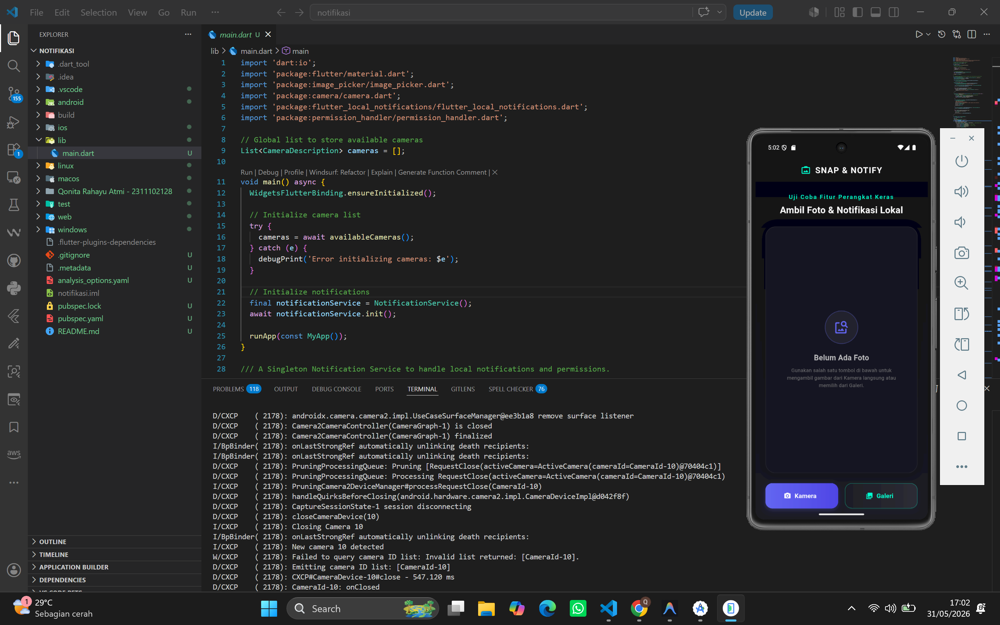
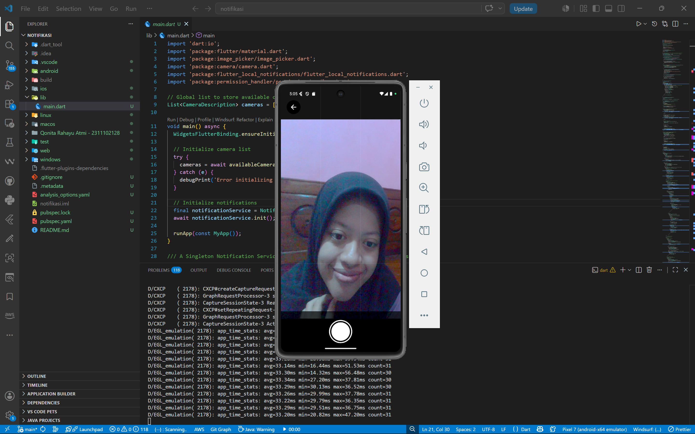
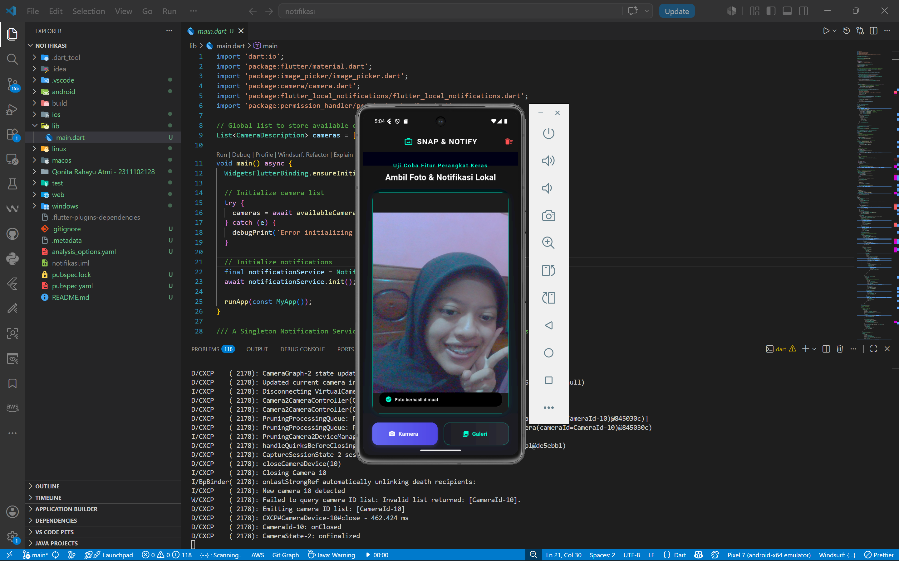
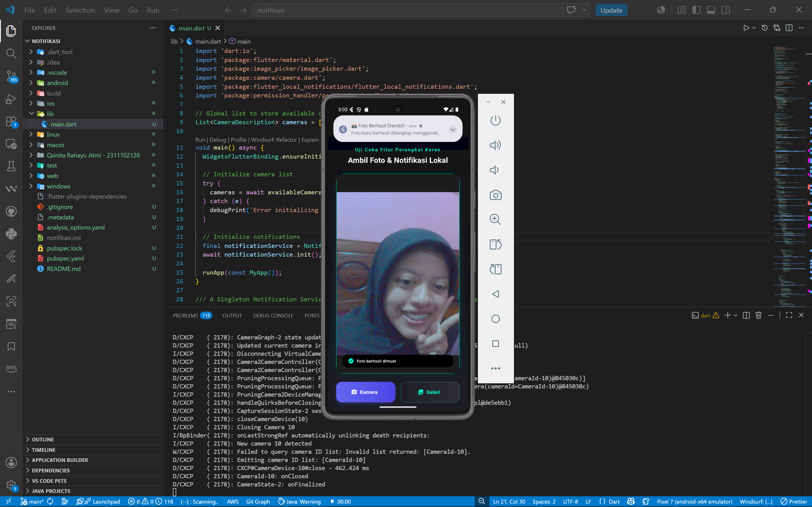
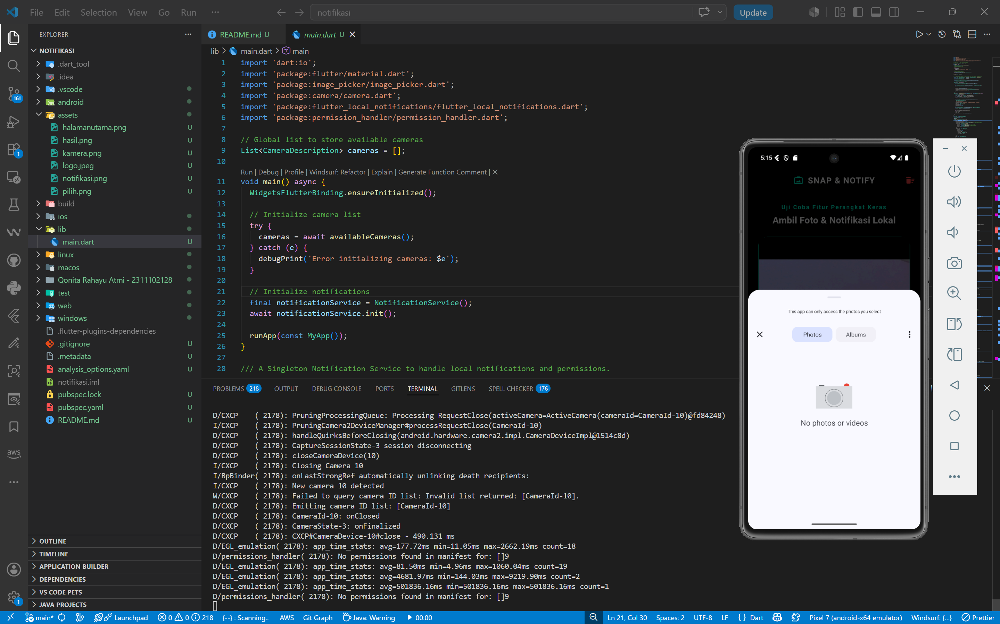

<div align="center">
  <br />
  <h1>LAPORAN PRAKTIKUM <br>APLIKASI BERBASIS PLATFORM</h1>
  <br />
  <h3>MODUL 8-9<br> NOTIFIKASI & API PERANGKAT KERAS <br>(Aplikasi Kamera & Notifikasi)</h3>
  <br />
   
  <br />
  <br />
  <br />
  <h3>Disusun Oleh :</h3>
  <p>
    <strong>QONITA RAHAYU ATMI</strong><br>
    <strong>2311102128</strong><br>
    <strong>S1 IF-11-REG01</strong>
  </p>
  <br />
  <br />
  <h3>Dosen Pengampu :</h3>
  <p>
    <strong>Dimas Fanny Hebrasianto Permadi, S.ST., M.Kom</strong>
  </p>
  <br />
  <br />
    <h4>Asisten Praktikum :</h4>
    <strong> Apri Pandu Wicaksono </strong> <br>
    <strong>Rangga Pradarrell Fathi</strong>
  <br />
  <h3>LABORATORIUM HIGH PERFORMANCE
 <br>FAKULTAS INFORMATIKA <br>TELKOM UNIVERSITY PURWOKERTO <br>2026</h3>
</div>

---

## 1. Dasar Teori

### 1.1 Flutter

Flutter adalah framework UI dari Google untuk membuat aplikasi mobile (Android/iOS) menggunakan bahasa Dart. Flutter menerapkan konsep widget sebagai komponen utama untuk membangun tampilan yang atraktif dan responsif.

### 1.2 Image Picker & Camera API

- **`image_picker`** adalah plugin Flutter yang memungkinkan aplikasi untuk berinteraksi dengan galeri perangkat guna memilih gambar yang ada secara efisien dengan kapasitas memori yang terkontrol.
- **`camera`** adalah paket yang berinteraksi langsung dengan API tingkat rendah pada hardware kamera untuk merender stream video secara real-time dan menangkap foto menggunakan kontrol kustom.

### 1.3 Flutter Local Notifications

`flutter_local_notifications` adalah plugin yang digunakan untuk membuat dan menampilkan notifikasi pop-up lokal pada perangkat. Berbeda dengan notifikasi push (seperti Firebase dari server), notifikasi lokal dipicu secara langsung dari dalam sistem kode perangkat itu sendiri ketika suatu aksi selesai dieksekusi.

### 1.4 StatefulWidget & API Perangkat Keras

Aplikasi ini menggunakan **StatefulWidget** karena memerlukan perubahan *state* secara aktif saat kamera diinisialisasi secara asinkron atau ketika berkas foto berhasil dipilih/diambil. Melalui fungsi `setState()`, Flutter memicu pembangunan ulang UI (*rebuild*) untuk merender pratinjau gambar baru di layar, serta membersihkan memori (*dispose controller*) saat aplikasi ditutup untuk menghindari kebocoran memori.

### 1.5 Widget yang Digunakan

Aplikasi ini menggunakan beberapa widget utama:

- **Scaffold**: kerangka dasar struktur halaman visual aplikasi.
- **Container**: mengelola dekorasi UI (*gradient background*, bayangan pendar sian neon, *border radius*).
- **Column & Row**: menyusun widget secara vertikal dan horizontal.
- **Stack**: menumpuk widget pratinjau kamera live dengan elemen penunjuk kisi grid 3x3 dan tombol aksi.
- **CameraPreview**: menampilkan stream visual langsung dari lensa kamera perangkat.
- **Image.file**: menampilkan file gambar/foto dari sistem memori penyimpanan perangkat secara dinamis.
- **ElevatedButton**: tombol modern bersinar untuk memicu fungsi kamera kustom dan pemilih galeri.

---

## 2. Implementasi Program

### 2.1 Deskripsi Aplikasi

Aplikasi bertema “Snap & Notify” ini didesain premium dengan balutan warna gelap modern (*Obsidian Dark Mode*) dan aksen sian elektrik guna memahami fungsionalitas *hardware* dan *service* sistem operasi. Fitur utama yang diimplementasikan:

1. **Fitur Ambil Foto (Kamera API)**: Membuka layar kustom `CameraScreen` untuk melihat stream kamera real-time dengan bantuan garis pembagi komposisi fotografi 3x3 (*Rule of Thirds*) dan mengambil gambar dengan tombol rana (*shutter button*) kustom.
2. **Fitur Pilih Foto (Galeri)**: Mengintegrasikan `ImagePicker` untuk memuat foto dari galeri penyimpanan eksternal perangkat.
3. **Bingkai Penampil Gambar**: Foto yang berhasil didapatkan ditampilkan dengan sudut melengkung halus berbingkai pendar cahaya sian neon yang memukau.
4. **Fitur Notifikasi Lokal**: Mengirim pesan *pop-up* instan ke sistem tray HP secara offline sesaat setelah foto berhasil dimuat di layar utama.

Saat proses berlangsung:
- Sistem menggunakan kelas `CameraController` atau `ImagePicker` untuk menangkap objek *File* gambar.
- Melakukan pembaruan state (`setState`) pada variabel `_selectedImage`.
- Layanan singleton `NotificationService` memicu fungsi `showNotification` untuk memunculkan notifikasi pop-up dari atas layar.

---

## 3. Code & Penjelasan

### 3.1 `pubspec.yaml` (Menambahkan Dependensi Plugin API)

Dalam pengembangan aplikasi Flutter yang membutuhkan akses ke fitur sistem operasi (seperti kamera dan notifikasi), kita tidak bisa hanya mengandalkan kode Dart standar. Kita harus mengimpor *library* pihak ketiga yang sudah disediakan oleh komunitas.

```yaml
dependencies:
  flutter:
    sdk: flutter
  camera: ^0.12.0+1 # Plugin untuk mengontrol API Kamera tingkat rendah kustom
  image_picker: ^1.2.2 # Plugin untuk memanggil galeri penyimpanan bawaan OS
  flutter_local_notifications: ^21.0.0 # Plugin untuk membuat notifikasi pop-up sistem
  permission_handler: ^12.0.2 # Pustaka manajemen permintaan izin di runtime
```

**Penjelasan:**
- `camera` memberikan kontrol penuh untuk merancang layar preview kamera kustom.
- `image_picker` menyederhanakan akses ke galeri perangkat pengguna.
- `flutter_local_notifications` digunakan untuk membangun jendela notifikasi di *notification tray* tanpa harus menggunakan layanan internet.

### 3.2 Konfigurasi Izin Akses Android (`AndroidManifest.xml`)

Sebelum aplikasi diizinkan mengakses perangkat keras sensitif, kita diwajibkan mendeklarasikan permohonan izin (*permissions*) di dalam file konfigurasi utama Android.

```xml
<manifest xmlns:android="http://schemas.android.com/apk/res/android">
    <!-- Izin utama untuk mengakses perangkat keras Kamera HP -->
    <uses-permission android:name="android.permission.CAMERA" />
    <!-- Izin khusus Android 13+ untuk memperbolehkan aplikasi mengirim notifikasi -->
    <uses-permission android:name="android.permission.POST_NOTIFICATIONS" />
```

**Penjelasan:**
Setiap izin memiliki peran penting. Jika izin `CAMERA` tidak disertakan, sistem operasi Android akan memblokir aktivitas kamera dan memicu *crash*. Sementara `POST_NOTIFICATIONS` menjamin kepatuhan sistem operasi Android versi terbaru agar jendela notifikasi pop-up tidak diblokir secara otomatis oleh sistem.

### 3.3 Inisialisasi Sistem Notifikasi di `main.dart`

Plugin notifikasi membutuhkan persiapan sebelum bisa memunculkan pesan. Inisialisasi ini dilakukan di dalam metode `init()`, yang dibungkus di dalam kelas *Singleton* `NotificationService`.

```dart
  Future<void> init() async {
    // 1. Menentukan ikon apa yang akan muncul di sebelah pesan notifikasi
    // '@mipmap/ic_launcher' berarti menggunakan ikon bawaan aplikasi Flutter
    const AndroidInitializationSettings initializationSettingsAndroid =
        AndroidInitializationSettings('@mipmap/ic_launcher');

    // 2. Membungkus pengaturan platform Android ke dalam objek InitializationSettings
    const InitializationSettings initializationSettings = InitializationSettings(
      android: initializationSettingsAndroid,
    );

    // 3. Mengeksekusi proses inisialisasi ke sistem operasi
    await flutterLocalNotificationsPlugin.initialize(
      settings: initializationSettings,
      onDidReceiveNotificationResponse: (NotificationResponse response) {
        debugPrint("Notification clicked!");
      },
    );
  }
```

**Penjelasan:**
Proses ini sangat esensial karena *service* notifikasi Android harus mengenali aplikasi mana yang mencoba mengirim pesan. Tanpa inisialisasi ikon (`@mipmap/ic_launcher`), notifikasi bisa gagal tayang karena sistem menolaknya. Callback `onDidReceiveNotificationResponse` juga dipersiapkan untuk menangani aksi ketika pengguna mengetuk notifikasi tersebut.

### 3.4 Proses Pemilihan Gambar dan Reaktivitas UI

Fungsi pengambilan foto menggunakan Camera API kustom (`_takePhotoWithCameraAPI`) dan pemilihan gambar dari galeri (`_pickPhotoFromGallery`) dijalankan secara asinkron (`Future<void>`) karena memerlukan interaksi eksternal yang memakan waktu.

```dart
  // Mengambil gambar dari Galeri menggunakan Image Picker
  Future<void> _pickPhotoFromGallery() async {
    final XFile? image = await _imagePicker.pickImage(
      source: ImageSource.gallery,
      imageQuality: 85,
    );

    if (image != null) {
      // Mengubah State UI. setState() memaksa layar utama melakukan menggambar ulang (rebuild)
      setState(() {
        _selectedImage = File(image.path);
      });

      // Memicu notifikasi lokal keberhasilan memuat foto
      await NotificationService().showNotification(
        title: '🖼️ Foto Berhasil Dipilih!',
        body: 'Foto dari galeri Anda berhasil dimuat dan siap ditampilkan.',
      );
    }
  }
```

**Penjelasan:**
Penggunaan `await` sangat penting agar alur eksekusi aplikasi Flutter menunggu tindakan pengguna selesai memilih foto tanpa membekukan antarmuka (*non-blocking*). Penggunaan `setState()` memicu pembaruan kontainer berbingkai kaca pada layar beranda sehingga gambar yang baru dimuat langsung menggantikan visual placeholder default.

### 3.5 Pembuatan Konstruksi Jendela Notifikasi

Fungsi `showNotification` memformat notifikasi lokal dengan parameter tingkat kepentingan tertinggi agar langsung muncul secara proaktif di atas layar pengguna.

```dart
  Future<void> showNotification({required String title, required String body}) async {
    // 1. Meminta izin secara dinamis untuk Android 13+
    if (Platform.isAndroid) {
      final status = await Permission.notification.status;
      if (status.isDenied || status.isPermanentlyDenied) {
        await Permission.notification.request();
      }
    }

    // 2. Membuat konfigurasi spesifik untuk perangkat Android
    const AndroidNotificationDetails androidPlatformChannelSpecifics =
        AndroidNotificationDetails(
      'camera_app_channel_id', // ID unik untuk channel notifikasi (wajib untuk Android 8.0+)
      'Camera & Photo App Notifications', // Nama channel yang terlihat di pengaturan HP
      channelDescription: 'Notifications for photo captures and selections',
      importance: Importance.max, // Mengatur agar notifikasi diprioritaskan
      priority: Priority.high, // Memaksa notifikasi muncul sebagai pop-up melayang (Heads-up)
      playSound: true,
      enableVibration: true,
    );

    const NotificationDetails platformChannelSpecifics = NotificationDetails(
      android: androidPlatformChannelSpecifics,
    );

    // 3. Memicu eksekusi ke sistem OS untuk menayangkan notifikasi
    await flutterLocalNotificationsPlugin.show(
      id: DateTime.now().millisecond, // Menggunakan ID dinamis agar tidak menimpa notifikasi sebelumnya
      title: title,
      body: body,
      notificationDetails: platformChannelSpecifics,
    );
  }
```

**Penjelasan:**
Pada Android versi 8.0 ke atas, notifikasi wajib dikelompokkan ke dalam sebuah *Channel*. Properti `Importance.max` dan `Priority.high` dikonfigurasikan agar notifikasi secara agresif melayang jatuh dari atas layar (*Heads-up Notification*) lengkap dengan getaran dan suara sebagai penanda visual dan audio yang premium bagi pengguna.

---

## 4. Hasil Tampilan (*Output*)

Berikut adalah tangkapan layar (*screenshot*) hasil eksekusi aplikasi API Kamera & Notifikasi:

### A. Halaman Utama (Kondisi Awal / *Default*)



### B. Proses Mengambil Foto (Kamera / Galeri)



### C. Halaman Utama (Foto Berhasil Ditampilkan)



### D. Tampilan Notifikasi (*Pop-Up* di Status Bar Atas)



### E. Tampilan Foto Galeri (Pilih Gambar)


